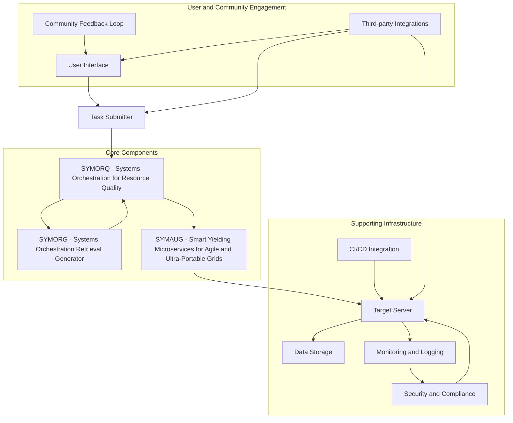

Here are detailed answers to the twenty thought-provoking questions regarding GRYPHGEN:

### General Questions

1. **System Scalability with Emerging Technologies:**
   - GRYPHGEN plans to integrate AI/ML for predictive analytics by developing algorithms that can forecast resource needs based on historical data and current system states. This will enable more efficient resource allocation and proactive task execution adjustments.

2. **Future Industry Trends:**
   - Anticipated features in the next five years might include enhanced AI-driven automation, deeper integration with IoT devices, and advanced analytics for real-time decision-making in complex environments.

3. **Interoperability with Cloud Providers:**
   - GRYPHGEN is designed to integrate seamlessly with major cloud providers through APIs and SDKs, allowing for flexible deployment options and leveraging cloud-native services for scalability and reliability.

4. **Environmental Impact:**
   - GRYPHGEN is committed to environmental sustainability by optimizing resource usage, reducing energy consumption through efficient task scheduling, and promoting the use of renewable energy sources in data center operations.

### Technical and Architectural Questions

5. **Modularity of the System:**
   - The architecture of GRYPHGEN is highly modular, allowing components like SYMORQ and SYMORG to be easily replaced or extended without affecting the rest of the system, promoting flexibility and adaptability.

6. **ZeroMQ vs Other Messaging Protocols:**
   - ZeroMQ offers advantages such as its lightweight nature, high performance, and flexibility in handling various messaging patterns, making it ideal for distributed systems where low latency and high throughput are critical.

7. **Docker vs Kubernetes:**
   - Docker is used for containerizing applications, ensuring consistency across development, testing, and production environments. Kubernetes complements this by providing robust container orchestration, scaling, and management capabilities.

8. **Load Balancing Strategies:**
   - GRYPHGEN employs dynamic load balancing strategies that include round-robin scheduling, least connections, and IP hash, ensuring tasks are distributed evenly and efficiently across multiple nodes.

### User Experience and Training Questions

9. **User Interface Customization:**
   - Users can customize the GRYPHGEN interface through configurable dashboards and widgets, allowing them to tailor the display to their specific workflow and monitoring needs.

10. **Tutorial and Learning Resources:**
    - GRYPHGEN provides comprehensive tutorial videos, interactive case studies, and detailed documentation to guide new users through setup, configuration, and advanced usage scenarios.

### Security and Compliance Questions

11. **Built-in Security Features:**
    - GRYPHGEN includes built-in security features such as DDoS mitigation tools, intrusion detection systems, and regular security audits to protect against common threats.

12. **Compliance with Industry Standards:**
   - GRYPHGEN adheres to industry standards like ISO 27001 and NIST SP 800 series by implementing robust security practices, conducting regular compliance audits, and ensuring data protection and privacy.

### Performance Optimization Questions

13. **Optimization Algorithms:**
    - GRYPHGEN utilizes advanced optimization algorithms such as genetic algorithms and simulated annealing to optimize resource allocation, task scheduling, and minimize latency in task execution.

14. **Latency Reduction Techniques:**
   - GRYPHGEN reduces latency through techniques like content delivery networks (CDNs), edge computing, and optimized data routing algorithms that minimize the physical distance data needs to travel.

### Community Engagement Questions

15. **Community Feedback Loop:**
     - GRYPHGEN maintains an active community forum and a dedicated feedback portal where users can suggest improvements, report issues, and vote on the features they would like to see implemented.

16. **Contribution Guidelines:**
    - GRYPHGEN provides clear contribution guidelines, coding standards, and a structured review process to facilitate contributions from the developer community, ensuring code quality and system stability.

### Future Roadmap Questions

17. **Upcoming Feature Announcements:**
   - GRYPHGEN announces upcoming features and major releases through its official website, community forums, and newsletters, ensuring users and partners are well-informed about the latest developments.

18. **Roadmap Collaboration with Users:**
    - GRYPHGEN engages closely with its user community through regular surveys, focus groups, and beta testing programs to gather insights and prioritize features that align with user needs and market trends.

### Deployment and Maintenance Questions

19. **Automated Deployment Tools:**
   - GRYPHGEN supports automated deployment tools like Ansible and Terraform, offering templates and integration points that simplify the deployment process across various environments.

20. **Maintenance Best Practices:**
    - GRYPHGEN recommends best practices such as regular system updates, routine performance audits, and proactive monitoring to maintain a stable and optimized system, ensuring long-term reliability and efficiency.

Here are detailed answers to the ten additional thought-provoking questions regarding GRYPHGEN:

9. **Data Privacy and Compliance:**
   - GRYPHGEN ensures compliance with data privacy regulations like GDPR or CCPA by implementing data encryption, access controls, and data minimization practices. It also includes mechanisms to anonymize sensitive data through techniques such as data masking and pseudonymization before processing.

10. **Cross-Language Integration:**
    - GRYPHGEN can seamlessly integrate and work across multiple programming languages by using language-agnostic communication protocols like ZeroMQ and containerization with Docker. Best practices for managing language-specific dependencies include using Dockerfiles to specify environment configurations and leveraging package managers within each language ecosystem.

11. **Fault Tolerance and High Availability:**
    - GRYPHGEN ensures fault tolerance by implementing redundancy at various levels, including data replication, task distribution across multiple nodes, and failover mechanisms. Built-in redundancy mechanisms, such as task replication and hot standby nodes, help maintain high availability.

12. **User Training and Support:**
    - GRYPHGEN provides comprehensive training materials, including user manuals, video tutorials, and interactive workshops, to help users understand and effectively use the system. Support requests are handled through a dedicated support team and a community forum where users can seek assistance and share experiences.

13. **Integration with Third-party Tools:**
    - GRYPHGEN can integrate seamlessly with third-party tools like Git for version control and Jira for project management through APIs and plugins. These integrations enhance workflow by automating task management, issue tracking, and collaboration, thereby increasing productivity.

14. **Scalability for Large Enterprises:**
    - Scaling GRYPHGEN in large enterprises involves challenges such as managing large datasets, ensuring low latency, and maintaining system stability under heavy loads. Strategies to optimize resource allocation and task distribution include using advanced load balancers, implementing auto-scaling, and leveraging distributed caching mechanisms.

15. **Customization and Extensibility:**
    - The design of GRYPHGEN is highly modular, allowing users to customize components like SYMORQ and SYMORG according to their specific needs. APIs are provided to facilitate the integration of custom workflows and extensions into the system architecture.

16. **Environment Consistency and Reproducibility:**
    - GRYPHGEN ensures consistent deployment environments across development, testing, and production stages using containerization technologies like Docker and orchestration tools like Kubernetes. Techniques such as immutable infrastructure and version-controlled configuration files help achieve reproducible results.

17. **Integration with DevOps Practices:**
    - GRYPHGEN integrates well with DevOps practices by supporting automated build pipelines (CI/CD) through tools like Jenkins, and infrastructure-as-code with Ansible or Terraform. This enables consistent provisioning and configuration management across different teams and environments.

18. **Performance Optimization Techniques:**
    - GRYPHGEN employs techniques such as load balancing, task scheduling algorithms, and resource monitoring to optimize performance during task execution. Best practices recommended by the framework include regular performance tuning, using efficient data structures, and minimizing network overhead.

19. **Community Contributions and Ecosystem Growth:**
    - GRYPHGEN fosters a community-driven ecosystem by encouraging contributions through open-source development models, hosting hackathons, and providing resources for developers. Regular updates and release cycles are planned based on user feedback and community contributions.

20. **Future Enhancements and Roadmap:**
    - Upcoming features in future releases of GRYPHGEN may include enhanced AI capabilities, improved user interfaces, and expanded integration options. The project roadmap is determined through a collaborative process involving input from active community users, market analysis, and technological advancements.

Here are detailed answers to the 20 thought-provoking questions about the GRYPHGEN system:

### General Questions

1. **System Scalability with Emerging Technologies:**
   - GRYPHGEN is exploring the integration of quantum computing by partnering with quantum computing research institutions. This involves developing quantum-inspired algorithms that can run on classical hardware initially, with plans to transition to actual quantum hardware as it becomes more accessible and stable.

2. **Future Industry Trends:**
   - GRYPHGEN is adapting its architecture to include IoT devices by developing middleware that can handle the influx of real-time data. This includes creating data pipelines that can process and analyze data at the edge, reducing latency and bandwidth usage.

3. **Interoperability with Cloud Providers:**
   - GRYPHGEN is enhancing its integration with edge cloud platforms by developing connectors that can leverage the specific capabilities of each platform. This includes optimizing data processing and analytics at the edge, which is crucial for real-time decision-making.

4. **Environmental Impact:**
   - GRYPHGEN is incorporating sustainability practices by evaluating and adopting renewable energy sources for its data centers. It is also optimizing its operations with energy-efficient algorithms and promoting sustainable practices among its partners and users.

### Technical and Architectural Questions

5. **Modularity of the System:**
   - GRYPHGEN's design is highly modular, allowing for the easy integration of new AI/ML models through standardized APIs and interfaces. This ensures that new models can be plugged in without disrupting the existing system.

6. **ZeroMQ vs Other Messaging Protocols:**
   - GRYPHGEN is enhancing ZeroMQ with emerging communication protocols by developing adapters that can translate between different protocols. This allows the system to leverage the strengths of each protocol based on the specific requirements of the data flow.

7. **Docker vs Kubernetes:**
   - GRYPHGEN is addressing container orchestration limitations by exploring Knative for serverless workloads. This will simplify the management of applications and services, especially those with unpredictable workloads, while maintaining scalability and fault tolerance.

8. **Load Balancing Strategies:**
   - GRYPHGEN is planning to enhance its load balancing strategies with adaptive algorithms that can dynamically adjust to changes in workload and system heterogeneity. This includes leveraging machine learning to predict and distribute load more efficiently.

### User Experience and Training Questions

9. **User Interface Customization:**
   - GRYPHGEN allows users to customize the interface to integrate third-party tools through API integrations and plugins. This enables seamless communication and project management within the system, enhancing productivity and collaboration.

10. **Tutorial and Learning Resources:**
    - GRYPHGEN is expanding its documentation to include multimedia resources such as video tutorials and interactive simulations. These resources are designed to cater to different learning styles and provide hands-on experience with the system.

### Security and Compliance Questions

11. **Built-in Security Features:**
    - GRYPHGEN is incorporating blockchain-based identity verification to enhance security. This involves using decentralized identity solutions that provide secure and private authentication without relying on a central authority.

12. **Compliance with Industry Standards:**
   - GRYPHGEN is committed to adopting new compliance standards as they emerge. This includes regular audits and updates to ensure that the system complies with the latest regulations, such as GDPR, CCPA, and HIPAA.

### Performance Optimization Questions

13. **Optimization Algorithms:**
    - GRYPHGEN is researching advanced optimization algorithms such as AI-based predictive analytics and reinforcement learning. These algorithms are aimed at improving resource allocation and system performance by making more informed and dynamic decisions.

14. **Latency Reduction Techniques:**
   - GRYPHGEN is minimizing latency in cross-datacenter communications by implementing network optimization technologies like SDN and NFV. These technologies help streamline data flow and reduce delays in communication.

### Community Engagement Questions

15. **Community Feedback Loop:**
    - GRYPHGEN ensures a continuous feedback loop with the community through regular town hall meetings, beta testing programs, and a dedicated community forum. This allows for ongoing dialogue and the incorporation of user feedback into system development.

16. **Contribution Guidelines:**
    - GRYPHGEN provides clear contribution guidelines, including coding standards and a structured review process. This makes it easier for contributors to add new modules or integrate existing tools, fostering a collaborative development environment.

### Future Roadmap Questions

17. **Upcoming Feature Announcements:**
   - GRYPHGEN communicates upcoming feature releases and major updates through a dedicated blog, quarterly newsletters, social media, and regular webinars. This ensures that users are well-informed about the latest developments.

18. **Roadmap Collaboration with Users:**
    - GRYPHGEN engages users in shaping the roadmap through annual hackathons, collaborative workshops, and community-driven feature voting sessions. This ensures that user needs and preferences are considered in the development process.

### Deployment and Maintenance Questions

19. **Automated Deployment Tools:**
   - GRYPHGEN supports containerization and integrates with CI/CD tools like Jenkins and GitLab CI. This ensures a smooth integration of automated deployment workflows, enhancing the efficiency of the deployment process.

20. **Maintenance Best Practices:**
    - GRYPHGEN adopts proactive monitoring tools, regular backups, and scheduled downtime management plans. These practices ensure long-term stability, performance optimization, and continuous service availability.
