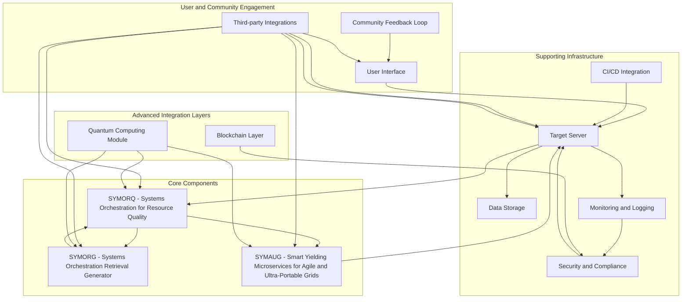

Explanation of Components:
User Interface (UI):

The main interface through which users interact with the GRYPHGEN system. It connects to the Task Submitter and Community Feedback Loop.
Task Submitter (TS):

Submits tasks initiated by the user to the orchestration system.
SYMORQ - Systems Orchestration for Resource Quality:

Manages and coordinates resources for task execution, ensuring efficient utilization.
SYMORG - Systems Orchestration Retrieval Generator:

Handles retrieval of relevant information and incorporates it into the task orchestration process.
SYMAUG - Smart Yielding Microservices for Agile and Ultra-Portable Grids:

Provides a lightweight and portable solution for deploying GRYPHGEN across different platforms and architectures.
Target Server (TS):

Executes tasks and runs the generated code. It interacts with data storage, monitoring, and CI/CD systems.
Data Storage (DS):

Stores data used and generated by the GRYPHGEN system.
Monitoring and Logging (ML):

Continuously monitors task execution, logs performance metrics, and detects anomalies.
Security and Compliance (SC):

Ensures that the system adheres to security standards and regulatory compliance requirements.
Community Feedback Loop (CF):

Collects feedback from users to improve the system and prioritize new features.
CI/CD Integration (CI):

Integrates with continuous integration and continuous deployment tools to streamline updates and deployment.
Third-party Integrations (TI):

Interfaces with third-party tools such as Jira, Slack, and Microsoft Teams for enhanced communication and project management.
Blockchain Layer (BL):

Enhances transparency and security in data management through immutable record storage and decentralized security measures.
Quantum Computing Module (QC):

Integrates quantum computing technologies for advanced optimization in resource allocation and task management.
This ideal deployment diagram illustrates how the various components of the GRYPHGEN system interact with each other, highlighting core components, supporting infrastructure, user engagement, and advanced integration layers.
