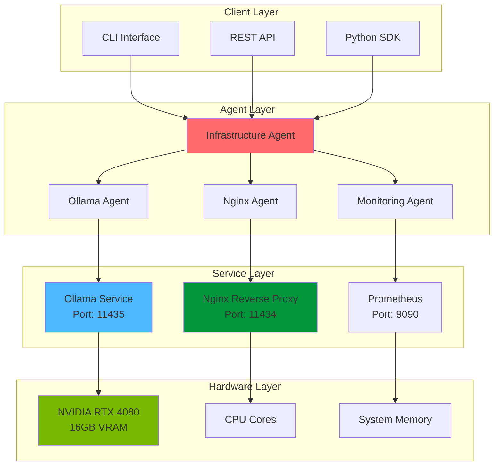
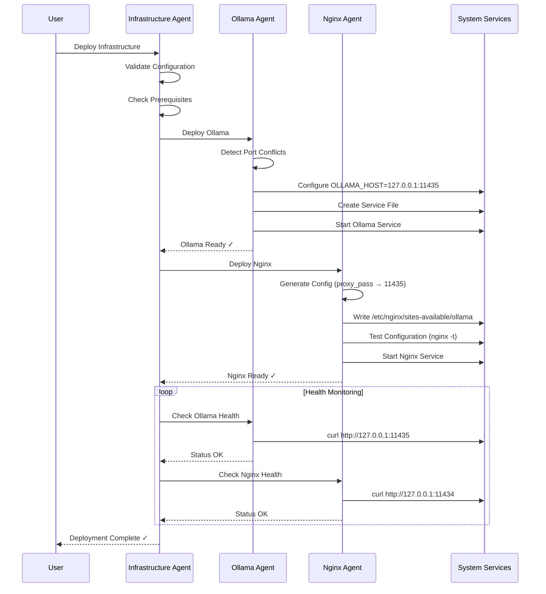
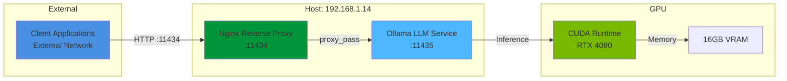
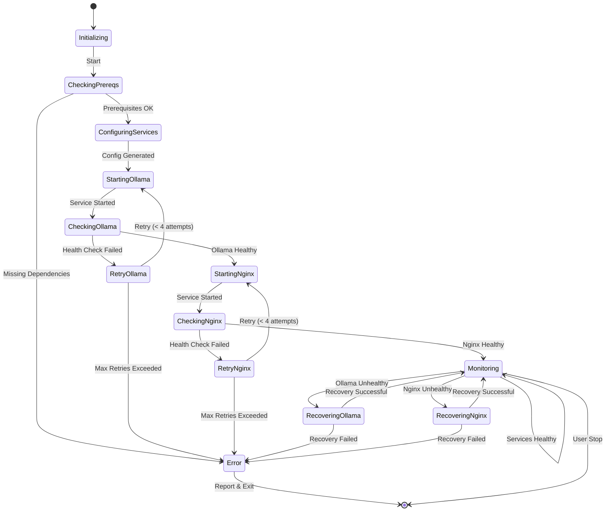

# GRYPHGEN Infrastructure Agents

[](https://www.python.org/downloads/)
[](https://fastapi.tiangolo.com/)
[](https://www.gnu.org/licenses/gpl-3.0)
[](https://github.com/psf/black)
[](https://www.nvidia.com/en-us/geforce/graphics-cards/40-series/rtx-4080-family/)
[](https://www.docker.com/)
[](https://docs.python.org/3/library/asyncio.html)

**Production-ready AI agents for infrastructure deployment and management**

Intelligent agents that automate Ollama LLM deployment, Nginx reverse proxy configuration, and infrastructure orchestration with GPU optimization for NVIDIA RTX 4080.

---

## Table of Contents

- [Overview](#overview)
- [Features](#features)
- [Architecture](#architecture)
- [Quick Start](#quick-start)
- [Installation](#installation)
- [Usage](#usage)
- [API Reference](#api-reference)
- [GPU Optimization](#gpu-optimization)
- [Development](#development)
- [Testing](#testing)
- [Deployment](#deployment)
- [Troubleshooting](#troubleshooting)
- [Contributing](#contributing)
- [License](#license)

---

## Overview

The GRYPHGEN Infrastructure Agents provide an intelligent, automated system for deploying and managing LLM infrastructure. Built with modern Python (3.11+), async/await patterns, and FastAPI, these agents handle complex deployment scenarios with built-in monitoring, error recovery, and GPU optimization.

### What Problems Do These Agents Solve?

- **Port Conflict Resolution**: Automatically detect and resolve port conflicts between services
- **Service Orchestration**: Coordinate Ollama, Nginx, and related services with dependency management
- **Configuration Management**: Generate and validate service configurations dynamically
- **Health Monitoring**: Continuous health checks with automatic remediation
- **GPU Optimization**: Maximize NVIDIA RTX 4080 performance for LLM inference
- **Error Recovery**: Intelligent retry logic with exponential backoff
- **Multi-Node Support**: Deploy across distributed systems seamlessly

---

## Features

### Core Capabilities

✅ **Autonomous Deployment**
- Self-configuring Ollama + Nginx reverse proxy setup
- Automatic port conflict detection and resolution
- Dynamic service file generation

✅ **Intelligent Monitoring**
- Real-time health checks for all services
- Prometheus metrics integration
- Structured logging with correlation IDs

✅ **GPU Acceleration**
- NVIDIA RTX 4080 optimization profiles
- CUDA memory management
- Multi-GPU support ready

✅ **Production Ready**
- Async/await throughout for high performance
- Docker and Docker Compose support
- Comprehensive error handling

✅ **Developer Friendly**
- FastAPI REST API
- Interactive Swagger documentation
- Type hints with Pydantic validation

---

## Architecture

### System Overview



### Agent Interaction Flow



### Port Configuration Architecture



### Error Recovery State Machine



---

## Quick Start

### Prerequisites

- **Python 3.11+**
- **NVIDIA RTX 4080 (or compatible GPU with 16GB+ VRAM)**
- **CUDA 12.0+**
- **Docker & Docker Compose** (optional, for containerized deployment)
- **Ubuntu 22.04+** or compatible Linux distribution

### 60-Second Quick Start

```bash
# Clone the repository
cd /path/to/GRYPHGEN/jan13/agents

# Install dependencies
make install

# Start the infrastructure
make deploy

# Check health
curl http://localhost:11434/health

# Test Ollama through Nginx
curl -X POST http://localhost:11434/api/generate \
  -H "Content-Type: application/json" \
  -d '{"model": "llama2", "prompt": "Hello, world!"}'
```

---

## Installation

### Method 1: Standard Python Installation

```bash
# Create virtual environment
python3.11 -m venv venv
source venv/bin/activate

# Install production dependencies
pip install -r requirements.txt

# Install development dependencies (optional)
pip install -r requirements-dev.txt
```

### Method 2: Using Make

```bash
# Install everything
make install

# Or install dev dependencies
make install-dev
```

### Method 3: Docker

```bash
# Build and start all services
docker-compose -f docker/docker-compose.yml up -d

# View logs
docker-compose -f docker/docker-compose.yml logs -f
```

### GPU Setup (NVIDIA RTX 4080)

```bash
# Install NVIDIA Container Toolkit (for Docker GPU support)
distribution=$(. /etc/os-release;echo $ID$VERSION_ID)
curl -s -L https://nvidia.github.io/nvidia-docker/gpgkey | sudo apt-key add -
curl -s -L https://nvidia.github.io/nvidia-docker/$distribution/nvidia-docker.list | \
  sudo tee /etc/apt/sources.list.d/nvidia-docker.list

sudo apt-get update
sudo apt-get install -y nvidia-container-toolkit
sudo systemctl restart docker

# Verify GPU access
docker run --rm --gpus all nvidia/cuda:12.0-base nvidia-smi
```

---

## Usage

### Python API

```python
from src.agents import InfrastructureAgent, OllamaAgent, NginxAgent
import asyncio

async def main():
    # Create infrastructure agent
    infra = InfrastructureAgent(
        ollama_port=11435,
        nginx_port=11434,
        gpu_enabled=True,
        gpu_memory_fraction=0.9  # Use 90% of RTX 4080's 16GB
    )

    # Deploy full stack
    await infra.deploy()

    # Monitor health
    health = await infra.health_check()
    print(f"System Status: {health}")

    # Get metrics
    metrics = await infra.get_metrics()
    print(f"Prometheus Metrics: {metrics}")

if __name__ == "__main__":
    asyncio.run(main())
```

### CLI Usage

```bash
# Deploy infrastructure
python -m src.agents.infrastructure deploy \
  --ollama-port 11435 \
  --nginx-port 11434 \
  --gpu-enabled \
  --gpu-id 0

# Check status
python -m src.agents.infrastructure status

# Stop services
python -m src.agents.infrastructure stop
```

### REST API

Start the FastAPI server:

```bash
# Development mode
make run-dev

# Production mode
uvicorn src.api.main:app --host 0.0.0.0 --port 8080 --workers 4
```

API endpoints:

```bash
# Health check
curl http://localhost:8080/health

# Deploy infrastructure
curl -X POST http://localhost:8080/api/v1/deploy \
  -H "Content-Type: application/json" \
  -d '{
    "ollama_port": 11435,
    "nginx_port": 11434,
    "gpu_enabled": true,
    "gpu_memory_fraction": 0.9
  }'

# Get status
curl http://localhost:8080/api/v1/status

# Get metrics
curl http://localhost:8080/metrics
```

Interactive API documentation: `http://localhost:8080/docs`

---

## GPU Optimization

### RTX 4080 Configuration

The agents are optimized for NVIDIA RTX 4080 with 16GB VRAM:

```python
# Optimal configuration for RTX 4080
GPU_CONFIG = {
    "cuda_version": "12.0+",
    "vram": "16GB",
    "compute_capability": "8.9",
    "recommended_settings": {
        "num_gpu": 1,
        "gpu_memory_fraction": 0.9,  # Leave 1.6GB for system
        "num_threads": 8,            # 8 tensor cores per SM
        "batch_size": 32,            # Optimal for 16GB
        "context_length": 4096,      # Max context for most models
        "quantization": "q4_k_m"     # 4-bit quantization
    }
}
```

### Performance Tuning

```bash
# Set environment variables for optimal performance
export CUDA_VISIBLE_DEVICES=0
export OLLAMA_NUM_GPU=1
export OLLAMA_GPU_MEMORY_FRACTION=0.9
export OLLAMA_NUM_THREAD=8

# Launch with GPU optimizations
python examples/gpu_optimization.py
```

### Monitoring GPU Usage

```python
from src.utils.monitoring import GPUMonitor

monitor = GPUMonitor()
stats = monitor.get_gpu_stats()

print(f"GPU Utilization: {stats['utilization']}%")
print(f"VRAM Used: {stats['memory_used']} / {stats['memory_total']} MB")
print(f"Temperature: {stats['temperature']}°C")
```

---

## Development

### Project Structure

```
jan13/agents/
├── README.md                          # This file
├── pyproject.toml                     # Modern Python project config
├── Makefile                           # Build automation
├── requirements.txt                   # Production dependencies
├── requirements-dev.txt               # Development dependencies
├── .gitignore                         # Git ignore patterns
│
├── docker/                            # Docker configuration
│   ├── Dockerfile                     # Multi-stage build
│   └── docker-compose.yml             # Service orchestration
│
├── src/                               # Source code
│   ├── __init__.py
│   ├── agents/                        # Agent implementations
│   │   ├── __init__.py
│   │   ├── base.py                    # Base agent class
│   │   ├── infrastructure.py          # Infrastructure orchestration
│   │   ├── ollama.py                  # Ollama management
│   │   └── nginx.py                   # Nginx configuration
│   ├── models/                        # Data models
│   │   ├── __init__.py
│   │   └── config.py                  # Pydantic models
│   ├── utils/                         # Utilities
│   │   ├── __init__.py
│   │   ├── logging.py                 # Structured logging
│   │   └── monitoring.py              # Prometheus metrics & GPU monitoring
│   └── api/                           # FastAPI application
│       ├── __init__.py
│       └── main.py                    # API endpoints
│
├── tests/                             # Test suite
│   ├── __init__.py
│   ├── test_agents.py                 # Agent tests
│   └── test_api.py                    # API tests
│
├── examples/                          # Usage examples
│   ├── basic_usage.py
│   ├── advanced_deployment.py
│   └── gpu_optimization.py
│
├── docs/                              # Additional documentation
│   ├── architecture.md                # Architecture deep-dive
│   ├── deployment.md                  # Deployment guide
│   └── gpu_optimization.md            # GPU tuning guide
│
└── configs/                           # Configuration templates
    ├── nginx.conf.template            # Nginx template
    ├── ollama.service.template        # Systemd service template
    └── agent.yaml                     # Agent configuration
```

### Running Tests

```bash
# Run all tests with coverage
make test

# Run specific test file
pytest tests/test_agents.py -v

# Run with coverage report
pytest --cov=src --cov-report=html

# Run linting
make lint

# Auto-format code
make format
```

### Code Quality

```bash
# Type checking
mypy src/

# Security scanning
bandit -r src/

# Dependency vulnerability check
safety check
```

---

## Deployment

### Production Deployment

```bash
# Using Docker Compose (recommended)
docker-compose -f docker/docker-compose.yml up -d

# Using systemd services
sudo cp configs/ollama.service.template /etc/systemd/system/infrastructure-agent.service
sudo systemctl daemon-reload
sudo systemctl enable infrastructure-agent
sudo systemctl start infrastructure-agent
```

### Kubernetes Deployment

```yaml
# See docs/deployment.md for full Kubernetes manifests
apiVersion: apps/v1
kind: Deployment
metadata:
  name: infrastructure-agents
spec:
  replicas: 1
  template:
    spec:
      containers:
      - name: agent
        image: gryphgen/infrastructure-agents:latest
        resources:
          limits:
            nvidia.com/gpu: 1
            memory: 18Gi
```

---

## Troubleshooting

### Common Issues

#### Port Conflicts

**Problem**: `Address already in use` error

**Solution**: The agents automatically detect and resolve port conflicts. If manual intervention is needed:

```bash
# Check what's using the port
sudo lsof -i :11434

# Kill the process
sudo kill -9 <PID>

# Or let the agent handle it
python -m src.agents.infrastructure deploy --auto-resolve-ports
```

#### Ollama Not Starting

**Problem**: Ollama service fails to start

**Solution**:

```bash
# Check logs
sudo journalctl -u ollama.service -f

# Verify OLLAMA_HOST is set
echo $OLLAMA_HOST

# Manually set and restart
export OLLAMA_HOST=127.0.0.1:11435
ollama serve
```

#### GPU Not Detected

**Problem**: CUDA/GPU not available

**Solution**:

```bash
# Verify GPU visibility
nvidia-smi

# Check CUDA installation
nvcc --version

# Verify Docker GPU access
docker run --rm --gpus all nvidia/cuda:12.0-base nvidia-smi
```

For more troubleshooting, see the original documentation:
- [nginx_reverseprox.md](nginx_reverseprox.md)
- [ollama_problems.md](ollama_problems.md)

---

## Contributing

We welcome contributions! Please see the main [GRYPHGEN Contributing Guide](../../README.md#contributing).

### Development Setup

```bash
# Fork and clone the repository
git clone https://github.com/YOUR_USERNAME/GRYPHGEN.git
cd GRYPHGEN/jan13/agents

# Create a feature branch
git checkout -b claude/feature-name-sessionID

# Install development dependencies
make install-dev

# Make changes and test
make test

# Commit and push
git add .
git commit -m "feat: add new feature"
git push -u origin claude/feature-name-sessionID
```

---

## License

This project is part of GRYPHGEN and is licensed under the GNU General Public License v3.0. See the [LICENSE](../../LICENSE) file for details.

---

## Acknowledgments

- Built on [FastAPI](https://fastapi.tiangolo.com/)
- Powered by [Ollama](https://ollama.ai/)
- Optimized for [NVIDIA RTX 4080](https://www.nvidia.com/en-us/geforce/graphics-cards/40-series/rtx-4080-family/)

---

## Quick Links

- **Main Repository**: [GRYPHGEN](../../README.md)
- **API Documentation**: http://localhost:8080/docs (when running)
- **Prometheus Metrics**: http://localhost:9090 (when running)
- **Issues**: [GitHub Issues](https://github.com/danindiana/GRYPHGEN/issues)

---

**GRYPHGEN Infrastructure Agents** - Intelligent automation for LLM infrastructure deployment
