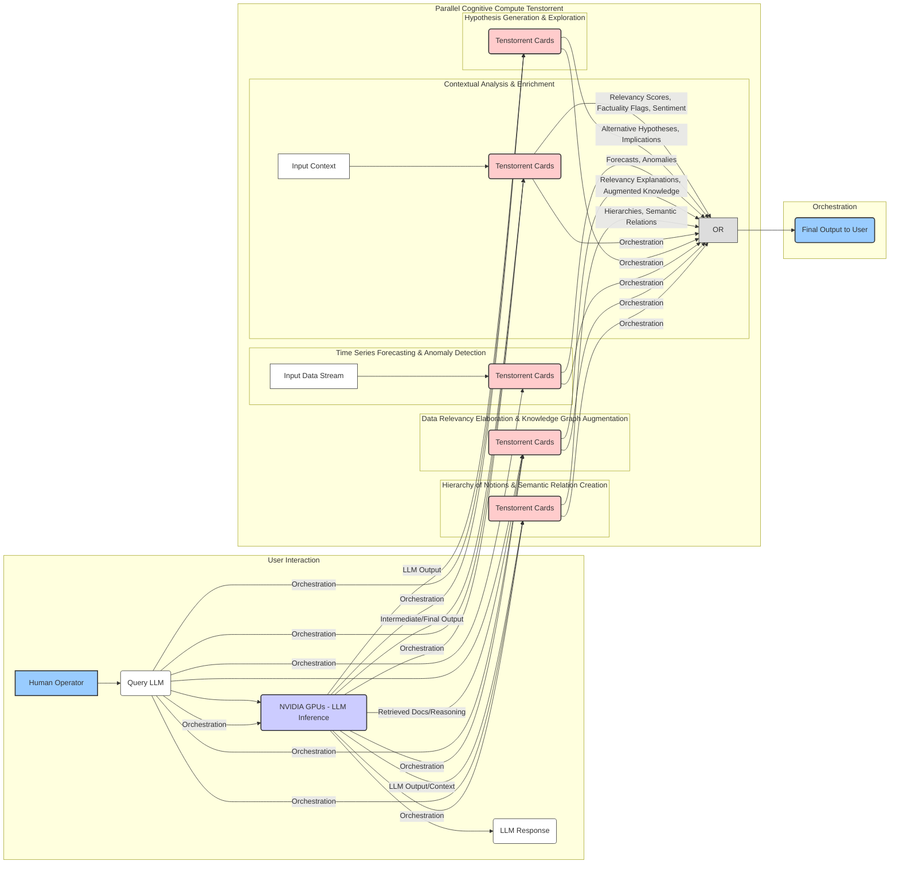

Explanation of the Diagram:

User Interaction: The user sends a query to the Language Model inference running on the NVIDIA GPUs.
NVIDIA GPUs (LLM Inference): This represents the primary task of generating text based on the user's query.
Parallel Cognitive Compute (Tenstorrent): This subgraph encompasses the various parallel AI applications that the Tenstorrent cards could be running. Each sub-section represents one of the suggested applications:
Contextual Analysis & Enrichment: Tenstorrent analyzes the input context and LLM output.
Hypothesis Generation & Exploration: Tenstorrent generates alternative ideas or explores implications.
Time Series Forecasting & Anomaly Detection: Tenstorrent processes streaming input data.
Data Relevancy Elaboration & Knowledge Graph Augmentation: Tenstorrent enhances the RAG process.
Hierarchy of Notions & Semantic Relation Creation: Tenstorrent builds structured knowledge.
Orchestration: This subgraph represents the role of the Threadripper host CPU in managing the flow of information and coordinating the tasks between the NVIDIA GPUs and the Tenstorrent cards. It shows the query and LLM outputs being fed to the Tenstorrent cards and the outputs from the Tenstorrent cards being aggregated (OR) for the final output.
Output: The final output presented to the user, which can include the LLM's response and the insights generated by the parallel Tenstorrent processing.
Key Points Illustrated:

The NVIDIA GPUs handle the main LLM inference.
The Tenstorrent cards run several parallel tasks to provide additional cognitive value.
The Threadripper CPU acts as the orchestrator, managing the data flow.
The final output combines the results from both the NVIDIA and Tenstorrent processing.
This diagram provides a high-level visual representation of the proposed parallel processing architecture. You could create more detailed diagrams for each specific Tenstorrent application if needed to illustrate the internal data flow within those tasks.
