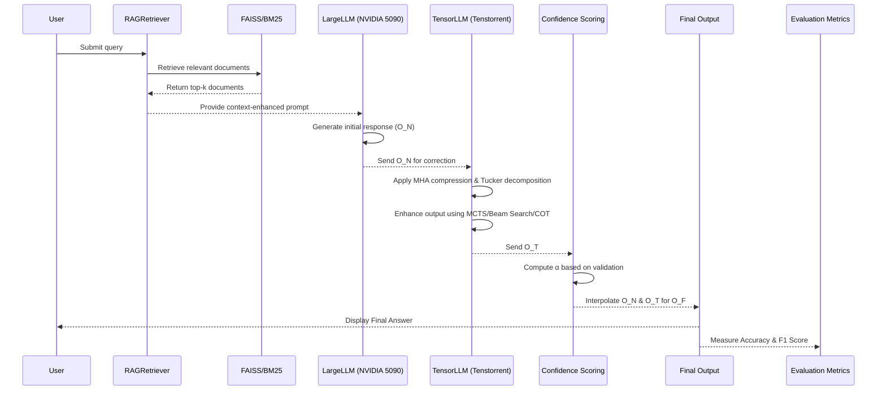
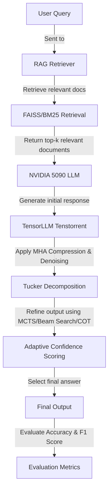

```mermaid
sequenceDiagram
    participant User
    participant RAGRetriever
    participant FAISS/BM25
    participant LargeLLM (NVIDIA 5090)
    participant TensorLLM (Tenstorrent)
    participant Confidence Scoring
    participant Final Output

    User->>RAGRetriever: Submit query
    RAGRetriever->>FAISS/BM25: Retrieve relevant documents
    FAISS/BM25-->>RAGRetriever: Return top-k documents
    RAGRetriever-->>LargeLLM (NVIDIA 5090): Provide context-enhanced prompt
    LargeLLM (NVIDIA 5090)->>LargeLLM (NVIDIA 5090): Generate initial response (O_N)
    LargeLLM (NVIDIA 5090)-->>TensorLLM (Tenstorrent): Send O_N for correction
    TensorLLM (Tenstorrent)->>TensorLLM (Tenstorrent): Apply MHA compression & Tucker decomposition
    TensorLLM (Tenstorrent)->>TensorLLM (Tenstorrent): Enhance output using MCTS/Beam Search/COT
    TensorLLM (Tenstorrent)-->>Confidence Scoring: Send O_T
    Confidence Scoring->>Confidence Scoring: Compute α based on validation
    Confidence Scoring-->>Final Output: Interpolate O_N & O_T for O_F
    Final Output-->>User: Display Final Answer
    Final Output-->>Evaluation Metrics: Measure Accuracy & F1 Score
```

```mermaid
graph TD;
    A[User Query] -->|Sent to| B[RAG Retriever]
    B -->|Retrieve relevant docs| C[FAISS/BM25 Retrieval]
    C -->|Return top-k relevant documents| D[NVIDIA 5090 LLM]
    D -->|Generate initial response| E[TensorLLM Tenstorrent]
    E -->|Apply MHA Compression & Denoising| F[Tucker Decomposition]
    F -->|Refine output using MCTS/Beam Search/COT| G[Adaptive Confidence Scoring]
    G -->|Select final answer| H[Final Output]
    H -->|Evaluate Accuracy & F1 Score| I[Evaluation Metrics]
```
