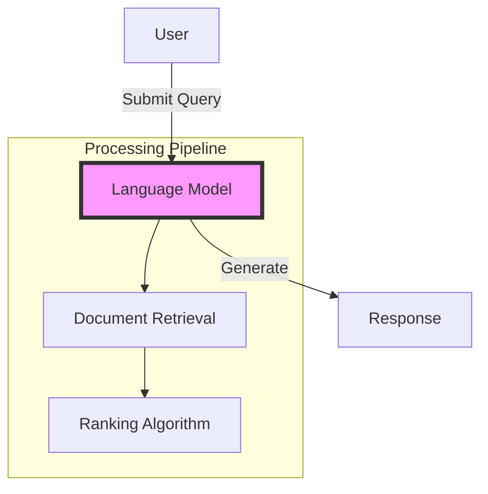

# 🤝 Contributing to GRYPHGEN Mermaid Diagrams

Thank you for your interest in contributing to the GRYPHGEN Mermaid Diagram Collection! This guide will help you contribute effectively.

## 📋 Table of Contents

- [Ways to Contribute](#ways-to-contribute)
- [Diagram Guidelines](#diagram-guidelines)
- [Submission Process](#submission-process)
- [Style Guide](#style-guide)
- [Best Practices](#best-practices)
- [Review Process](#review-process)

---

## 🎯 Ways to Contribute

### 1. New Diagrams
- Add new AI/ML architecture patterns
- Document emerging workflows
- Create variations of existing patterns

### 2. Improvements
- Enhance existing diagrams
- Add detailed explanations
- Include use cases and examples
- Update technology references

### 3. Documentation
- Expand README files
- Add tutorials and guides
- Include code examples
- Create comparison tables

### 4. Bug Fixes
- Correct syntax errors
- Fix broken links
- Update deprecated information

---

## 📐 Diagram Guidelines

### Required Elements

Every diagram contribution should include:

1. **Diagram Title**: Clear, descriptive title
2. **Mermaid Code**: Valid, properly formatted diagram
3. **Overview**: Brief description of what the diagram shows
4. **Component Description**: Explanation of each element
5. **Use Cases**: Real-world applications
6. **Related Patterns**: Links to related diagrams

### File Structure

```markdown
# Title with Emoji


## Overview
Brief description (2-3 sentences)

## Architecture Diagram
\```mermaid
[Your diagram code]
\```

## Component Description
Detailed explanation of each component

## Workflow
Step-by-step process

## Use Cases
Real-world examples

## Implementation Considerations
Technical details and best practices

## Related Patterns
- [Pattern 1](./link.md)
- [Pattern 2](./link.md)

---
**[🔙 Back to ABACUS](./README.md)** | **[🏠 Main README](../README.md)**
```

---

## 🔄 Submission Process

### Step 1: Fork and Clone

```bash
# Fork the repository on GitHub
# Then clone your fork
git clone https://github.com/YOUR_USERNAME/GRYPHGEN.git
cd GRYPHGEN
```

### Step 2: Create a Branch

```bash
# Create a descriptive branch name
git checkout -b feature/add-mlops-pipeline-diagram
```

### Step 3: Add Your Contribution

```bash
# Navigate to the appropriate folder
cd mermaid/abacus  # or mermaid/mmd_seqdiagrams

# Create or edit files
# Use your preferred editor
```

### Step 4: Test Your Diagram

1. **Validate Syntax**: Use [Mermaid Live Editor](https://mermaid.live/)
2. **Check Rendering**: Preview in GitHub markdown
3. **Verify Links**: Ensure all links work
4. **Test Examples**: Run any code examples

### Step 5: Commit Your Changes

```bash
# Add your files
git add .

# Commit with descriptive message
git commit -m "feat: add MLOps pipeline diagram with deployment workflow"

# Follow conventional commits format:
# feat: New feature
# fix: Bug fix
# docs: Documentation changes
# style: Formatting changes
# refactor: Code refactoring
```

### Step 6: Push and Create PR

```bash
# Push to your fork
git push origin feature/add-mlops-pipeline-diagram

# Create Pull Request on GitHub
# Fill out the PR template with details
```

---

## 🎨 Style Guide

### Diagram Naming

- **Files**: Use lowercase with underscores: `mlops_pipeline.md`
- **Nodes**: Use PascalCase or clear labels: `LanguageModel`, `Code Generator`
- **Edges**: Use descriptive labels in quotes: `"Send Data"`, `"Analyze"`

### Mermaid Syntax

#### Good Examples



#### Best Practices

1. **Use Subgraphs**: Group related components
2. **Add Styles**: Highlight important nodes
3. **Descriptive Labels**: Avoid abbreviations
4. **Consistent Direction**: TD (top-down) or LR (left-right)
5. **Comments**: Use `%% Comment` for complex logic

### Documentation Style

- **Headers**: Use sentence case with emoji
- **Lists**: Use bullet points for scanability
- **Code Blocks**: Always specify language
- **Links**: Use descriptive text, not "click here"
- **Tables**: Use for comparisons and references

### Badge Style

Use consistent badge format:

```markdown

```

Recommended colors:
- **blue**: General info
- **green**: Complexity/status
- **purple**: Patterns
- **orange**: Architecture
- **red**: Warnings

---

## ✅ Best Practices

### Diagram Quality

1. **Start Simple**: Create minimal viable diagram first
2. **Iterate**: Add complexity gradually
3. **Test Rendering**: Check in multiple viewers
4. **Seek Feedback**: Share with community before finalizing

### Documentation Quality

1. **Be Clear**: Use plain language
2. **Be Specific**: Include concrete examples
3. **Be Complete**: Cover all components
4. **Be Current**: Reference latest technologies

### Code Examples

If including code:

```python
# Always include:
# 1. Language specification in code fence
# 2. Comments explaining key points
# 3. Working, tested code
# 4. Dependencies clearly stated

from transformers import pipeline

# Initialize the model
llm = pipeline("text-generation", model="gpt2")

# Generate text
response = llm("Your prompt here")
```

### Technical Accuracy

- **Verify Information**: Double-check technical details
- **Cite Sources**: Link to authoritative references
- **Update Regularly**: Keep up with latest practices
- **Test Examples**: Ensure code runs as described

---

## 🔍 Review Process

### What We Look For

1. **Correctness**: Diagram accurately represents the system
2. **Clarity**: Easy to understand for the target audience
3. **Completeness**: All necessary information included
4. **Consistency**: Follows existing patterns and style
5. **Value**: Adds meaningful content to the collection

### Review Timeline

- **Initial Review**: 1-3 days
- **Feedback**: Provided via PR comments
- **Revisions**: Iterate based on feedback
- **Approval**: 2+ maintainer approvals required
- **Merge**: Typically within 1 week

### Common Feedback

- **Too Complex**: Simplify or break into multiple diagrams
- **Missing Documentation**: Add explanations and use cases
- **Syntax Errors**: Fix Mermaid rendering issues
- **Inconsistent Style**: Align with style guide
- **Unclear Labels**: Use more descriptive names

---

## 📝 Diagram Categories

### ABACUS (Architecture Patterns)

Focus on:
- High-level system design
- Component interactions
- Data flows
- Technology integration

Examples: RAG systems, agent architectures, MLOps pipelines

### Sequence Diagrams

Focus on:
- Temporal interactions
- Message passing
- State changes
- Error handling

Examples: API flows, multi-agent coordination, deployment sequences

---

## 🎓 Learning Resources

### Mermaid Documentation
- [Official Docs](https://mermaid.js.org/)
- [Live Editor](https://mermaid.live/)
- [GitHub Integration](https://github.blog/2022-02-14-include-diagrams-markdown-files-mermaid/)

### AI/ML Architecture
- [Patterns.dev](https://www.patterns.dev/)
- [ML Ops](https://ml-ops.org/)
- [LangChain Docs](https://python.langchain.com/)

### Markdown Style
- [GitHub Flavored Markdown](https://github.github.com/gfm/)
- [Markdown Guide](https://www.markdownguide.org/)

---

## ❓ Questions?

- **GitHub Issues**: [Create an issue](https://github.com/danindiana/GRYPHGEN/issues)
- **Discussions**: [Join the discussion](https://github.com/danindiana/GRYPHGEN/discussions)
- **Email**: Contact maintainers

---

## 📜 Code of Conduct

- Be respectful and inclusive
- Provide constructive feedback
- Credit original authors
- Follow open source etiquette

---

## 🙏 Thank You!

Your contributions help the AI/ML community build better systems. We appreciate your time and effort!

---

**[🏠 Back to Main README](./README.md)**
