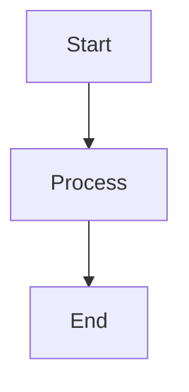
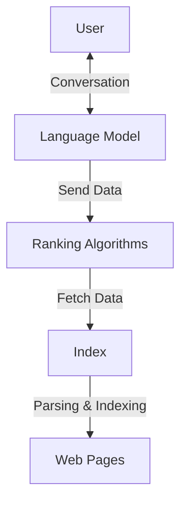
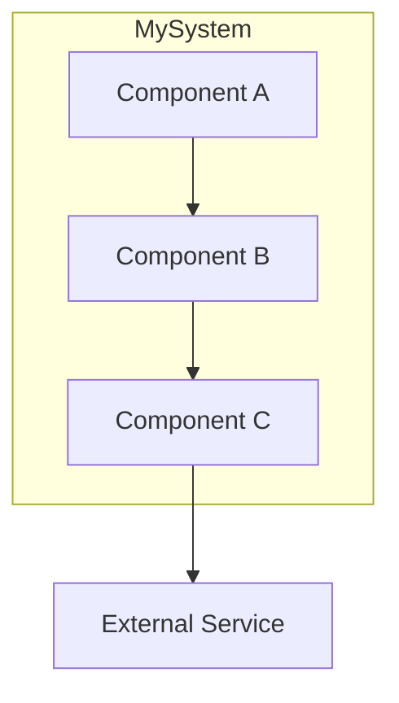
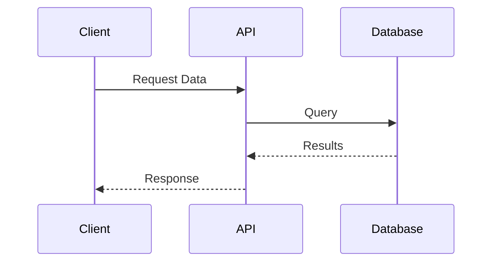
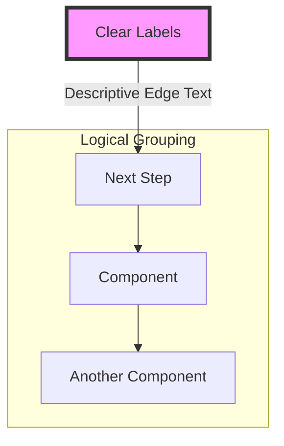

# 📊 GRYPHGEN Mermaid Diagram Collection

<div align="center">


**Comprehensive collection of Mermaid diagrams for AI/LLM system architectures, workflows, and design patterns**

[📖 Documentation](#documentation) • [🎨 Diagram Gallery](#diagram-gallery) • [🚀 Quick Start](#quick-start) • [🤝 Contributing](#contributing)

</div>

---

## 📑 Table of Contents

- [Overview](#overview)
- [Folder Structure](#folder-structure)
- [Diagram Gallery](#diagram-gallery)
  - [ABACUS AI/ML Concepts](#abacus-aiml-concepts)
  - [Sequence Diagrams](#sequence-diagrams)
  - [System Workflows](#system-workflows)
- [Quick Start](#quick-start)
- [Usage Examples](#usage-examples)
- [Best Practices](#best-practices)
- [Documentation](#documentation)
- [Contributing](#contributing)
- [License](#license)

---

## 🎯 Overview

This collection contains **production-ready Mermaid diagrams** documenting the GRYPHGEN system architecture, AI/ML workflows, and LLM orchestration patterns. These diagrams serve as both technical documentation and implementation blueprints for:

- **Multi-Agent LLM Systems**: Collaborative AI agent architectures with code generation, analysis, monitoring, and optimization
- **RAG Systems**: Retrieval-Augmented Generation pipelines with vector stores and embedding strategies
- **AI Orchestration**: End-to-end workflows from data ingestion to model deployment
- **DevOps Integration**: CI/CD patterns for AI/ML systems
- **Security & Compliance**: Monitoring, logging, and security frameworks

### Key Features

- ✅ **20+ Production-Grade Diagrams**: Covering all aspects of AI/ML system design
- ✅ **Modular Architecture**: Easy to mix and match components
- ✅ **Best Practices**: Industry-standard patterns and conventions
- ✅ **GitHub-Native**: Renders beautifully in GitHub markdown
- ✅ **Comprehensive Documentation**: Each diagram includes detailed explanations

---

## 📂 Folder Structure

```
mermaid/
├── README.md                    # This file - main documentation
├── seq_diagram.md              # Core GRYPHGEN sequence diagram
├── gryphgen.pdf                # System architecture PDF
│
├── abacus/                     # AI/ML concept diagrams
│   ├── README.md              # ABACUS module documentation
│   ├── agents.md              # AI agent architecture
│   ├── agents_over_data.md    # Data-centric agent patterns
│   ├── ai_at_scale.md         # Scalable AI infrastructure
│   ├── finetune.md            # LLM fine-tuning workflows
│   ├── llm_ops.md             # LLM operations pipeline
│   ├── sota_rag.md            # State-of-the-art RAG system
│   ├── whole_enchilada_ai.md  # Comprehensive AI architecture
│   ├── enchilada.pdf          # Visual architecture reference
│   └── enchiladav2.pdf        # Updated architecture
│
└── mmd_seqdiagrams/           # Sequence diagram library
    ├── README.md              # Sequence diagram index
    ├── input.mmd              # Base sequence diagram
    ├── input2.mmd             # Variant diagrams
    ├── input3-19.mmd          # Additional patterns
    └── ...                    # (19 total diagrams)
```

---

## 🎨 Diagram Gallery

### ABACUS AI/ML Concepts

The **ABACUS** (AI-Based Augmented Computational Understanding System) collection contains fundamental AI/ML architecture patterns:

#### 🤖 [AI Agents](./abacus/agents.md)
Multi-agent systems with planning, reasoning, and execution capabilities.

#### 📊 [State-of-the-Art RAG](./abacus/sota_rag.md)
Modern Retrieval-Augmented Generation architecture with embeddings and vector search.

#### 🎯 [LLM Fine-Tuning](./abacus/finetune.md)
Pre-training to fine-tuning pipeline for domain-specific models.

#### ⚙️ [LLM Operations](./abacus/llm_ops.md)
Production MLOps pipeline: data preprocessing, embeddings, orchestration, and monitoring.

#### 🌐 [Whole Enchilada AI](./abacus/whole_enchilada_ai.md)
Comprehensive end-to-end AI system architecture integrating all components.

#### 📈 [AI at Scale](./abacus/ai_at_scale.md)
Scalable infrastructure patterns for production AI systems.

#### 🔄 [Agents Over Data](./abacus/agents_over_data.md)
Data-centric AI agent workflows with retrieval and processing.

### Sequence Diagrams

The **mmd_seqdiagrams** collection contains 19 sequence diagrams showing:

- Multi-LLM collaboration patterns
- Code generation and analysis workflows
- Task monitoring and optimization
- Deployment and continuous integration
- Security and compliance flows
- Event-driven architectures with SYMORQ/SYMORG/SYMAUG

📁 [View All Sequence Diagrams](./mmd_seqdiagrams/README.md)

### System Workflows

#### 🔄 [Core GRYPHGEN Workflow](./seq_diagram.md)
The main sequence diagram showing the interaction between:
- **Code Generator (LLM A)**: Generates code based on requirements
- **Code Analyzer (LLM B)**: Validates and provides feedback
- **Task Monitor (LLM C)**: Ensures alignment with project parameters
- **Workflow Optimizer (LLM D)**: Manages processes and optimizes workflow
- **Supporting Systems**: Target Server, Monitoring, Security, and Data Storage

---

## 🚀 Quick Start

### Viewing Diagrams

All diagrams are written in **Mermaid syntax** and render automatically in:

- ✅ GitHub markdown files
- ✅ GitLab
- ✅ VS Code with Mermaid extension
- ✅ Obsidian, Notion, and other markdown editors
- ✅ Mermaid Live Editor: https://mermaid.live/

### Using Diagrams in Your Project

1. **Copy the diagram code** from any `.md` or `.mmd` file
2. **Paste into your markdown** surrounded by mermaid code fences:

````markdown

````

3. **Customize** the diagram to fit your needs

### Exporting Diagrams

#### Method 1: Mermaid Live Editor
1. Visit https://mermaid.live/
2. Paste your diagram code
3. Export as PNG, SVG, or PDF

#### Method 2: Mermaid CLI
```bash
npm install -g @mermaid-js/mermaid-cli
mmdc -i input.mmd -o output.png
```

#### Method 3: VS Code Extension
1. Install "Mermaid Markdown Syntax Highlighting" extension
2. Use "Markdown Preview Mermaid Support" for live preview
3. Export via preview context menu

---

## 💡 Usage Examples

### Example 1: Embedding in Documentation

```markdown
# My AI System Architecture

Below is the high-level architecture of our RAG system:


```

### Example 2: Creating Custom Diagrams

Start with a base diagram from this collection and modify:



### Example 3: Sequence Diagram for API Flow



---

## 📚 Best Practices

### Diagram Design Guidelines

1. **Keep it Simple**: One diagram should illustrate one concept
2. **Use Subgraphs**: Group related components for clarity
3. **Meaningful Labels**: Use descriptive names, not abbreviations
4. **Consistent Styling**: Maintain visual consistency across diagrams
5. **Add Context**: Include explanatory text with each diagram

### Mermaid Syntax Tips



### Common Diagram Types

- **Flowcharts** (`graph TD`): System architecture, decision trees
- **Sequence Diagrams** (`sequenceDiagram`): API flows, interactions
- **State Diagrams** (`stateDiagram-v2`): Workflow states
- **Class Diagrams** (`classDiagram`): Object relationships
- **Entity Relationship** (`erDiagram`): Database schemas

---

## 📖 Documentation

### Core Documents

- [**ABACUS Collection**](./abacus/README.md): AI/ML architecture patterns
- [**Sequence Diagrams**](./mmd_seqdiagrams/README.md): Interaction flows
- [**GRYPHGEN PDF**](./gryphgen.pdf): Complete system documentation

### External Resources

- [Mermaid Official Documentation](https://mermaid.js.org/)
- [Mermaid Live Editor](https://mermaid.live/)
- [GitHub Mermaid Support](https://github.blog/2022-02-14-include-diagrams-markdown-files-mermaid/)

---

## 🤝 Contributing

We welcome contributions to expand and improve this diagram collection!

### How to Contribute

1. **Fork** the repository
2. **Create a feature branch**: `git checkout -b feature/new-diagram`
3. **Add your diagram** with documentation
4. **Follow naming conventions**: descriptive lowercase with underscores
5. **Submit a Pull Request**

### Contribution Guidelines

- Include both the diagram and explanatory text
- Add your diagram to the appropriate section in this README
- Test rendering in GitHub markdown preview
- Use consistent formatting and style

---

## 📄 License

This project is part of the GRYPHGEN repository. See the main repository for license information.

---

## 🙏 Acknowledgments

- Built with [Mermaid.js](https://mermaid.js.org/)
- Inspired by modern AI/ML architecture patterns
- Community contributions and feedback

---

<div align="center">

**[⬆ Back to Top](#-gryphgen-mermaid-diagram-collection)**

Made with ❤️ for the AI/ML community

</div>
