# 📁 Mermaid Folder Structure

## Visual Structure

```mermaid
graph TD
    Root[📊 mermaid/]

    Root --> README[📄 README.md<br/>Main documentation]
    Root --> CONTRIB[📄 CONTRIBUTING.md<br/>Contribution guide]
    Root --> STRUCT[📄 STRUCTURE.md<br/>This file]
    Root --> SEQ[📄 seq_diagram.md<br/>Core sequence diagram]
    Root --> PDF[📑 gryphgen.pdf<br/>System architecture]

    Root --> Abacus[📂 abacus/<br/>AI/ML Architecture Patterns]
    Root --> SeqDiagrams[📂 mmd_seqdiagrams/<br/>Sequence Diagram Library]

    Abacus --> AbacusREADME[📄 README.md<br/>ABACUS documentation]
    Abacus --> Agents[📄 agents.md<br/>AI agent patterns]
    Abacus --> AgentsData[📄 agents_over_data.md<br/>Data-centric agents]
    Abacus --> AIScale[📄 ai_at_scale.md<br/>Scalable AI]
    Abacus --> FineTune[📄 finetune.md<br/>LLM fine-tuning]
    Abacus --> LLMOps[📄 llm_ops.md<br/>MLOps pipeline]
    Abacus --> RAG[📄 sota_rag.md<br/>RAG system]
    Abacus --> WholeEnch[📄 whole_enchilada_ai.md<br/>Complete AI system]
    Abacus --> EncPDF1[📑 enchilada.pdf<br/>Architecture PDF]
    Abacus --> EncPDF2[📑 enchiladav2.pdf<br/>Updated architecture]

    SeqDiagrams --> SeqREADME[📄 README.md<br/>Sequence diagrams index]
    SeqDiagrams --> Input1[📄 input.mmd<br/>Core workflow]
    SeqDiagrams --> Input2to19[📄 input2-19.mmd<br/>19 sequence patterns]

    style Root fill:#f9f,stroke:#333,stroke-width:4px
    style Abacus fill:#bbf,stroke:#333,stroke-width:2px
    style SeqDiagrams fill:#bfb,stroke:#333,stroke-width:2px
```



## Directory Tree

```
mermaid/
├── README.md                    # 📚 Main documentation hub
├── CONTRIBUTING.md              # 🤝 Contribution guidelines
├── STRUCTURE.md                 # 📁 This file - folder structure
├── seq_diagram.md              # 🔄 Core GRYPHGEN sequence diagram
├── gryphgen.pdf                # 📑 System architecture reference
│
├── abacus/                     # 🧮 ABACUS - AI/ML Architecture Patterns
│   ├── README.md              # ABACUS module documentation
│   ├── agents.md              # 🤖 AI agent architecture
│   ├── agents_over_data.md    # 📊 Data-centric agent patterns
│   ├── ai_at_scale.md         # 📈 Scalable AI infrastructure
│   ├── finetune.md            # 🎯 LLM fine-tuning workflow
│   ├── llm_ops.md             # ⚙️ LLM operations pipeline
│   ├── sota_rag.md            # 📊 State-of-the-art RAG system
│   ├── whole_enchilada_ai.md  # 🌐 Comprehensive AI architecture
│   ├── enchilada.pdf          # 📑 Visual architecture reference
│   └── enchiladav2.pdf        # 📑 Updated architecture
│
└── mmd_seqdiagrams/           # 📐 Sequence Diagram Library
    ├── README.md              # Sequence diagrams index & guide
    ├── input.mmd              # Core 4-agent workflow
    ├── input2.mmd             # Extended workflow
    ├── input3.mmd             # Variant pattern
    ├── input4.mmd             # Specialized interaction
    ├── input5.mmd             # Optimized flow
    ├── input6.mmd             # Event-driven architecture
    ├── input7.mmd             # Advanced orchestration
    ├── input8.mmd             # Parallel processing
    ├── input9.mmd             # Error handling
    ├── input10.mmd            # Complete user workflow ⭐
    ├── input11.mmd            # Distributed system
    ├── input12.mmd            # Failover & recovery
    ├── input13.mmd            # State management
    ├── input14.mmd            # Simple deployment
    ├── input15.mmd            # Code refinement loop ⭐
    ├── input16.mmd            # Microservices architecture
    ├── input17.mmd            # Enterprise integration
    ├── input18.mmd            # Advanced security
    ├── input19.mmd            # Complete system architecture
    ├── readme.txt             # Legacy text file
    └── readme.md              # Legacy readme (replaced by README.md)
```

## File Categories

### Documentation Files

| File | Purpose | Audience |
|------|---------|----------|
| `README.md` | Main entry point, overview, navigation | All users |
| `CONTRIBUTING.md` | Contribution guidelines and processes | Contributors |
| `STRUCTURE.md` | Folder organization and file descriptions | Developers |
| `abacus/README.md` | ABACUS pattern documentation | AI/ML architects |
| `mmd_seqdiagrams/README.md` | Sequence diagram catalog | System designers |

### Architecture Diagrams (ABACUS)

| File | Focus | Complexity | Target Use |
|------|-------|------------|------------|
| `agents.md` | Multi-agent systems | ⭐⭐ | Task automation |
| `agents_over_data.md` | Data processing agents | ⭐⭐⭐ | ETL workflows |
| `sota_rag.md` | RAG architecture | ⭐⭐ | Q&A systems |
| `finetune.md` | LLM training | ⭐⭐ | Model specialization |
| `llm_ops.md` | MLOps pipeline | ⭐⭐⭐⭐ | Production deployment |
| `whole_enchilada_ai.md` | Complete system | ⭐⭐⭐⭐⭐ | Enterprise AI |
| `ai_at_scale.md` | Scaling patterns | ⭐⭐⭐⭐ | Infrastructure |

### Sequence Diagrams (19 total)

| Category | Files | Description |
|----------|-------|-------------|
| **Basic** | input.mmd - input5.mmd | Foundational patterns |
| **Intermediate** | input6.mmd - input10.mmd | Event-driven, workflows |
| **Advanced** | input11.mmd - input15.mmd | Distributed, refinement |
| **Expert** | input16.mmd - input19.mmd | Enterprise, security |

### Reference Materials

| File | Type | Description |
|------|------|-------------|
| `gryphgen.pdf` | PDF | Complete system architecture |
| `enchilada.pdf` | PDF | Visual AI architecture v1 |
| `enchiladav2.pdf` | PDF | Visual AI architecture v2 |

## Navigation Paths

### For Beginners

```
START: mermaid/README.md
    ↓
Choose: AI Patterns OR Sequence Diagrams
    ↓
AI Patterns → abacus/README.md → agents.md OR sota_rag.md
Sequence Diagrams → mmd_seqdiagrams/README.md → input.mmd
```

### For Contributors

```
START: CONTRIBUTING.md
    ↓
Review: Style guide & submission process
    ↓
Check: STRUCTURE.md for organization
    ↓
Create: New diagram in appropriate folder
    ↓
Update: Respective README.md with your addition
```

### For System Designers

```
START: abacus/whole_enchilada_ai.md
    ↓
Deep Dive: Specific patterns (RAG, Agents, MLOps)
    ↓
Implementation: mmd_seqdiagrams/ for workflows
    ↓
Reference: PDFs for visual context
```

## Content Organization Principles

### 1. Separation of Concerns
- **Architecture Patterns** (abacus/): WHAT to build
- **Sequence Diagrams** (mmd_seqdiagrams/): HOW it works
- **Documentation**: WHY and WHEN to use

### 2. Progressive Disclosure
- Start with README (overview)
- Drill down to specific patterns
- Reference detailed implementations

### 3. Discoverability
- Clear naming conventions
- Comprehensive READMEs with links
- Cross-references between related content

### 4. Maintainability
- Each diagram is self-contained
- READMEs serve as indexes
- Version history in git

## File Naming Conventions

### Markdown Files
- **Pattern**: `descriptive_name.md` (lowercase with underscores)
- **Examples**: `sota_rag.md`, `agents_over_data.md`

### Mermaid Files
- **Pattern**: `inputN.mmd` (sequential numbering)
- **Alternative**: `feature_name.mmd` for specific features

### READMEs
- **Root**: `README.md` (uppercase)
- **Subfolders**: Also `README.md`
- **Legacy**: `readme.md` or `readme.txt` (deprecated)

## Diagram Coverage

### Topics Covered

✅ Multi-agent LLM systems
✅ RAG (Retrieval-Augmented Generation)
✅ LLM fine-tuning and training
✅ MLOps and deployment pipelines
✅ Event-driven architectures
✅ Security and monitoring
✅ Scalable infrastructure
✅ Data processing workflows

### Potential Additions

🔜 CI/CD for ML models
🔜 Model monitoring and observability
🔜 Multi-modal AI systems
🔜 Federated learning patterns
🔜 Edge AI deployment
🔜 Cost optimization strategies

## Usage Statistics

| Category | File Count | Total Lines |
|----------|------------|-------------|
| Architecture Diagrams | 7 | ~1,200 |
| Sequence Diagrams | 19 | ~500 |
| Documentation | 5 | ~1,500 |
| PDFs | 3 | N/A |
| **TOTAL** | **34 files** | **~3,200 lines** |

## Quick Links

### Most Popular Diagrams
1. [Complete AI System](./abacus/whole_enchilada_ai.md) - End-to-end architecture
2. [RAG System](./abacus/sota_rag.md) - Modern retrieval patterns
3. [Complete Workflow](./mmd_seqdiagrams/README.md#input10mmd) - Production pipeline

### Quick Start
1. [Main README](./README.md) - Start here
2. [ABACUS Patterns](./abacus/README.md) - Architecture patterns
3. [Sequence Diagrams](./mmd_seqdiagrams/README.md) - Workflow patterns

### For Contributors
1. [Contributing Guide](./CONTRIBUTING.md) - How to contribute
2. [This Document](./STRUCTURE.md) - Folder structure

---

**[🏠 Back to Main README](./README.md)** | **[🤝 Contributing](./CONTRIBUTING.md)**

Last Updated: 2025-11-18
