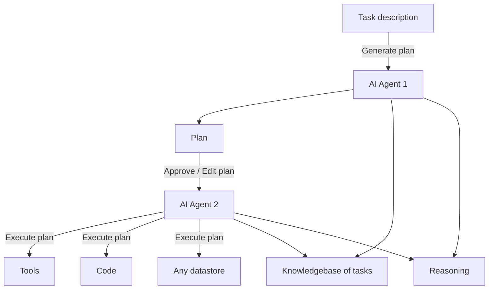
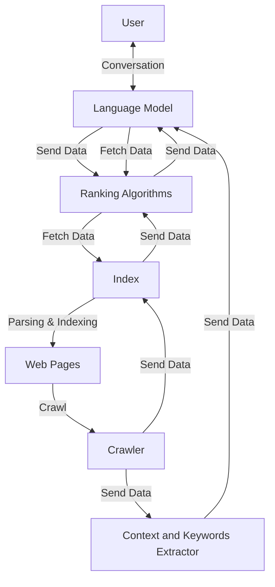
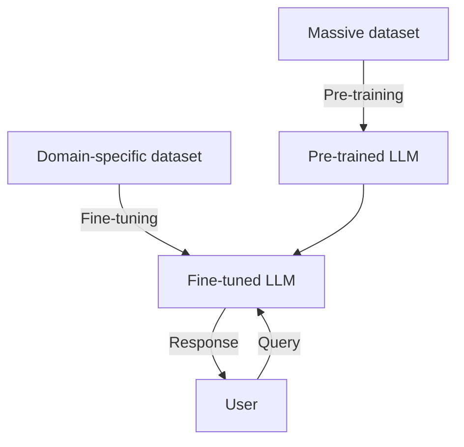
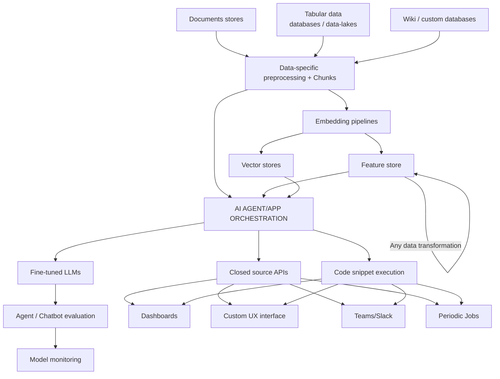

# 🧮 ABACUS - AI Architecture Patterns

<div align="center">


**AI-Based Augmented Computational Understanding System**

Comprehensive collection of AI/ML architecture patterns and design blueprints

[🔙 Back to Main](../README.md)

</div>

---

## 📑 Table of Contents

- [Overview](#overview)
- [Architecture Diagrams](#architecture-diagrams)
- [Quick Reference](#quick-reference)
- [Usage Guide](#usage-guide)
- [Integration Patterns](#integration-patterns)

---

## 🎯 Overview

The **ABACUS** collection provides fundamental building blocks for modern AI/ML systems. Each diagram represents a production-tested pattern that can be used independently or combined to create comprehensive AI solutions.

### Key Components

- **AI Agents**: Multi-agent orchestration and planning
- **RAG Systems**: Retrieval-Augmented Generation pipelines
- **LLM Operations**: MLOps for language models
- **Fine-Tuning**: Model training and adaptation workflows
- **Scaling Patterns**: Infrastructure for production AI

---

## 📊 Architecture Diagrams

### 🤖 AI Agents
**File**: [agents.md](./agents.md)



**Purpose**: Demonstrates a two-agent system where one agent plans and another executes, both leveraging a shared knowledge base.

**Key Features**:
- Task planning and decomposition
- Plan approval workflow
- Multi-tool execution (code, tools, datastores)
- Shared reasoning and knowledge base

**Use Cases**:
- Autonomous software development
- Complex task automation
- Research and analysis workflows
- Code generation and execution

---

### 🔄 Agents Over Data
**File**: [agents_over_data.md](./agents_over_data.md)

Enhanced agent pattern with data processing capabilities.

**Key Features**:
- Data-centric agent workflows
- Integration with external data sources
- Real-time data processing
- Agent collaboration on shared datasets

**Use Cases**:
- Data pipeline automation
- ETL workflow orchestration
- Real-time analytics
- Database query generation

---

### 📈 State-of-the-Art RAG
**File**: [sota_rag.md](./sota_rag.md)



**Purpose**: Modern RAG (Retrieval-Augmented Generation) architecture with web crawling, indexing, and intelligent retrieval.

**Key Features**:
- Web content crawling and indexing
- Context-aware keyword extraction
- Ranking algorithms for relevance
- Bidirectional communication with LLM

**Use Cases**:
- Knowledge base chatbots
- Document Q&A systems
- Research assistants
- Enterprise search

---

### 🎯 LLM Fine-Tuning
**File**: [finetune.md](./finetune.md)



**Purpose**: Illustrates the two-stage training process for domain-specific LLMs.

**Key Features**:
- Pre-training on large corpora
- Fine-tuning for specialization
- Domain adaptation workflow
- User interaction with specialized model

**Use Cases**:
- Medical/legal domain models
- Code-specific models
- Multilingual specialization
- Industry-specific assistants

---

### ⚙️ LLM Operations (MLOps)
**File**: [llm_ops.md](./llm_ops.md)



**Purpose**: Complete MLOps pipeline from data ingestion to deployment and monitoring.

**Key Features**:
- Multi-source data ingestion
- Embedding and vector store management
- Feature store with transformations
- Model evaluation and monitoring
- Multiple deployment channels

**Use Cases**:
- Production LLM deployment
- Enterprise AI platforms
- Multi-channel chatbots
- AI-powered automation

---

### 🌐 Whole Enchilada AI
**File**: [whole_enchilada_ai.md](./whole_enchilada_ai.md)

Comprehensive end-to-end AI architecture integrating all components: agents, RAG, fine-tuning, and operations.

**Purpose**: Shows how all ABACUS components work together in a complete system.

**Key Features**:
- User task management
- Multi-agent orchestration
- Document processing and RAG
- Data sources integration
- Complete AI orchestration
- Fine-tuning pipeline

**Components Integrated**:
1. **User Task Management**: Task description, planning, execution
2. **AI Agents**: Planning and execution agents with reasoning
3. **Document Processing**: Chunking, embedding, retrieval strategies
4. **Data Sources**: Warehouses, document stores, wikis
5. **AI Orchestration**: Model deployment, monitoring, UX
6. **RAG System**: Full retrieval and ranking
7. **Fine-Tuning**: Pre-training to deployment

**Use Cases**:
- Enterprise AI platforms
- Comprehensive AI assistants
- Multi-modal AI systems
- Production-scale deployments

---

### 📊 AI at Scale
**File**: [ai_at_scale.md](./ai_at_scale.md)

Infrastructure patterns for scaling AI systems to production.

**Key Features**:
- Horizontal scaling patterns
- Load balancing strategies
- Distributed processing
- High availability architectures

**Use Cases**:
- Large-scale deployments
- High-traffic applications
- Enterprise AI infrastructure
- Cloud-native AI systems

---

## 🚀 Quick Reference

| Diagram | Focus Area | Complexity | Best For |
|---------|-----------|------------|----------|
| **agents.md** | Agent Architecture | ⭐⭐ | Task automation, planning |
| **agents_over_data.md** | Data Processing | ⭐⭐⭐ | ETL, data workflows |
| **sota_rag.md** | Retrieval Systems | ⭐⭐ | Q&A, knowledge bases |
| **finetune.md** | Model Training | ⭐⭐ | Domain specialization |
| **llm_ops.md** | MLOps Pipeline | ⭐⭐⭐⭐ | Production deployment |
| **whole_enchilada_ai.md** | Complete System | ⭐⭐⭐⭐⭐ | Enterprise platforms |
| **ai_at_scale.md** | Infrastructure | ⭐⭐⭐⭐ | Scaling, HA |

**Complexity Legend**:
- ⭐ = Simple, single concept
- ⭐⭐⭐⭐⭐ = Complex, multiple integrated systems

---

## 💡 Usage Guide

### Getting Started

1. **Identify Your Use Case**: Match your requirements to the diagrams above
2. **Start Simple**: Begin with single-component diagrams
3. **Combine Patterns**: Mix and match components as needed
4. **Customize**: Adapt diagrams to your specific infrastructure

### Example: Building a RAG System

```markdown
**Step 1**: Start with `sota_rag.md` as your base architecture

**Step 2**: Add agent orchestration from `agents.md` for task planning

**Step 3**: Integrate MLOps from `llm_ops.md` for production deployment

**Step 4**: Scale with patterns from `ai_at_scale.md`
```

### Customization Tips

1. **Adapt Node Names**: Use your specific technology stack names
2. **Add Your Tools**: Replace generic "Tools" with actual services
3. **Include Metrics**: Add monitoring and logging components
4. **Security Layers**: Incorporate authentication and authorization

---

## 🔗 Integration Patterns

### Combining Multiple Diagrams

#### Pattern 1: RAG + Agents
```
sota_rag.md (retrieval) → agents.md (reasoning) → llm_ops.md (deployment)
```
Use for intelligent assistants that retrieve, reason, and act.

#### Pattern 2: Complete MLOps
```
finetune.md (training) → llm_ops.md (pipeline) → ai_at_scale.md (infrastructure)
```
Full lifecycle from model training to scaled deployment.

#### Pattern 3: Data-Driven AI
```
agents_over_data.md (processing) → sota_rag.md (indexing) → whole_enchilada_ai.md (integration)
```
End-to-end data processing to AI application.

---

## 📚 Additional Resources

### Related Documentation
- [Main Mermaid Collection](../README.md)
- [Sequence Diagrams](../mmd_seqdiagrams/README.md)
- [GRYPHGEN System Documentation](../gryphgen.pdf)

### PDFs in This Folder
- **enchilada.pdf**: Visual reference for complete AI architecture
- **enchiladav2.pdf**: Updated architecture with latest patterns

### External Resources
- [Mermaid Documentation](https://mermaid.js.org/)
- [AI/ML Best Practices](https://ml-ops.org/)
- [LLM Application Patterns](https://www.patterns.dev/)

---

<div align="center">

**[⬆ Back to Top](#-abacus---ai-architecture-patterns)** | **[🏠 Main README](../README.md)**

Built for the AI/ML community with ❤️

</div>
