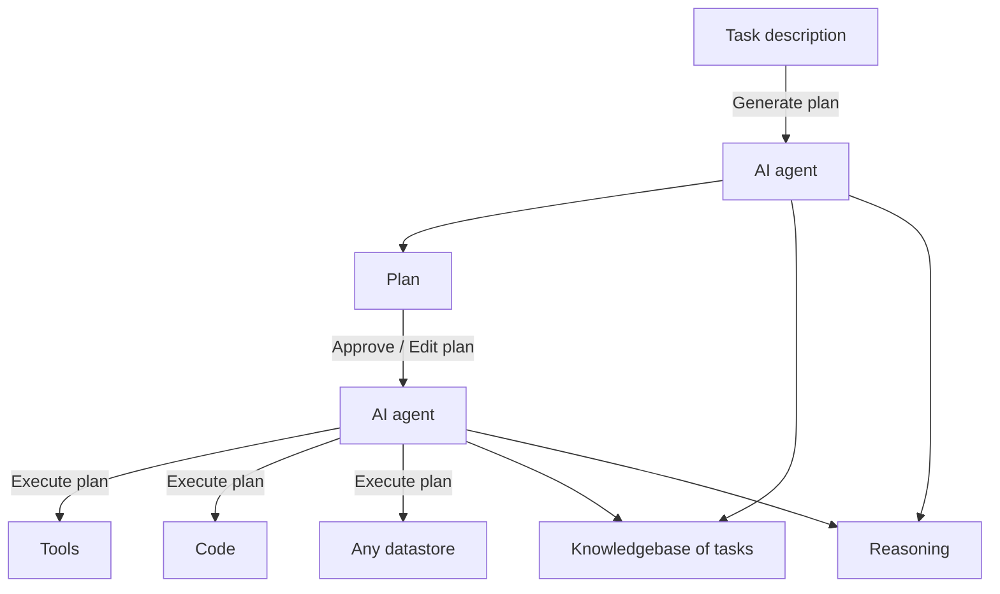

# 🤖 AI Agent Architecture

## Overview

This diagram illustrates a **two-tier AI agent system** where one agent handles planning and another handles execution. Both agents share access to a common knowledge base and reasoning engine, enabling coordinated task completion.

## Architecture Diagram

## Component Description

### AI Agent 1 (Planning Agent)
- **Role**: Strategic planning and task decomposition
- **Input**: User task description
- **Output**: Structured execution plan
- **Capabilities**:
  - Analyzes task requirements
  - Queries knowledge base for similar tasks
  - Uses reasoning to create optimal plan
  - Generates step-by-step execution strategy

### AI Agent 2 (Execution Agent)
- **Role**: Plan execution and implementation
- **Input**: Approved/edited plan from Agent 1
- **Output**: Completed tasks via multiple channels
- **Capabilities**:
  - Executes using external tools
  - Generates and runs code
  - Interacts with datastores
  - Leverages shared knowledge and reasoning

### Shared Resources

#### Knowledge Base
- Repository of past tasks and solutions
- Best practices and patterns
- Domain-specific information
- Continuously updated from agent experiences

#### Reasoning Engine
- Logical inference capabilities
- Problem-solving algorithms
- Decision-making frameworks
- Context-aware reasoning

## Workflow

1. **Task Submission**: User provides task description
2. **Plan Generation**: Agent 1 creates execution plan using knowledge base
3. **Plan Review**: User approves or edits the plan
4. **Execution**: Agent 2 executes plan using available resources
5. **Output**: Results delivered via tools, code, or datastore operations

## Use Cases

- **Software Development**: Plan features, generate code, deploy
- **Data Analysis**: Design analysis, query data, generate reports
- **Research**: Plan investigation, gather data, synthesize findings
- **Automation**: Design workflow, implement scripts, execute tasks

## Benefits

✅ **Separation of Concerns**: Planning separate from execution
✅ **Human-in-the-Loop**: User review before execution
✅ **Knowledge Sharing**: Both agents leverage same knowledge
✅ **Flexibility**: Multiple execution modes (tools, code, datastore)
✅ **Scalability**: Agents can be specialized or replicated

## Implementation Considerations

- **Knowledge Base**: Use vector database for efficient retrieval
- **Reasoning Engine**: Implement with LLM or rule-based system
- **Tool Integration**: Ensure robust API connections
- **Error Handling**: Plan validation and execution rollback
- **Monitoring**: Track agent decisions and performance

## Related Patterns

- [Agents Over Data](./agents_over_data.md) - Data-centric agent workflows
- [Whole Enchilada AI](./whole_enchilada_ai.md) - Complete AI system integration
- [LLM Ops](./llm_ops.md) - Production deployment patterns

---

**[🔙 Back to ABACUS](./README.md)** | **[🏠 Main README](../README.md)**
