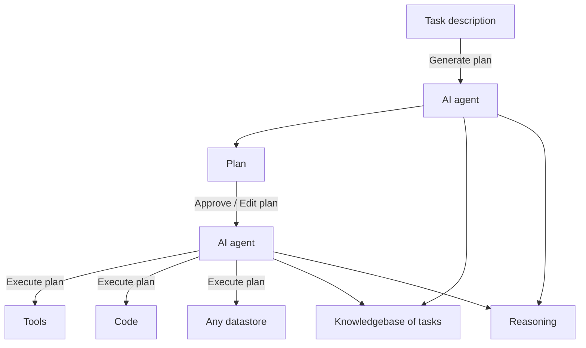

```mermaid
graph TD
    User[Task description <user>] -->|Generate plan| AI_Agent_1[AI agent]
    AI_Agent_1 --> Plan[Plan]
    Plan -->|Approve / Edit plan| AI_Agent_2[AI agent]
    AI_Agent_2 -->|Execute plan| Tools[Tools]
    AI_Agent_2 -->|Execute plan| Code[Code]
    AI_Agent_2 -->|Execute plan| Datastore[Any datastore]
    
    AI_Agent_1 --> Knowledgebase[Knowledgebase of tasks]
    AI_Agent_1 --> Reasoning[Reasoning]
    AI_Agent_2 --> Knowledgebase
    AI_Agent_2 --> Reasoning
```
