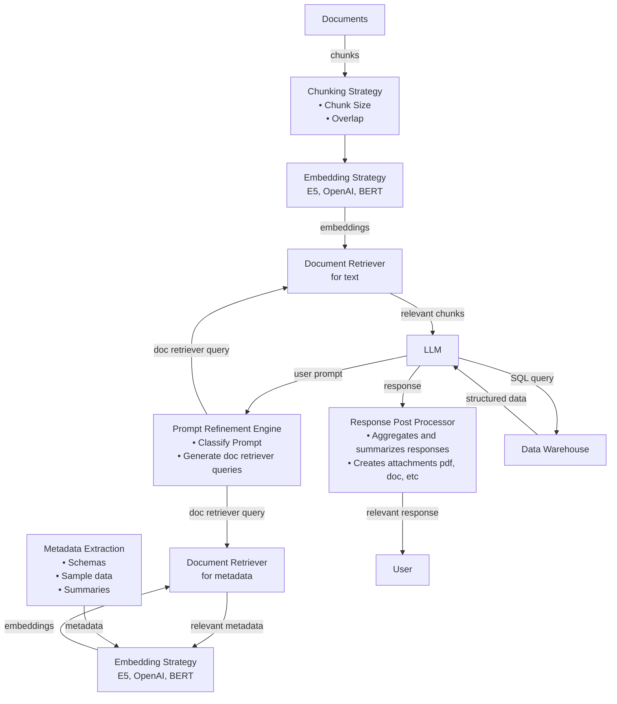

```mermaid
graph TD
    Documents[Documents] -->|chunks| ChunkingStrategy[Chunking Strategy<br>• Chunk Size<br>• Overlap]
    ChunkingStrategy --> EmbeddingStrategy1[Embedding Strategy<br>E5, OpenAI, BERT]
    EmbeddingStrategy1 -->|embeddings| DocumentRetrieverText[Document Retriever<br>for text]
    DocumentRetrieverText -->|relevant chunks| LLM[LLM]
    
    LLM -->|user prompt| PromptRefinementEngine[Prompt Refinement Engine<br>• Classify Prompt<br>• Generate doc retriever queries]
    PromptRefinementEngine -->|doc retriever query| DocumentRetrieverText
    PromptRefinementEngine -->|doc retriever query| DocumentRetrieverMetadata[Document Retriever<br>for metadata]
    DocumentRetrieverMetadata -->|relevant metadata| EmbeddingStrategy2[Embedding Strategy<br>E5, OpenAI, BERT]
    
    MetadataExtraction[Metadata Extraction<br>• Schemas<br>• Sample data<br>• Summaries] -->|metadata| EmbeddingStrategy2
    EmbeddingStrategy2 -->|embeddings| DocumentRetrieverMetadata
    
    LLM -->|response| ResponsePostProcessor[Response Post Processor<br>• Aggregates and summarizes responses<br>• Creates attachments pdf, doc, etc]
    ResponsePostProcessor -->|relevant response| User[User]
    
    DataWarehouse[Data Warehouse] -->|structured data| LLM
    LLM -->|SQL query| DataWarehouse
```
