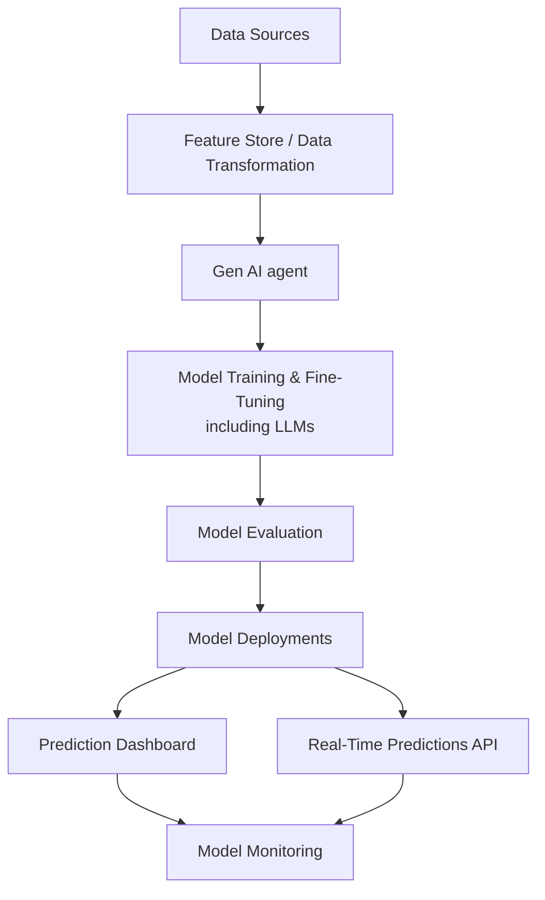

```mermaid
graph TD
    DataSources[Data Sources] --> FeatureStore[Feature Store / Data Transformation]
    FeatureStore --> GenAIAgent[Gen AI agent]
    GenAIAgent --> ModelTraining[Model Training & Fine-Tuning<br>including LLMs]
    ModelTraining --> ModelEvaluation[Model Evaluation]
    ModelEvaluation --> ModelDeployments[Model Deployments]

    ModelDeployments --> PredictionDashboard[Prediction Dashboard]
    ModelDeployments --> RealTimeAPI[Real-Time Predictions API]

    PredictionDashboard --> ModelMonitoring[Model Monitoring]
    RealTimeAPI --> ModelMonitoring
```
