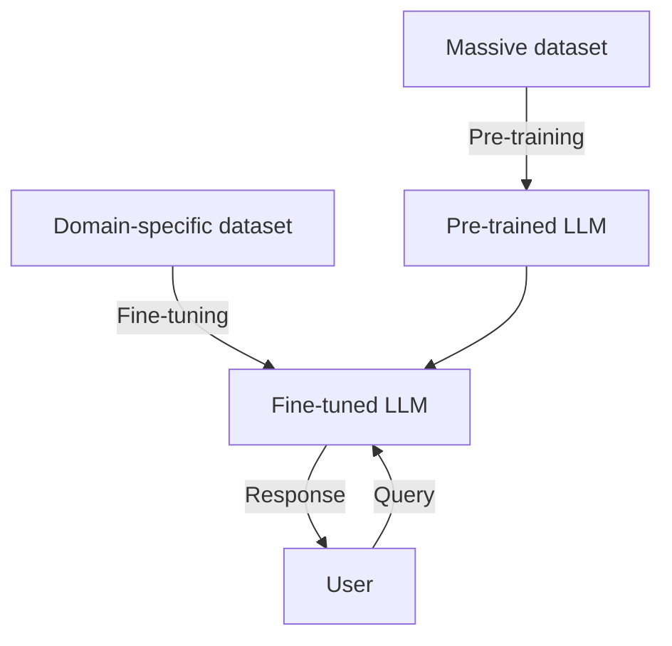

# 🎯 LLM Fine-Tuning Workflow


## Overview

This diagram illustrates the **two-stage training process** for creating domain-specific Large Language Models (LLMs). It shows how a base model is pre-trained on massive datasets and then fine-tuned for specialized tasks.

## Architecture Diagram



## Training Stages

### Stage 1: Pre-Training

**Purpose**: Build general language understanding and knowledge

**Data Requirements**:
- **Scale**: 100GB to multiple TB of text
- **Sources**: Web crawls (Common Crawl), books, Wikipedia, code repositories
- **Diversity**: Multiple domains, languages, and formats
- **Quality**: Filtered for toxicity, duplicates, and low-quality content

**Process**:
- **Objective**: Next-token prediction (causal language modeling)
- **Duration**: Weeks to months on GPU clusters
- **Compute**: 1000s of GPU-hours (A100, H100)
- **Parameters**: Billions to trillions of parameters
- **Cost**: $1M - $100M+ depending on scale

**Output**: Pre-trained LLM with broad capabilities but no specialization

### Stage 2: Fine-Tuning

**Purpose**: Adapt model to specific domain or task

**Data Requirements**:
- **Scale**: 1K to 100K high-quality examples
- **Sources**: Domain-specific corpus (medical, legal, code, etc.)
- **Format**: Instruction-response pairs, conversational data, or domain text
- **Quality**: Manually curated or filtered for domain relevance

**Process**:
- **Objective**: Supervised fine-tuning (SFT) on task-specific data
- **Duration**: Hours to days
- **Compute**: 10s to 100s of GPU-hours
- **Parameters**: Update all or subset (LoRA, QLoRA)
- **Cost**: $100 - $10K depending on data and model size

**Output**: Fine-tuned LLM specialized for target domain

## Fine-Tuning Methods

### Full Fine-Tuning
```
Pre-trained Model (all parameters)
        ↓
Update ALL parameters
        ↓
Fine-tuned Model
```
- **Pros**: Maximum performance
- **Cons**: Expensive, risk of catastrophic forgetting

### LoRA (Low-Rank Adaptation)
```
Pre-trained Model (frozen)
        ↓
Train low-rank adapters (~1% params)
        ↓
Fine-tuned Model (base + adapters)
```
- **Pros**: Parameter efficient, fast, low memory
- **Cons**: Slightly lower performance than full FT

### QLoRA (Quantized LoRA)
```
Pre-trained Model (4-bit quantized)
        ↓
Train LoRA adapters
        ↓
Fine-tuned Model (quantized + adapters)
```
- **Pros**: Runs on consumer GPUs (e.g., 24GB VRAM)
- **Cons**: Slower training than full precision

## Use Cases

### Medical Domain
- **Pre-training**: General medical knowledge from PubMed, textbooks
- **Fine-tuning**: Clinical notes, treatment protocols, drug interactions
- **Result**: Medical assistant for diagnosis support

### Legal Domain
- **Pre-training**: Case law, legal documents, statutes
- **Fine-tuning**: Contract analysis, legal research queries
- **Result**: Legal research assistant

### Code Generation
- **Pre-training**: GitHub, Stack Overflow, documentation
- **Fine-tuning**: Company codebase, coding standards
- **Result**: Code completion for internal frameworks

### Customer Support
- **Pre-training**: General conversational data
- **Fine-tuning**: Product FAQs, support tickets, knowledge base
- **Result**: Automated customer support chatbot

## Fine-Tuning Workflow

```
1. Data Collection
   └─> Gather domain-specific data (text, Q&A, instructions)

2. Data Preparation
   └─> Clean, format, split (train/val/test)

3. Base Model Selection
   └─> Choose pre-trained model (Llama, Mistral, GPT)

4. Training Configuration
   └─> Set hyperparameters (LR, batch size, epochs)

5. Fine-Tuning
   └─> Run training with validation monitoring

6. Evaluation
   └─> Test on held-out set, domain-specific benchmarks

7. Deployment
   └─> Serve model via API or local inference
```

## Key Considerations

### Data Quality
✅ **High-Quality Examples**: Better than large low-quality datasets
✅ **Diversity**: Cover edge cases and variations
✅ **Format Consistency**: Standardize instruction format
✅ **Deduplication**: Remove duplicates to prevent overfitting

### Training Hyperparameters
- **Learning Rate**: 1e-5 to 5e-5 (lower than pre-training)
- **Batch Size**: 4-32 depending on GPU memory
- **Epochs**: 1-5 (watch for overfitting)
- **Warmup Steps**: 10% of total steps
- **Weight Decay**: 0.01-0.1 for regularization

### Evaluation Metrics
- **Perplexity**: Lower is better (language modeling)
- **Task Accuracy**: Domain-specific benchmarks
- **Human Evaluation**: Quality, relevance, safety
- **Held-Out Performance**: Generalization test

### Preventing Overfitting
- **Early Stopping**: Monitor validation loss
- **Regularization**: Dropout, weight decay
- **Data Augmentation**: Paraphrase, back-translation
- **Curriculum Learning**: Start with easier examples

## Technology Stack

### Training Frameworks
- **Hugging Face Transformers**: Most popular, extensive model support
- **PyTorch FSDP**: Fully Sharded Data Parallel for large models
- **DeepSpeed**: Microsoft's optimization library
- **Axolotl**: Fine-tuning tool with LoRA/QLoRA support

### Recommended Models for Fine-Tuning
| Model | Parameters | License | Best For |
|-------|------------|---------|----------|
| **Llama 3** | 8B-70B | Open | General purpose |
| **Mistral** | 7B-8x7B | Apache 2.0 | Efficient inference |
| **Qwen** | 7B-72B | Apache 2.0 | Multilingual |
| **Phi-3** | 3.8B | MIT | On-device |

### Infrastructure
- **GPU**: A100, H100 for large models; RTX 4090 for QLoRA
- **Storage**: SSD for fast data loading
- **Memory**: 80GB+ for full fine-tuning; 24GB+ for QLoRA

## Cost Estimation

| Model Size | Method | GPU | Duration | Cost (AWS) |
|------------|--------|-----|----------|------------|
| **7B** | QLoRA | 1x A10G | 4 hours | ~$5 |
| **13B** | LoRA | 1x A100 | 8 hours | ~$30 |
| **70B** | LoRA | 4x A100 | 24 hours | ~$400 |
| **70B** | Full FT | 8x A100 | 48 hours | ~$1,600 |

## Best Practices

1. **Start Small**: Begin with LoRA/QLoRA before full fine-tuning
2. **Data Quality > Quantity**: 1K high-quality examples beat 100K poor ones
3. **Monitor Validation**: Early stopping prevents overfitting
4. **Experiment Tracking**: Use Weights & Biases or MLflow
5. **Version Control**: Track data, code, and model versions
6. **Safety Filtering**: Test for harmful outputs before deployment

## Related Patterns

- [LLM Ops](./llm_ops.md) - Production deployment of fine-tuned models
- [Whole Enchilada AI](./whole_enchilada_ai.md) - Complete AI system integration
- [Agents](./agents.md) - Fine-tuned models in agent systems

## Further Reading

- [Hugging Face Fine-Tuning Guide](https://huggingface.co/docs/transformers/training)
- [LoRA Paper](https://arxiv.org/abs/2106.09685)
- [QLoRA Paper](https://arxiv.org/abs/2305.14314)
- [Axolotl GitHub](https://github.com/OpenAccess-AI-Collective/axolotl)

---

**[🔙 Back to ABACUS](./README.md)** | **[🏠 Main README](../README.md)**
