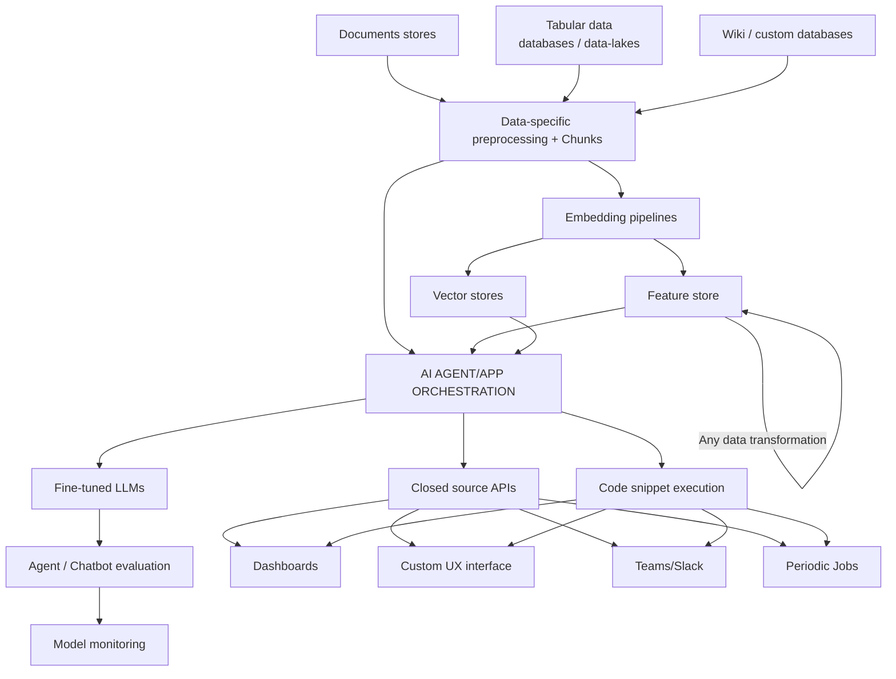

```mermaid
graph TD
    Documents[Documents stores] --> DataPreprocessing[Data-specific preprocessing + Chunks]
    TabularData[Tabular data<br>databases / data-lakes] --> DataPreprocessing
    Wiki[Wiki / custom databases] --> DataPreprocessing
    
    DataPreprocessing --> EmbeddingPipelines[Embedding pipelines]
    EmbeddingPipelines --> VectorStores[Vector stores]
    EmbeddingPipelines --> FeatureStore[Feature store]
    
    FeatureStore -->|Any data transformation| FeatureStore
    
    AI_Orchestration[AI AGENT/APP ORCHESTRATION]
    AI_Orchestration --> FineTunedLLMs[Fine-tuned LLMs]
    AI_Orchestration --> ClosedAPIs[Closed source APIs]
    AI_Orchestration --> CodeExecution[Code snippet execution]
    
    FineTunedLLMs --> AgentEvaluation[Agent / Chatbot evaluation]
    AgentEvaluation --> ModelMonitoring[Model monitoring]
    
    ClosedAPIs --> Dashboards[Dashboards]
    ClosedAPIs --> CustomUX[Custom UX interface]
    ClosedAPIs --> TeamsSlack[Teams/Slack]
    ClosedAPIs --> PeriodicJobs[Periodic Jobs]
    
    CodeExecution --> Dashboards
    CodeExecution --> CustomUX
    CodeExecution --> TeamsSlack
    CodeExecution --> PeriodicJobs
    
    DataPreprocessing --> AI_Orchestration
    FeatureStore --> AI_Orchestration
    VectorStores --> AI_Orchestration
```
