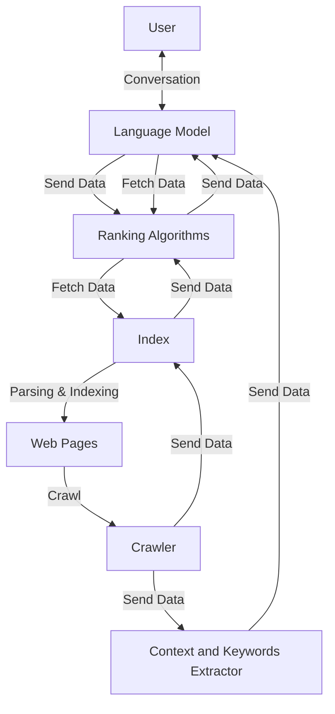

# 📊 State-of-the-Art RAG System


## Overview

This diagram illustrates a **Retrieval-Augmented Generation (RAG)** system architecture that combines web crawling, intelligent indexing, and language model capabilities to provide context-aware responses based on retrieved information.

## Architecture Diagram



## Component Description

### Language Model (LLM)
- **Role**: Generate responses based on retrieved context
- **Capabilities**:
  - Natural language understanding
  - Context integration
  - Response generation
  - Query formulation for retrieval
- **Bidirectional**: Receives user input and augments with retrieved data

### Crawler
- **Role**: Web content acquisition
- **Functions**:
  - Discovers and fetches web pages
  - Extracts raw content
  - Feeds data to both index and keyword extractor
- **Technologies**: Scrapy, Beautiful Soup, Selenium

### Context and Keywords Extractor
- **Role**: Semantic understanding of crawled content
- **Capabilities**:
  - Named Entity Recognition (NER)
  - Keyword extraction
  - Topic modeling
  - Context summarization
- **Output**: Enriched metadata for language model

### Index
- **Role**: Structured storage of crawled content
- **Features**:
  - Full-text search capabilities
  - Metadata storage
  - Fast retrieval
  - Incremental updates
- **Technologies**: Elasticsearch, OpenSearch, Solr

### Ranking Algorithms
- **Role**: Relevance scoring and result ordering
- **Methods**:
  - BM25 for keyword matching
  - Semantic similarity (embeddings)
  - Hybrid ranking (keyword + semantic)
  - Re-ranking with cross-encoders
- **Output**: Ordered list of relevant documents

## Data Flow

### Indexing Pipeline (Offline)
1. **Crawl**: Crawler discovers and fetches web pages
2. **Extract**: Keywords and context extracted from content
3. **Index**: Parsed content stored in searchable index
4. **Enrich**: Metadata and context added to index

### Query Pipeline (Online)
1. **User Query**: User submits question/request
2. **LLM Processing**: Language model formulates retrieval query
3. **Ranking**: Algorithms fetch and rank relevant documents
4. **Context Integration**: LLM augments response with retrieved data
5. **Response**: User receives context-aware answer

## RAG Workflow

```
User Question
    ↓
Language Model (query formulation)
    ↓
Ranking Algorithms (semantic + keyword search)
    ↓
Index (retrieve top-k documents)
    ↓
Language Model (generate answer with context)
    ↓
Response to User
```

## Use Cases

### Knowledge Base Q&A
- **Example**: "What are the latest security features?"
- **Flow**: Retrieves recent documentation, generates comprehensive answer

### Research Assistant
- **Example**: "Summarize papers on transformer architectures"
- **Flow**: Crawls academic sources, extracts key findings, synthesizes summary

### Enterprise Search
- **Example**: "Find all customer complaints about product X"
- **Flow**: Searches internal docs, ranks by relevance, provides categorized results

### Real-time Information
- **Example**: "What's the current status of project Y?"
- **Flow**: Fetches latest updates, combines context, delivers current state

## Key Features

✅ **Hybrid Retrieval**: Combines keyword and semantic search
✅ **Context-Aware**: Extracts and uses contextual information
✅ **Scalable**: Handles large document collections
✅ **Fresh Data**: Continuous crawling for up-to-date information
✅ **Explainable**: Can cite sources from index

## Implementation Considerations

### Crawler Configuration
- **Politeness**: Respect robots.txt, rate limiting
- **Deduplication**: Avoid indexing duplicate content
- **Recrawl Strategy**: Balance freshness vs. load

### Embedding Strategy
- **Models**: E5, OpenAI Ada, BERT, Sentence Transformers
- **Dimensionality**: 384-1536 dimensions based on model
- **Update Frequency**: Batch or streaming updates

### Ranking Optimization
- **Hybrid Search**: α·BM25 + (1-α)·Semantic
- **Re-ranking**: Use cross-encoder for top-k refinement
- **Personalization**: User history and preferences

### Scaling Strategies
- **Distributed Index**: Shard across multiple nodes
- **Caching**: Cache frequent queries
- **Async Crawling**: Parallel crawler workers

## Performance Metrics

| Metric | Target | Measurement |
|--------|--------|-------------|
| **Retrieval Latency** | <100ms | Time to fetch top-k docs |
| **Relevance** | >0.8 NDCG | Ranking quality |
| **Freshness** | <24h | Time since last crawl |
| **Coverage** | >95% | Indexed vs. total docs |

## Technology Stack

### Recommended Components
- **LLM**: GPT-4, Claude, Llama 2/3
- **Embeddings**: OpenAI Ada-002, E5-large, BGE
- **Index**: Elasticsearch, Qdrant, Weaviate
- **Crawler**: Scrapy, Playwright
- **Keyword Extraction**: spaCy, YAKE, KeyBERT

## Related Patterns

- [Whole Enchilada AI](./whole_enchilada_ai.md) - Complete RAG integration
- [LLM Ops](./llm_ops.md) - Production deployment
- [Agents](./agents.md) - Agent-based RAG systems

## Further Reading

- [RAG Survey Paper](https://arxiv.org/abs/2312.10997)
- [Pinecone RAG Guide](https://www.pinecone.io/learn/retrieval-augmented-generation/)
- [LangChain RAG](https://python.langchain.com/docs/use_cases/question_answering/)

---

**[🔙 Back to ABACUS](./README.md)** | **[🏠 Main README](../README.md)**
