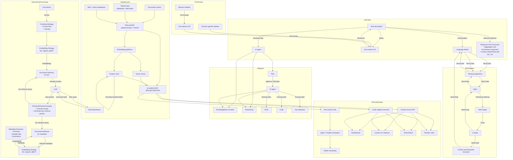

```mermaid
graph TD
    subgraph UserTask
        User[User] -->|Conversation| LanguageModel[Language Model]
        User[User] -->|Query| FineTunedLLM[Fine-tuned LLM]
        User[Task description <user>] -->|Generate plan| AI_Agent_1[AI agent]
        User -->|relevant response| ResponsePostProcessor[Response Post Processor<br>• Aggregates and summarizes responses<br>• Creates attachments pdf, doc, etc]
    end

    subgraph AIAgents
        AI_Agent_1 --> Plan[Plan]
        AI_Agent_1 --> Knowledgebase[Knowledgebase of tasks]
        AI_Agent_1 --> Reasoning[Reasoning]
        Plan -->|Approve / Edit plan| AI_Agent_2[AI agent]
        AI_Agent_2 -->|Execute plan| Tools[Tools]
        AI_Agent_2 -->|Execute plan| Code[Code]
        AI_Agent_2 -->|Execute plan| Datastore[Any datastore]
        AI_Agent_2 --> Knowledgebase
        AI_Agent_2 --> Reasoning
    end

    subgraph DocumentsProcessing
        Documents[Documents] -->|chunks| ChunkingStrategy[Chunking Strategy<br>• Chunk Size<br>• Overlap]
        ChunkingStrategy --> EmbeddingStrategy1[Embedding Strategy<br>E5, OpenAI, BERT]
        EmbeddingStrategy1 -->|embeddings| DocumentRetrieverText[Document Retriever<br>for text]
        DocumentRetrieverText -->|relevant chunks| LLM[LLM]
        LLM -->|user prompt| PromptRefinementEngine[Prompt Refinement Engine<br>• Classify Prompt<br>• Generate doc retriever queries]
        PromptRefinementEngine -->|doc retriever query| DocumentRetrieverText
        PromptRefinementEngine -->|doc retriever query| DocumentRetrieverMetadata[Document Retriever<br>for metadata]
        DocumentRetrieverMetadata -->|relevant metadata| EmbeddingStrategy2[Embedding Strategy<br>E5, OpenAI, BERT]
        MetadataExtraction[Metadata Extraction<br>• Schemas<br>• Sample data<br>• Summaries] -->|metadata| EmbeddingStrategy2
        EmbeddingStrategy2 -->|embeddings| DocumentRetrieverMetadata
    end

    subgraph DataSources
        DataWarehouse[Data Warehouse] -->|structured data| LLM
        LLM -->|SQL query| DataWarehouse
        DocumentsStores[Documents stores] --> DataPreprocessing[Data-specific preprocessing + Chunks]
        TabularData[Tabular data<br>databases / data-lakes] --> DataPreprocessing
        Wiki[Wiki / custom databases] --> DataPreprocessing
        DataPreprocessing --> EmbeddingPipelines[Embedding pipelines]
        EmbeddingPipelines --> VectorStores[Vector stores]
        EmbeddingPipelines --> FeatureStore[Feature store]
        FeatureStore -->|Any data transformation| FeatureStore
        DataPreprocessing --> AI_Orchestration[AI AGENT/APP ORCHESTRATION]
        FeatureStore --> AI_Orchestration
        VectorStores --> AI_Orchestration
    end

    subgraph AIOrchestration
        AI_Orchestration --> FineTunedLLMs[Fine-tuned LLMs]
        AI_Orchestration --> ClosedAPIs[Closed source APIs]
        AI_Orchestration --> CodeExecution[Code snippet execution]
        FineTunedLLMs --> AgentEvaluation[Agent / Chatbot evaluation]
        AgentEvaluation --> ModelMonitoring[Model monitoring]
        ClosedAPIs --> Dashboards[Dashboards]
        ClosedAPIs --> CustomUX[Custom UX interface]
        ClosedAPIs --> TeamsSlack[Teams/Slack]
        ClosedAPIs --> PeriodicJobs[Periodic Jobs]
        CodeExecution --> Dashboards
        CodeExecution --> CustomUX
        CodeExecution --> TeamsSlack
        CodeExecution --> PeriodicJobs
    end

    subgraph RAGSystem
        LanguageModel -->|Send Data| RankingAlgorithms[Ranking Algorithms]
        RankingAlgorithms -->|Fetch Data| Index
        Index -->|Send Data| RankingAlgorithms
        Index -->|Parsing & Indexing| WebPages[Web Pages]
        WebPages -->|Crawl| Crawler
        Crawler -->|Send Data| ContextKeywords[Context and Keywords Extractor]
        ContextKeywords -->|Send Data| LanguageModel
        Crawler -->|Send Data| Index
        LanguageModel -->|Fetch Data| RankingAlgorithms
        RankingAlgorithms -->|Send Data| LanguageModel
    end

    subgraph FineTuning
        MassiveDataset[Massive dataset] -->|Pre-training| PreTrainedLLM[Pre-trained LLM]
        DomainSpecificDataset[Domain-specific dataset] -->|Fine-tuning| FineTunedLLM
        PreTrainedLLM --> FineTunedLLM
        FineTunedLLM -->|Response| User
    end
```
