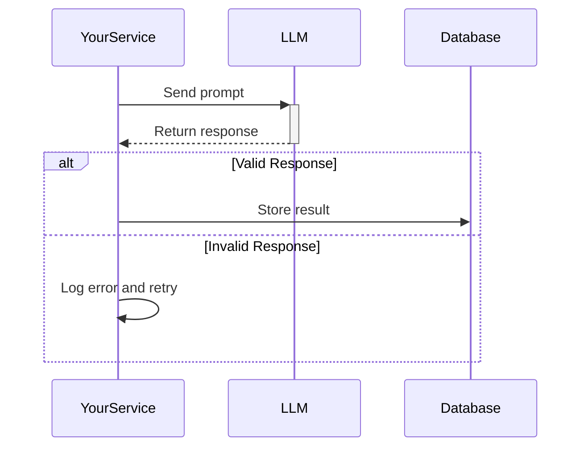
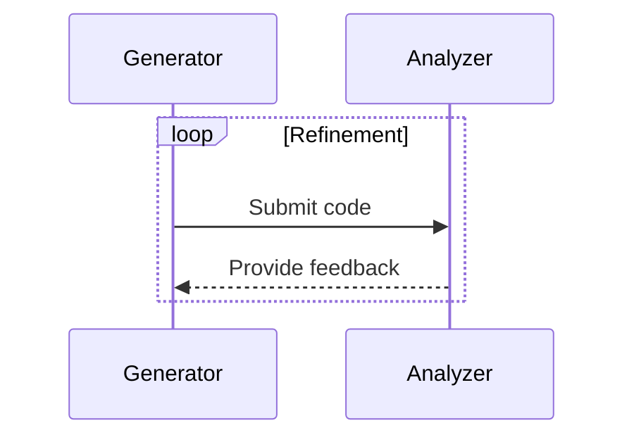
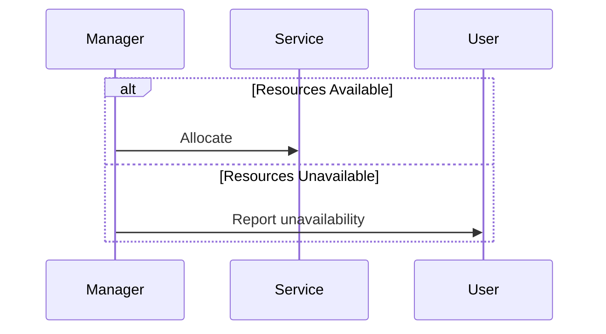
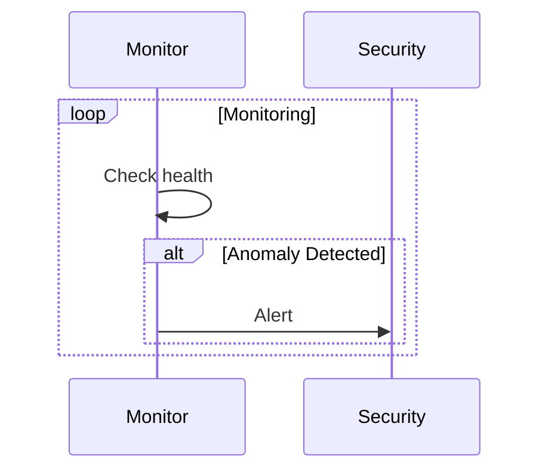

# 📐 GRYPHGEN Sequence Diagrams Collection

<div align="center">


**Interactive Multi-LLM Workflow Patterns**

Comprehensive collection of sequence diagrams documenting GRYPHGEN's multi-agent interactions

[🔙 Back to Main](../README.md)

</div>

---

## 📑 Table of Contents

- [Overview](#overview)
- [Diagram Index](#diagram-index)
- [Key Components](#key-components)
- [Pattern Categories](#pattern-categories)
- [Usage Guide](#usage-guide)
- [Quick Reference Table](#quick-reference-table)

---

## 🎯 Overview

This collection contains **19 sequence diagrams** illustrating the interaction patterns between multiple Large Language Models (LLMs) and system components in the GRYPHGEN architecture. Each diagram represents a specific workflow pattern from simple interactions to complex multi-agent orchestration.

### What's Included

- ✅ **Multi-Agent Collaboration**: LLM A, B, C, D working together
- ✅ **Code Generation Workflows**: From generation to deployment
- ✅ **Task Orchestration**: Resource allocation and task management
- ✅ **Quality Assurance**: Analysis, refinement, and alignment checking
- ✅ **Deployment Patterns**: Build, test, and production deployment
- ✅ **Security & Monitoring**: Continuous health monitoring and incident response

---

## 📊 Diagram Index

### Basic Patterns (1-5)

#### `input.mmd` - Core Four-Agent Workflow
**Participants**: A, B, C, D, Target_Server

The foundational GRYPHGEN pattern showing:
- Code generation by Agent A
- Analysis and feedback by Agent B
- Output monitoring by Agent C
- Process optimization by Agent D

**Use Case**: Basic multi-agent software development

---

#### `input2.mmd` - Extended Workflow
**Complexity**: ⭐⭐

Enhanced version with additional coordination patterns.

---

#### `input3.mmd` - Variant Pattern
**Complexity**: ⭐⭐

Alternative workflow for specific use cases.

---

#### `input4.mmd` - Specialized Interaction
**Complexity**: ⭐⭐

Focused on specific agent interactions.

---

#### `input5.mmd` - Optimized Flow
**Complexity**: ⭐⭐

Streamlined pattern for efficiency.

---

### Intermediate Patterns (6-10)

#### `input6.mmd` - Event-Driven Architecture
**Complexity**: ⭐⭐⭐

Introduces event-driven patterns with SYMORQ/SYMORG/SYMAUG components.

**Key Features**:
- Event publishing and subscription
- Message queue integration
- Containerized microservices
- Resource allocation loops

---

#### `input7.mmd` - Advanced Orchestration
**Complexity**: ⭐⭐⭐

Complex multi-component orchestration.

---

#### `input8.mmd` - Parallel Processing
**Complexity**: ⭐⭐⭐

Demonstrates concurrent agent operations.

---

#### `input9.mmd` - Error Handling Pattern
**Complexity**: ⭐⭐⭐

Focus on error detection and recovery.

---

#### `input10.mmd` - Complete User Workflow
**Complexity**: ⭐⭐⭐⭐

**Participants**: User, Web_Interface, LLMD, CCDE, LLMA, LLMB, DSS, ALM, SIM, Knowledge_Base, Target_Server

Comprehensive workflow including:
- User task submission via web interface
- Resource management (LLMD)
- Code generation and refinement loops
- Task alignment verification (DSS)
- Build and deployment pipeline
- Adaptive learning mechanism (ALM)
- Security incident management (SIM)
- Continuous monitoring

**Use Case**: Production-ready development pipeline with full lifecycle management

---

### Advanced Patterns (11-15)

#### `input11.mmd` - Distributed System Pattern
**Complexity**: ⭐⭐⭐⭐

Multi-node distributed processing.

---

#### `input12.mmd` - Failover & Recovery
**Complexity**: ⭐⭐⭐⭐

High-availability patterns with automatic recovery.

---

#### `input13.mmd` - State Management
**Complexity**: ⭐⭐⭐⭐

Complex state tracking across agents.

---

#### `input14.mmd` - Simple Deployment
**Complexity**: ⭐⭐

Streamlined deployment workflow.

---

#### `input15.mmd` - Code Refinement Loop
**Complexity**: ⭐⭐⭐

**Participants**: CCDE, LLMA, LLMB, Target_Server, Knowledge_Base

Focused workflow showing:
- Prompt engineering for code generation
- Knowledge base retrieval
- Iterative code refinement
- Analysis and feedback cycle
- Build environment testing
- Production deployment decision

**Use Case**: Continuous code improvement with quality gates

---

### Expert Patterns (16-19)

#### `input16.mmd` - Microservices Architecture
**Complexity**: ⭐⭐⭐⭐⭐

Complete microservices interaction pattern.

---

#### `input17.mmd` - Enterprise Integration
**Complexity**: ⭐⭐⭐⭐⭐

Large-scale enterprise system integration.

---

#### `input18.mmd` - Advanced Security
**Complexity**: ⭐⭐⭐⭐

Security-focused workflow with compliance.

---

#### `input19.mmd` - Complete System Architecture
**Complexity**: ⭐⭐⭐⭐⭐

Most comprehensive diagram showing full system integration.

---

## 🔧 Key Components

### LLM Agents

| Component | Role | Capabilities |
|-----------|------|--------------|
| **LLMA** | Code Generator | Generates code from prompts, retrieves context from knowledge base |
| **LLMB** | Code Analyzer | Analyzes code quality, identifies errors, provides feedback |
| **LLMC** | Task Monitor | Monitors alignment with project parameters, ensures deliverables |
| **LLMD** | Workflow Optimizer | Manages resources, optimizes processes, handles checkpoints |

### Supporting Systems

| Component | Description |
|-----------|-------------|
| **CCDE** | Code Creation and Deployment Engine - orchestrates generation and deployment |
| **DSS** | Decision Support System - validates task alignment |
| **ALM** | Adaptive Learning Module - updates models based on feedback |
| **SIM** | Security Incident Manager - monitors and mitigates threats |
| **SYMORQ** | Message queue for event-driven communication |
| **SYMORG** | RAG constructor and orchestrator |
| **SYMAUG** | Containerized microservice manager |

---

## 🎨 Pattern Categories

### By Workflow Type

#### 1. Code Generation Workflows
Files: `input.mmd`, `input15.mmd`
- Code generation and refinement
- Quality assurance loops
- Deployment pipelines

#### 2. Event-Driven Patterns
Files: `input6.mmd`, `input7.mmd`
- Message queue integration
- Event publishing/subscription
- Asynchronous processing

#### 3. Resource Management
Files: `input10.mmd`
- Resource allocation
- Task scheduling
- Load balancing

#### 4. Security & Monitoring
Files: `input10.mmd`, `input18.mmd`
- Continuous monitoring
- Anomaly detection
- Incident response

#### 5. Learning & Adaptation
Files: `input10.mmd`
- Knowledge base updates
- Model improvement
- Feedback integration

---

## 💡 Usage Guide

### Selecting the Right Diagram

**Starting a new project?**
→ Use `input.mmd` or `input15.mmd` for basic patterns

**Need event-driven architecture?**
→ Check `input6.mmd` for message queue patterns

**Building production system?**
→ Explore `input10.mmd` for complete workflow

**Implementing security?**
→ Review `input18.mmd` for security patterns

### Customizing Diagrams

1. **Replace Participants**: Use your actual service names
2. **Adjust Loops**: Modify iteration logic for your needs
3. **Add Error Handling**: Insert `alt/else` blocks for edge cases
4. **Include Logging**: Add monitoring points throughout

### Example Customization



---

## 📋 Quick Reference Table

| File | Complexity | Participants | Key Feature | Best For |
|------|------------|--------------|-------------|----------|
| `input.mmd` | ⭐⭐ | 4 | Core workflow | Getting started |
| `input6.mmd` | ⭐⭐⭐ | 8 | Event-driven | Message queues |
| `input10.mmd` | ⭐⭐⭐⭐ | 11 | Complete pipeline | Production systems |
| `input15.mmd` | ⭐⭐⭐ | 5 | Code refinement | Quality assurance |
| `input17.mmd` | ⭐⭐⭐⭐⭐ | Many | Enterprise | Large systems |

**Complexity Legend**:
- ⭐ = 1-3 participants, simple flow
- ⭐⭐ = 4-5 participants, basic loops
- ⭐⭐⭐ = 6-8 participants, multiple loops
- ⭐⭐⭐⭐ = 9-11 participants, complex logic
- ⭐⭐⭐⭐⭐ = 12+ participants, enterprise-scale

---

## 🔍 Common Patterns

### Pattern: Code Generation Loop

Found in: `input.mmd`, `input10.mmd`, `input15.mmd`



### Pattern: Resource Allocation

Found in: `input10.mmd`



### Pattern: Continuous Monitoring

Found in: `input10.mmd`



---

## 🚀 Integration Examples

### Example 1: Basic Integration

```markdown
Use `input.mmd` as foundation
↓
Add resource management from `input10.mmd`
↓
Integrate event system from `input6.mmd`
```

### Example 2: Production Pipeline

```markdown
User submission (input10.mmd)
↓
Code refinement (input15.mmd)
↓
Security checks (input18.mmd)
↓
Deployment (input.mmd)
```

---

## 📚 Additional Resources

### Related Documentation
- [Main Mermaid Collection](../README.md)
- [ABACUS AI Patterns](../abacus/README.md)
- [Core Sequence Diagram](../seq_diagram.md)

### Tools & Utilities
- [Mermaid Live Editor](https://mermaid.live/) - Test and export diagrams
- [Mermaid CLI](https://github.com/mermaid-js/mermaid-cli) - Generate images
- [VS Code Mermaid Extension](https://marketplace.visualstudio.com/items?itemName=bierner.markdown-mermaid)

### Learning Resources
- [Mermaid Sequence Diagram Docs](https://mermaid.js.org/syntax/sequenceDiagram.html)
- [UML Sequence Diagrams](https://www.uml-diagrams.org/sequence-diagrams.html)

---

<div align="center">

**[⬆ Back to Top](#-gryphgen-sequence-diagrams-collection)** | **[🏠 Main README](../README.md)**

💡 **Pro Tip**: Start with simpler diagrams and progressively add complexity as needed

</div>
