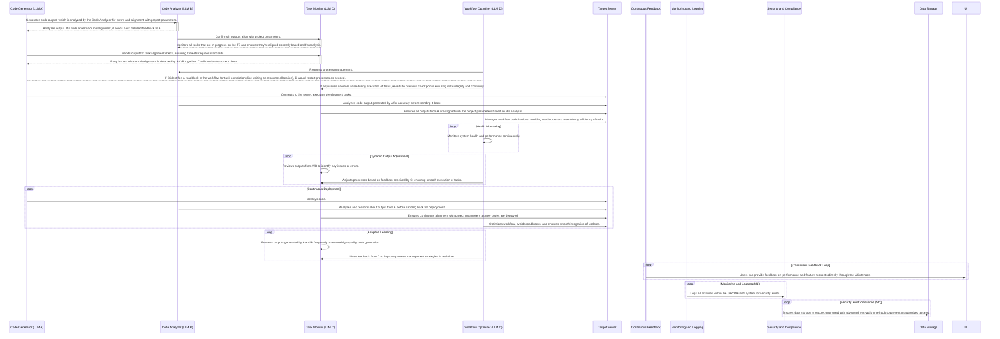

Here's a step-by-step software build process derived from Mermaid sequence diagram, designed to be implemented in a CI/CD pipeline:

**1. Initiation Phase (Triggered by User Action or Schedule)**

*   **User Interaction (Optional):** User submits a task or request via the UI (if applicable).
*   **Task Submitter Activation:** The Task Submitter (TS) component receives the request and initiates the build process.

**2. Code Generation and Analysis**

*   **LLM A (Code Generator):** Generates the initial code output based on the task requirements.
*   **LLM B (Code Analyzer):**
    *   Thoroughly analyzes the generated code.
    *   Checks for syntax errors, logical flaws, security vulnerabilities, and adherence to project coding standards and best practices.
    *   If errors or misalignments are found:
        *   Provides detailed feedback to LLM A.
        *   Potentially triggers a loop back to the code generation step for refinement.

**3. Task Alignment and Monitoring**

*   **LLM C (Task Monitor):**
    *   Receives the analyzed code from LLM B.
    *   Independently assesses the code's alignment with project parameters (requirements, specifications, etc.).
    *   Monitors the execution of the task on the Target Server (TS).
    *   If misalignment is detected:
        *   Flags the issue.
        *   Coordinates with LLM A and LLM B to initiate corrections.
        *   Continuously monitors the task until successful alignment is achieved.

**4. Workflow Optimization and Management**

*   **LLM D (Workflow Optimizer):**
    *   Actively observes the entire build process.
    *   Identifies bottlenecks, resource conflicts, or other potential roadblocks.
    *   If a roadblock is detected:
        *   Takes corrective action (e.g., reallocating resources, restarting processes).
        *   Communicates with other LLM components (A, B, C) to adjust their behavior as needed.
    *   Continuously optimizes the workflow for efficiency and reliability.

**5. Deployment and Execution on Target Server**

*   **Deployment:** LLM A sends the final, validated code to the Target Server (TS).
*   **Execution:** The code is executed on the TS.
*   **Monitoring:** LLM B and LLM C continue monitoring the code's execution on the TS, ensuring it functions as expected and remains aligned with project parameters.

**6. Continuous Improvement Loops**

*   **Health Monitoring:** LLM D continuously monitors the overall system health and performance metrics, making adjustments as necessary.
*   **Dynamic Output Adjustment:** LLM C and LLM D collaborate to review outputs and dynamically adjust processes for optimal results.
*   **Continuous Deployment:** The entire cycle (code generation, analysis, optimization, deployment) repeats as needed for continuous integration and delivery.
*   **Adaptive Learning:** LLM C and LLM D leverage feedback from the previous build cycles to refine their models and improve the overall code quality and process efficiency.
*   **Continuous Feedback Loop:** User feedback collected through the UI (if applicable) is incorporated to enhance future iterations of the software.

**7. Security and Compliance**

*   **Monitoring and Logging (ML):** Records detailed logs of all system activities for auditing and troubleshooting.
*   **Security and Compliance (SC):** 
    *   Regularly analyzes logs for potential security threats.
    *   Enforces compliance with relevant regulations and industry standards.
    *   Ensures that data storage (DS) is secure and encrypted.

**Additional Notes:**

*   **Orchestration:** A robust orchestration tool (e.g., Kubernetes) would be essential to manage the complex interactions between the various components.
*   **Error Handling:** Implement comprehensive error handling and rollback mechanisms throughout the pipeline to ensure system stability and data integrity.
*   **Testing:** Integrate automated testing at various stages to validate code quality and functionality.

Let me know if you'd like any part of this process explained in more detail or adapted to a specific CI/CD platform (e.g., Jenkins, GitLab CI/CD, CircleCI).
