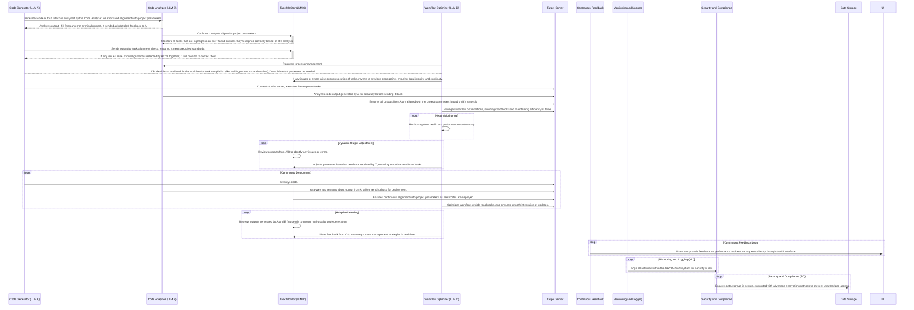

```mermaid
sequenceDiagram
    participant A as Code Generator (LLM A)
    participant B as Code Analyzer (LLM B)
    participant C as Task Monitor (LLM C)
    participant D as Workflow Optimizer (LLM D)
    participant TS as Target Server
    participant CF as Continuous Feedback
    participant ML as Monitoring and Logging
    participant SC as Security and Compliance
    participant DS as Data Storage

    A->>+B: Generates code output, which is analyzed by the Code Analyzer for errors and alignment with project parameters.
    B-->>-A: Analyzes output. If it finds an error or misalignment, it sends back detailed feedback to A.

    B->>+C: Confirms if outputs align with project parameters.
    C-->>-B: Monitors all tasks that are in progress on the TS and ensures they're aligned correctly based on B's analysis.
    
    A->>+C: Sends output for task alignment check, ensuring it meets required standards. 
    C-->>-A: If any issues arise or misalignment is detected by A/C/B together, C will monitor to correct them.

    D->>+B: Requests process management.
    D-->A: If B identifies a roadblock in the workflow for task completion (like waiting on resource allocation), D would restart processes as needed.
    
    D->>C: If any issues or errors arise during execution of tasks, reverts to previous checkpoints ensuring data integrity and continuity.  
   
    A->>+TS: Connects to the server, executes development tasks.
    B->>+TS: Analyzes code output generated by A for accuracy before sending it back.
    
    C->>+TS: Ensures all outputs from A are aligned with the project parameters based on B's analysis. 
   
    D->>+TS: Manages workflow optimizations, avoiding roadblocks and maintaining efficiency of tasks.

    loop Health Monitoring
        D->>D: Monitors system health and performance continuously.
    end

    loop Dynamic Output Adjustment
        C->>C: Reviews outputs from A/B to identify any issues or errors. 
        D->>C: Adjusts processes based on feedback received by C, ensuring smooth execution of tasks.
    end

    loop Continuous Deployment
        A->>TS: Deploys code.
        B->>TS: Analyzes and reasons about output from A before sending back for deployment.
        C->>TS: Ensures continuous alignment with project parameters as new codes are deployed. 
        D->>TS: Optimizes workflow, avoids roadblocks, and ensures smooth integration of updates.
    end

    loop Adaptive Learning
        C->>C: Reviews outputs generated by A and B frequently to ensure high-quality code generation.
        D->>C: Uses feedback from C to improve process management strategies in real-time. 
    end

    loop Continuous Feedback Loop
        CF->>+UI: Users can provide feedback on performance and feature requests directly through the UI interface.
    end
    
    loop Monitoring and Logging (ML)
        ML->>SC: Logs all activities within the GRYPHGEN system for security audits.
    end
   
    loop Security and Compliance (SC) 
        SC->>DS: Ensures data storage is secure, encrypted with advanced encryption methods to prevent unauthorized access.
    end
```
