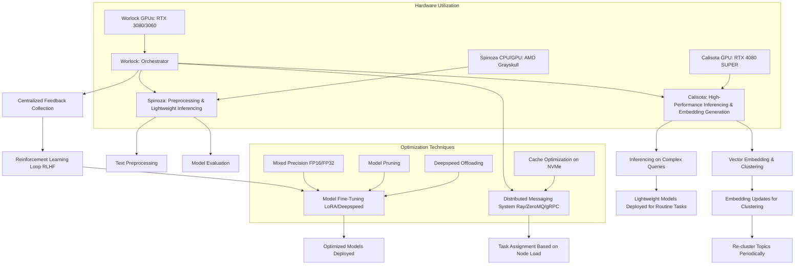

```mermaid
graph TD
    A[Worlock: Orchestrator] --> B[Spinoza: Preprocessing & Lightweight Inferencing]
    A --> C[Calisota: High-Performance Inferencing & Embedding Generation]
    A --> D[Distributed Messaging System Ray/ZeroMQ/gRPC]
    B --> E[Text Preprocessing]
    B --> F[Model Evaluation]
    C --> G[Inferencing on Complex Queries]
    C --> H[Vector Embedding & Clustering]
    D --> I[Task Assignment Based on Node Load]
    A --> J[Centralized Feedback Collection]
    J --> K[Reinforcement Learning Loop RLHF]
    K --> L[Model Fine-Tuning LoRA/Deepspeed]
    L --> M[Optimized Models Deployed]
    G --> N[Lightweight Models Deployed for Routine Tasks]
    H --> O[Embedding Updates for Clustering]
    O --> P[Re-cluster Topics Periodically]
    subgraph "Hardware Utilization"
        A1[Worlock GPUs: RTX 3080/3060]
        B1[Spinoza CPU/GPU: AMD Grayskull]
        C1[Calisota GPU: RTX 4080 SUPER]
        A1 --> A
        B1 --> B
        C1 --> C
    end
    subgraph "Optimization Techniques"
        Q[Mixed Precision FP16/FP32]
        R[Model Pruning]
        S[Cache Optimization on NVMe]
        T[Deepspeed Offloading]
        Q --> L
        R --> L
        S --> D
        T --> L
    end
```
