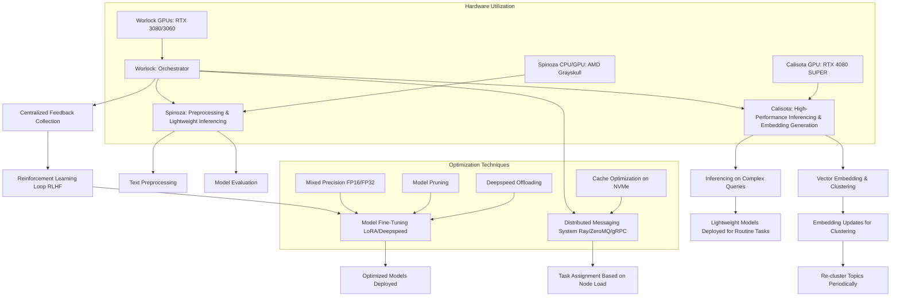

To build a minimally viable, self-improving or self-optimizing language model system across your distributed, GPU-accelerated hardware setup, the following approach could be pursued. This setup focuses on scalability, efficient utilization of available resources, and self-optimization without exponential growth in resource requirements.

---

## **Plan: Language Model Swarm with Local Resource Optimization**

### **1. Framework Selection**
Use open-source frameworks like **PyTorch** or **TensorFlow** for flexibility and compatibility. Integrate tools such as:
- **LoRA (Low-Rank Adaptation)**: For fine-tuning large language models without the need for full model retraining.
- **Hugging Face Transformers**: To leverage pre-trained models for fast prototyping.
- **OLLAMA or Similar**: For a lightweight, interactive interface to run optimized language models.

---

### **2. Architecture: Distributed Model Swarm**
#### **Core Components**
1. **Base Models**: Deploy lightweight models fine-tuned for specific tasks.
   - Use smaller models (e.g., GPT-2/3-lite, T5-small) for routine tasks.
   - Reserve large-scale models for high-complexity tasks.

2. **Agent-based Swarm**:
   - Each node (machine) operates as an autonomous agent with specific roles.
   - Use a distributed messaging system (e.g., **Ray**, **ZeroMQ**, or **gRPC**) to coordinate tasks among nodes.

3. **Task Specialization**:
   - **Worlock**: Main compute-intensive tasks (fine-tuning, large-scale inferencing).
   - **Spinoza**: Text pre-processing, lightweight inferencing, and evaluation.
   - **Calisota**: High-performance inferencing, vector embedding generation, clustering.

#### **Distributed System for Self-Optimization**
1. **Orchestrator**:
   - Central control system on `Worlock` using **Ray** for distributed workload management.
   - Assign tasks to other nodes based on load and capability.

2. **Model Improvement Cycle**:
   - Data Collection: Aggregate user queries and outputs.
   - Feedback Loop: Use reinforcement learning (e.g., RLHF - Reinforcement Learning with Human Feedback) to refine models.
   - Fine-tuning: Distributed fine-tuning using lightweight LoRA-based updates.

---

### **3. Optimization Techniques**
#### **Resource Utilization**
1. **Mixed Precision Training (FP16/FP32)**:
   - Use **AMP (Automatic Mixed Precision)** for faster training and lower memory usage.
2. **Model Pruning**:
   - Reduce model size by removing redundant weights without significantly impacting performance.
3. **Offloading and Overlap**:
   - Use **Deepspeed ZeRO-Offload** to manage memory between CPU/GPU for massive models.
4. **Cache Optimization**:
   - Use NVMe disks for temporary caching of model weights and datasets.

#### **Task Scheduling**
1. **Task Prioritization**:
   - Inferencing tasks prioritized on nodes with higher VRAM GPUs (e.g., Calisota).
   - CPU-heavy tasks offloaded to Spinoza.
2. **Load Balancing**:
   - Monitor system usage using tools like **Prometheus** and redistribute tasks dynamically.

---

### **4. Language Model Swarm Workflow**
1. **Query Handling**:
   - User queries are routed to the orchestrator (Worlock).
   - Queries are categorized and routed to specialized models/nodes.

2. **Self-Improvement**:
   - Feedback from users stored in a database.
   - Periodic updates:
     - Fine-tune models with new data.
     - Re-cluster embeddings to reflect new topics.
   - Automatically monitor performance metrics to determine when to update models.

3. **Human Oversight**:
   - Summarized outputs reviewed by operators periodically to ensure alignment with goals.

---

### **5. Key Features**
1. **Self-Improving Behavior**:
   - Use reinforcement learning and fine-tuning.
2. **Swarm Coordination**:
   - Nodes share load and specialize dynamically.
3. **Minimized Exponential Costs**:
   - Use pre-trained models and modular updates.
4. **Software Construction Support**:
   - Train models specifically on code datasets (e.g., CodeT5, Codex) to assist in generating software solutions.

---

### **6. Deployment Steps**
1. **Install Software**
   - Frameworks: `PyTorch`, `Hugging Face`, `Ray`, `Deepspeed`, `LoRA`, `OLLAMA`.
   - Messaging: `gRPC` or `ZeroMQ`.

2. **Pretrained Models**
   - Download lightweight models for immediate use.
   - Fine-tune or train on local datasets for specialized tasks.

3. **Distributed Setup**
   - Install and configure a distributed workload manager on all nodes.
   - Assign node-specific roles based on hardware.

4. **Monitor and Iterate**
   - Use tools like **TensorBoard**, **Prometheus**, and **Grafana** for system monitoring.
   - Regularly refine models based on feedback and performance metrics.

---

This system leverages your high-end GPUs and distributed nodes effectively, achieving scalability and adaptability while minimizing costs. For software construction, you could further specialize the swarm by training one or more models on open-source code repositories or local datasets.
