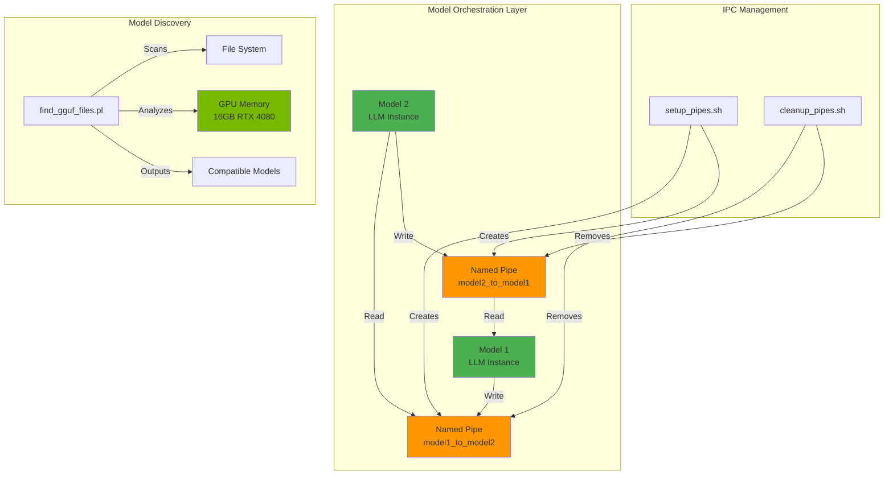
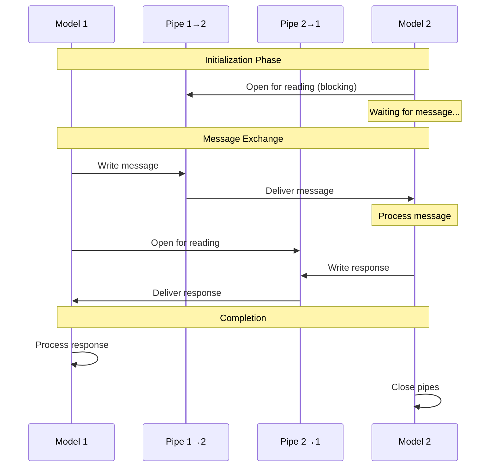
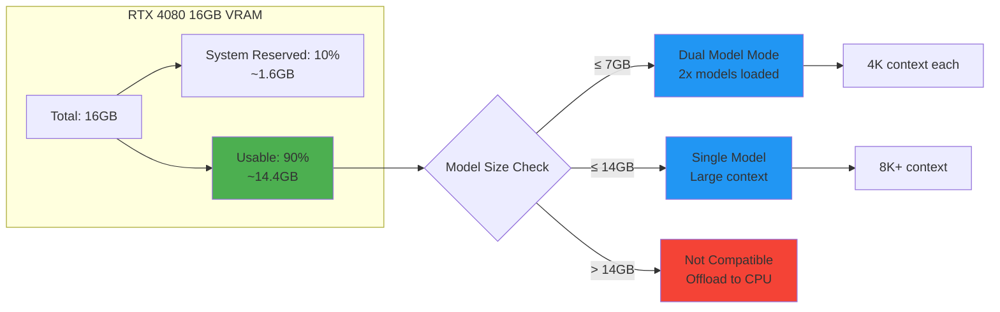

# 🔗 GRYPHGEN Perl Pipes - Multi-Model IPC System

[](https://www.perl.org/)
[](LICENSE)
[](https://www.nvidia.com/)
[](https://developer.nvidia.com/cuda-zone)
[](tests/)
[](CONTRIBUTING.md)

> **Inter-Process Communication (IPC) infrastructure for orchestrating multi-model LLM sessions using Perl pipes and named FIFOs**

Optimized for **NVIDIA RTX 4080 16GB** | Supports LM Studio, Ollama, and custom model servers

---

## 📋 Table of Contents

- [Features](#-features)
- [Architecture](#-architecture)
- [Quick Start](#-quick-start)
- [Installation](#-installation)
- [Usage](#-usage)
- [Examples](#-examples)
- [GPU Optimization](#-gpu-optimization)
- [API Reference](#-api-reference)
- [Testing](#-testing)
- [Performance](#-performance)
- [Troubleshooting](#-troubleshooting)
- [Contributing](#-contributing)
- [License](#-license)

---

## ✨ Features

### Core Capabilities
- 🔄 **Bidirectional IPC** - Seamless communication between multiple LLM models
- 📦 **Named Pipes (FIFOs)** - Efficient Unix-based inter-process communication
- 🎯 **GPU Memory Aware** - Intelligent model selection for NVIDIA RTX 4080 16GB
- 🔍 **GGUF Model Scanner** - Recursive search with GPU compatibility analysis
- ⚡ **Low Latency** - Sub-millisecond pipe operations
- 🛡️ **Timeout Protection** - Configurable timeouts prevent hanging processes
- 📊 **Comprehensive Logging** - Detailed operation logs for debugging

### Advanced Features
- 🔢 **Multi-Model Support** - Orchestrate 2+ models simultaneously
- 📈 **Performance Metrics** - Round-trip time and throughput monitoring
- 🎨 **Multiple Output Formats** - Table, JSON, CSV export options
- 🔧 **Flexible Configuration** - Environment variables and CLI options
- 🧪 **Full Test Suite** - Comprehensive testing with Test::More
- 🐳 **Docker Ready** - Containerized deployment support
- 📚 **Rich Documentation** - POD documentation and man pages

---

## 🏗️ Architecture

### System Overview



### Communication Flow



### GPU Memory Management



---

## 🚀 Quick Start

### Prerequisites

```bash
# Check Perl version (requires 5.36+)
perl -v

# Check NVIDIA GPU
nvidia-smi

# Install cpanminus if not present
curl -L https://cpanmin.us | perl - App::cpanminus
```

### 30-Second Demo

```bash
# Clone and navigate
cd perl_pipes

# Install dependencies
make install

# Run demo
make demo
```

Expected output:
```
=== Starting demo ===
Starting Model 2 (listener)...
Starting Model 1 (sender)...
Model 1 received: Hello from Model 2
Round-trip time: 0.023 seconds
=== Demo completed ===
```

---

## 📦 Installation

### Method 1: Make (Recommended)

```bash
# Install all dependencies and setup
make install

# Verify installation
make check-system
```

### Method 2: Manual Installation

```bash
# Install Perl dependencies
cpanm --installdeps .

# Make scripts executable
chmod +x bin/*.pl bin/*.sh

# Create log directory
mkdir -p logs
```

### Method 3: Docker

```bash
# Build image
make docker-build

# Run container with GPU support
make docker-run
```

---

## 💻 Usage

### 1. Model Communication

#### Setup Pipes

```bash
# Create default pipes (2 models)
./bin/setup_pipes.sh

# Custom configuration
./bin/setup_pipes.sh --num 3 --dir /var/run/pipes --prefix llm
```

#### Start Communication

```bash
# Terminal 1 - Start Model 2 (listener first)
./bin/model2_comm.pl --verbose

# Terminal 2 - Send message from Model 1
echo "Analyze this data..." | ./bin/model1_comm.pl --verbose
```

#### Cleanup

```bash
# Remove pipes
./bin/cleanup_pipes.sh --force
```

### 2. Finding GPU-Compatible Models

```bash
# Search entire system
./bin/find_gguf_files.pl --max-size=14GB

# Search specific directory
./bin/find_gguf_files.pl --dir=/mnt/models --gpu-fit

# Export to JSON
./bin/find_gguf_files.pl --format=json --max-size=14GB > models.json

# Find recent models
./bin/find_gguf_files.pl --max-age=30 --sort=age
```

### 3. Advanced Usage

#### Custom Pipe Locations

```bash
# Set environment variables
export PIPE_TO_MODEL2=/custom/path/pipe1
export PIPE_FROM_MODEL2=/custom/path/pipe2

./bin/model1_comm.pl
```

#### Timeout Configuration

```bash
# Set 60-second timeout
./bin/model1_comm.pl --timeout=60 --verbose
```

#### Batch Processing

```bash
# Process multiple messages
for msg in "message1" "message2" "message3"; do
    echo "$msg" | ./bin/model1_comm.pl
done
```

---

## 📚 Examples

### Basic Communication

```bash
./examples/basic_communication.sh
```

**What it does:**
1. Creates named pipes
2. Starts Model 2 listener
3. Sends message from Model 1
4. Displays response
5. Cleans up pipes

### Multi-Round Chat

```bash
./examples/multi_round_chat.sh
```

**Features:**
- Multiple message exchanges
- Round tracking
- Performance metrics

### Find GPU Models

```bash
./examples/find_gpu_models.sh
```

**Searches:**
- `~/models`
- `~/.cache/lm-studio`
- `/mnt/models`
- `/opt/models`

---

## 🎮 GPU Optimization

### NVIDIA RTX 4080 16GB Specifications

| Specification | Value |
|--------------|-------|
| **VRAM** | 16 GB GDDR6X |
| **Architecture** | Ada Lovelace |
| **CUDA Cores** | 9,728 |
| **Tensor Cores** | 304 (4th Gen) |
| **Memory Bandwidth** | 736 GB/s |
| **TDP** | 320W |

### Recommended Model Sizes

| Use Case | Model Size | Quantization | Context |
|----------|-----------|--------------|---------|
| **Dual Model** | 2× 7B | Q4_K_M | 4K each |
| **Single Large** | 1× 30B | Q4_K_M | 8K |
| **Single Huge** | 1× 70B | Q2_K | 4K |
| **Multi Model** | 3× 7B | Q4_0 | 2K each |

### Configuration File

See [`config/rtx4080_optimized.conf`](config/rtx4080_optimized.conf) for:
- GPU specifications
- Model size limits
- Performance tuning
- Recommended quantizations

---

## 📖 API Reference

### Scripts

#### `model1_comm.pl`

Send messages to Model 2 via named pipe.

**Options:**
```
--to=PATH       Output pipe path
--from=PATH     Input pipe path
--timeout=SEC   Timeout in seconds (default: 30)
--verbose       Enable verbose logging
--log=FILE      Custom log file
--help          Show help
--version       Show version
```

**Example:**
```bash
echo "Hello" | ./bin/model1_comm.pl --verbose --timeout=60
```

#### `model2_comm.pl`

Receive messages from Model 1 and send responses.

**Options:**
```
--to=PATH       Output pipe path
--from=PATH     Input pipe path
--timeout=SEC   Timeout in seconds (default: 30)
--verbose       Enable verbose logging
--log=FILE      Custom log file
--help          Show help
--version       Show version
```

#### `find_gguf_files.pl`

Find and analyze GGUF model files.

**Options:**
```
--dir=PATH          Search directory (default: /)
--format=FORMAT     Output: table, json, csv (default: table)
--sort=FIELD        Sort by: size, age, name
--gpu-fit           Show GPU compatibility (default: on)
--min-size=SIZE     Minimum file size (e.g., 1GB)
--max-size=SIZE     Maximum file size
--max-age=DAYS      Maximum age in days
--verbose           Verbose output
```

**Example:**
```bash
./bin/find_gguf_files.pl --dir=/mnt/models --max-size=14GB --format=json
```

#### `setup_pipes.sh`

Create named pipes for IPC.

**Options:**
```
-d, --dir DIR       Pipe directory (default: /tmp)
-p, --prefix NAME   Pipe prefix (default: model)
-n, --num COUNT     Number of models (default: 2)
-c, --clean         Clean existing pipes first
-h, --help          Show help
-v, --version       Show version
```

#### `cleanup_pipes.sh`

Remove named pipes.

**Options:**
```
-d, --dir DIR       Pipe directory (default: /tmp)
-p, --prefix NAME   Pipe prefix (default: model)
-f, --force         Force removal without confirmation
-h, --help          Show help
-v, --version       Show version
```

### Environment Variables

| Variable | Description | Default |
|----------|-------------|---------|
| `PIPE_TO_MODEL2` | Output pipe for Model 1 | `/tmp/model1_to_model2` |
| `PIPE_FROM_MODEL2` | Input pipe for Model 1 | `/tmp/model2_to_model1` |
| `PIPE_TIMEOUT` | Timeout in seconds | `30` |
| `LOG_FILE` | Log file path | `logs/model{N}.log` |
| `SEARCH_PATH` | GGUF search directory | `/` |

---

## 🧪 Testing

### Run Test Suite

```bash
# Run all tests
make test

# Run specific test
prove -v tests/01-basic.t

# Generate coverage report
make coverage
```

### Test Structure

```
tests/
├── 01-basic.t          # Script existence and syntax
├── 02-pipes.t          # Pipe creation and cleanup
└── 03-find-gguf.t      # GGUF finder functionality
```

### Test Coverage

- ✅ Script validation
- ✅ Pipe operations
- ✅ Error handling
- ✅ Output formats
- ✅ Size filtering
- ✅ GPU compatibility

---

## ⚡ Performance

### Benchmarks (RTX 4080 16GB)

| Operation | Latency | Throughput |
|-----------|---------|------------|
| **Pipe Write** | < 1 ms | 1000+ msg/s |
| **Pipe Read** | < 1 ms | 1000+ msg/s |
| **Round Trip** | 2-5 ms | 200-500 msg/s |
| **GGUF Scan** | ~1 sec/1000 files | - |

### Optimization Tips

1. **Use RAM disk for pipes:**
   ```bash
   ./bin/setup_pipes.sh --dir=/dev/shm
   ```

2. **Reduce timeout for fast models:**
   ```bash
   export PIPE_TIMEOUT=5
   ```

3. **Batch messages:**
   ```bash
   cat messages.txt | ./bin/model1_comm.pl
   ```

4. **Monitor GPU memory:**
   ```bash
   watch -n1 nvidia-smi
   ```

---

## 🔧 Troubleshooting

### Common Issues

#### Pipe Timeout Error

**Problem:** `Timeout reading from pipe`

**Solution:**
```bash
# Increase timeout
./bin/model1_comm.pl --timeout=60

# Or set environment variable
export PIPE_TIMEOUT=60
```

#### Pipe Not Found

**Problem:** `Pipe not found: /tmp/model1_to_model2`

**Solution:**
```bash
# Create pipes
./bin/setup_pipes.sh

# Verify pipes exist
ls -la /tmp/model*_to_*
```

#### Permission Denied

**Problem:** `Can't open /tmp/model1_to_model2: Permission denied`

**Solution:**
```bash
# Fix permissions
chmod 666 /tmp/model*_to_*

# Or recreate with correct permissions
./bin/cleanup_pipes.sh --force
./bin/setup_pipes.sh
```

#### Model Out of Memory

**Problem:** GPU runs out of memory

**Solution:**
```bash
# Find smaller models
./bin/find_gguf_files.pl --max-size=7GB --gpu-fit

# Use lower quantization (Q4, Q2)
# Reduce context window
# Offload layers to CPU
```

### Debug Mode

```bash
# Enable verbose logging
./bin/model1_comm.pl --verbose --log=debug.log

# Check logs
tail -f logs/model1.log logs/model2.log
```

---

## 🤝 Contributing

We welcome contributions! Please see [CONTRIBUTING.md](../CONTRIBUTING.md) for guidelines.

### Development Setup

```bash
# Install dev dependencies
cpanm --installdeps . --with-develop

# Run linter
make lint

# Format code
make format

# Run tests
make test
```

---

## 📄 License

This project is licensed under the MIT License - see the [LICENSE](../LICENSE) file for details.

---

## 🙏 Acknowledgments

- **Perl Community** - For robust IPC capabilities
- **NVIDIA** - For RTX 4080 GPU optimization
- **LM Studio** - For local model serving inspiration
- **GGUF Format** - For efficient model quantization

---

## 📞 Support

- **Issues:** [GitHub Issues](https://github.com/danindiana/GRYPHGEN/issues)
- **Discussions:** [GitHub Discussions](https://github.com/danindiana/GRYPHGEN/discussions)
- **Documentation:** [Full Documentation](docs/)

---

## 🗺️ Roadmap

- [ ] Web-based monitoring dashboard
- [ ] Real-time VRAM tracking with nvidia-ml-py
- [ ] Automatic model selection based on task
- [ ] Load balancing across multiple GPUs
- [ ] gRPC/REST API interfaces
- [ ] Integration with Ollama, LocalAI
- [ ] Kubernetes deployment manifests

---

**Made with ❤️ by the GRYPHGEN Team**

*Optimized for NVIDIA RTX 4080 | Powered by Perl 5.36+*
