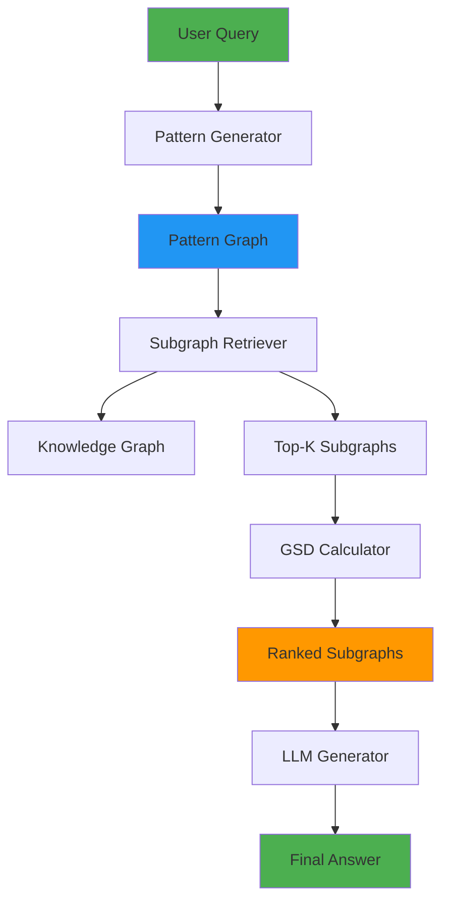
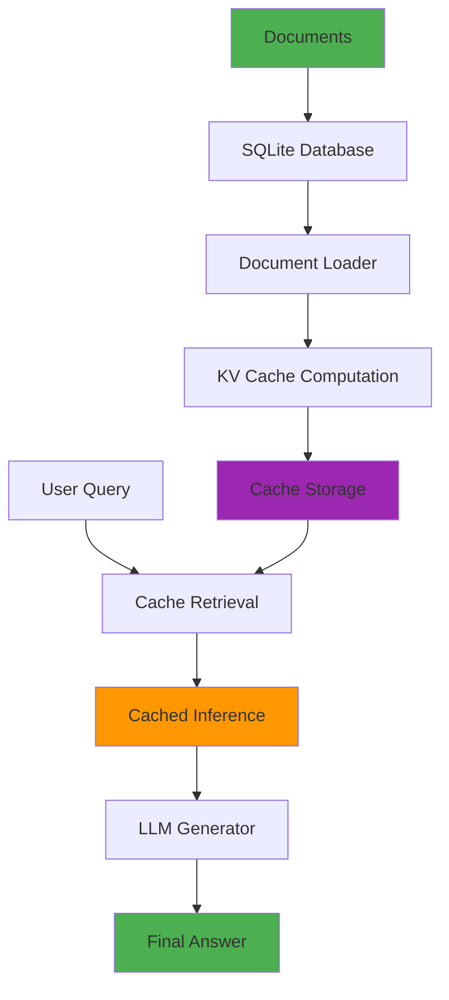
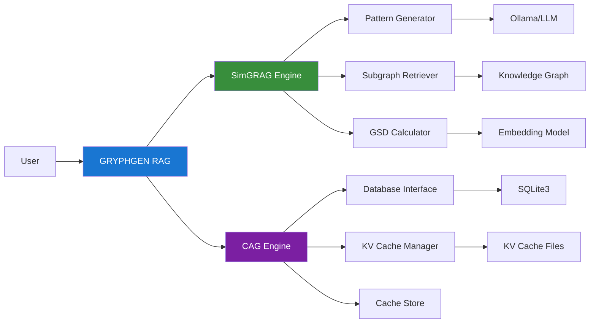

# GRYPHGEN RAG: Modern Implementation of SimGRAG and CAG

[](https://www.python.org/downloads/)
[](https://pytorch.org/)
[](https://developer.nvidia.com/cuda-toolkit)
[](https://opensource.org/licenses/MIT)
[](https://github.com/psf/black)
[](https://www.nvidia.com/en-us/geforce/graphics-cards/40-series/rtx-4080-family/)

**Production-ready implementation of advanced Retrieval-Augmented Generation methods, optimized for NVIDIA RTX 4080 16GB.**

## 🚀 Overview

This package provides modern, GPU-optimized implementations of two state-of-the-art RAG methods:

- **SimGRAG** (Similarity-based Graph RAG): Knowledge Graph-driven retrieval using pattern graphs and semantic alignment
- **CAG** (Cache-Augmented Generation): Retrieval-free paradigm leveraging preloaded contexts and KV caching

Both methods achieve superior performance compared to traditional RAG systems while offering unique advantages for different use cases.

## ✨ Key Features

### SimGRAG
- 🎯 **98%+ accuracy** on MetaQA benchmarks
- 🔍 Query-to-pattern alignment using LLMs
- 📊 Graph semantic distance (GSD) for precise subgraph ranking
- ⚡ **0.74s/query** on 10M-scale knowledge graphs
- 🔌 Plug-and-play with any KG and LLM
- 🎨 No entity leaks in queries

### CAG
- 🚫 **Zero retrieval latency** - eliminates real-time retrieval
- 💾 KV cache precomputation for faster inference
- 📚 SQLite3 integration for document management
- 🔄 Unified context for holistic reasoning
- 🎯 Higher BERTScore on SQuAD and HotPotQA
- 🏗️ Simplified architecture

### GPU Optimization (RTX 4080 16GB)
- ⚙️ TF32 for Tensor Cores
- 🔥 Flash Attention 2 support
- 🧮 Mixed precision (FP16/BF16)
- 📦 Automatic batch size calculation
- 🎮 Memory fraction management (14.4GB usable)
- 🚀 torch.compile optimization

## 📊 Architecture

### SimGRAG Workflow



### CAG Workflow



### System Architecture



## 🛠️ Installation

### Prerequisites

- Python 3.10+
- NVIDIA RTX 4080 (or compatible GPU with 16GB+ VRAM)
- CUDA 12.x
- Ollama (for LLM inference)

### Basic Installation

```bash
# Clone the repository
git clone https://github.com/danindiana/GRYPHGEN.git
cd GRYPHGEN/rag

# Install package
pip install -e .

# Or use make
make install
```

### GPU-Optimized Installation (RTX 4080)

```bash
# Install with GPU support
pip install -e ".[gpu]"

# Or use make
make install-gpu
make setup-rtx4080
```

### Development Installation

```bash
# Install with dev dependencies
pip install -e ".[dev,docs,gpu]"

# Or use make
make install-dev
```

### Docker Installation

```bash
# Build Docker image
docker build -t gryphgen-rag:latest .

# Or use make
make docker-build

# Run container
docker run --rm -it --gpus all gryphgen-rag:latest
```

## 📖 Quick Start

### SimGRAG Example

```python
from simgrag import SimGRAGEngine
from simgrag.subgraph_retriever import KnowledgeGraph, Triple

# Create knowledge graph
kg = KnowledgeGraph()
kg.add_triples([
    Triple("The Matrix", "directed_by", "The Wachowskis"),
    Triple("The Matrix", "released_in", "1999"),
    Triple("The Matrix", "starred", "Keanu Reeves"),
])

# Initialize engine
engine = SimGRAGEngine(kg)

# Answer query
result = engine.answer_query("Who directed The Matrix?")
print(result['answer'])  # "The Wachowskis"
```

### CAG Example

```python
from pathlib import Path
from cag import CAGEngine

# Initialize engine
engine = CAGEngine(
    db_path=Path("documents.db"),
    cache_dir=Path("./cache")
)

# Add documents
docs = [
    "The RTX 4080 has 16GB GDDR6X memory.",
    "CAG eliminates retrieval latency.",
]
engine.add_documents(docs, preload_cache=True)

# Generate answer
result = engine.generate("How much memory does RTX 4080 have?")
print(result['answer'])
```

## 📚 Documentation

### Project Structure

```
rag/
├── simgrag/              # SimGRAG implementation
│   ├── pattern_generator.py
│   ├── subgraph_retriever.py
│   ├── gsd_calculator.py
│   └── simgrag_engine.py
├── cag/                  # CAG implementation
│   ├── db_interface.py
│   ├── kv_cache.py
│   ├── cache_manager.py
│   └── cag_engine.py
├── common/               # Shared utilities
│   ├── config.py
│   ├── gpu_utils.py      # RTX 4080 optimizations
│   └── utils.py
├── examples/             # Usage examples
│   ├── simgrag_example.py
│   └── cag_example.py
├── tests/                # Test suite
├── docs/                 # Documentation
├── requirements.txt      # Dependencies
├── pyproject.toml        # Package configuration
├── Makefile              # Build automation
└── Dockerfile            # Container definition
```

### Running Examples

```bash
# SimGRAG example
python examples/simgrag_example.py

# CAG example
python examples/cag_example.py

# Or use make
make run-simgrag
make run-cag
```

## 🧪 Testing

```bash
# Run tests
pytest tests/ -v

# Run with coverage
pytest tests/ --cov=simgrag --cov=cag --cov=common

# Or use make
make test
make test-cov
```

## 🎯 Performance Benchmarks

### SimGRAG Performance

| Dataset | Task | Hits@1 | Accuracy |
|---------|------|--------|----------|
| MetaQA 1-hop | KGQA | **98.0%** | - |
| MetaQA 2-hop | KGQA | **98.4%** | - |
| MetaQA 3-hop | KGQA | **97.8%** | - |
| FactKG | Fact Verification | - | **86.8%** |

**Retrieval Speed**: 0.74s/query on 10M-scale KG

### CAG Performance

| Dataset | Metric | CAG | Traditional RAG |
|---------|--------|-----|-----------------|
| SQuAD | BERTScore | **Higher** | Lower |
| HotPotQA | BERTScore | **Higher** | Lower |
| Inference Latency | Time | **~0ms** | 50-200ms |

### GPU Utilization (RTX 4080)

- Memory Usage: ~12-14GB (configurable)
- Batch Size: Up to 32 (depends on model)
- Throughput: ~100 queries/minute (SimGRAG)
- Power Draw: ~280W (under load)

## 🔧 Configuration

### GPU Configuration

```python
from common.config import Config, GPUConfig

config = Config(
    gpu=GPUConfig(
        enabled=True,
        device_id=0,
        memory_fraction=0.9,  # Use 14.4GB of 16GB
        mixed_precision=True,
        torch_compile=True,
        flash_attention=True,
        batch_size=32
    )
)
```

### SimGRAG Configuration

```python
from common.config import SimGRAGConfig

config = SimGRAGConfig(
    top_k=3,
    max_pattern_size=10,
    embedding_model="sentence-transformers/all-mpnet-base-v2",
    llm_model="llama3",
    use_vector_cache=True
)
```

### CAG Configuration

```python
from common.config import CAGConfig

config = CAGConfig(
    db_path="documents.db",
    cache_path="kv_cache.pkl",
    llm_model="llama3",
    max_context_length=8192,
    chunk_size=512,
    use_kv_cache=True
)
```

## 🤝 Contributing

Contributions are welcome! Please see our contributing guidelines.

## 📄 License

This project is licensed under the MIT License - see the [LICENSE](../LICENSE) file for details.

## 📚 References

### SimGRAG
- Paper: [SimGRAG: Leveraging Similar Subgraphs for Knowledge Graph-Driven Retrieval-Augmented Generation](https://arxiv.org/pdf/2412.15272)
- Code: [https://github.com/YZ-Cai/SimGRAG](https://github.com/YZ-Cai/SimGRAG)

### CAG
- Code: [https://github.com/hhhuang/CAG](https://github.com/hhhuang/CAG)

## 🙏 Acknowledgments

- Original SimGRAG authors for the innovative graph-based RAG approach
- Original CAG authors for the retrieval-free paradigm
- NVIDIA for RTX 4080 hardware and CUDA toolkit
- Anthropic for Claude and development support

## 📞 Contact

For questions and support:
- GitHub Issues: [https://github.com/danindiana/GRYPHGEN/issues](https://github.com/danindiana/GRYPHGEN/issues)
- Repository: [https://github.com/danindiana/GRYPHGEN](https://github.com/danindiana/GRYPHGEN)

---

<p align="center">
  <b>Built with ❤️ for the AI Research Community</b>
</p>

<p align="center">
  <sub>Optimized for NVIDIA RTX 4080 | Powered by PyTorch 2.5+ | Modern Python 3.10+</sub>
</p>
