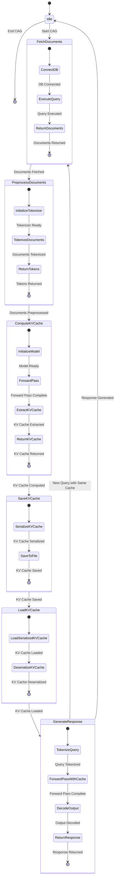

```
Cache-Augmented Generation (CAG): A Retrieval-Free Paradigm for Knowledge-Intensive Tasks
Abstract
Retrieval-augmented generation (RAG) has emerged as a powerful method to enhance large language models (LLMs) by integrating external knowledge sources. However, RAG introduces challenges such as retrieval latency, potential errors in document selection, and increased system complexity. With the advent of LLMs featuring significantly extended context windows, this paper proposes an alternative paradigm, cache-augmented generation (CAG), which bypasses real-time retrieval. CAG involves preloading all relevant resources into the LLM’s extended context and caching its runtime parameters. During inference, the model utilizes these preloaded parameters to answer queries without additional retrieval steps. Comparative analyses reveal that CAG eliminates retrieval latency and minimizes retrieval errors while maintaining context relevance. Performance evaluations across multiple benchmarks highlight scenarios where long-context LLMs either outperform or complement traditional RAG pipelines. These findings suggest that, for certain applications, particularly those with a constrained knowledge base, CAG provides a streamlined and efficient alternative to RAG, achieving comparable or superior results with reduced complexity.
```
1. Introduction
Retrieval-augmented generation (RAG) has significantly enhanced LLMs by dynamically integrating external knowledge sources. However, RAG introduces latency, retrieval errors, and system complexity. This paper proposes cache-augmented generation (CAG), leveraging long-context LLMs to preload relevant documents and precompute key-value (KV) caches, eliminating the need for real-time retrieval. This approach simplifies system architecture, reduces latency, and mitigates retrieval errors.

2. Methodology
The CAG framework operates in three phases:

External Knowledge Preloading: Relevant documents are preprocessed and loaded into the LLM’s extended context window, generating a precomputed KV cache.

Inference: During inference, the precomputed KV cache is loaded alongside the user’s query, enabling the LLM to generate responses without additional retrieval.

Cache Reset: The KV cache is reset efficiently between inference sessions to maintain system performance.

Advantages of CAG:

Reduced Inference Time: Eliminates real-time retrieval, speeding up responses.

Unified Context: Preloading ensures holistic understanding of documents, improving response quality.

Simplified Architecture: Removes the need for retriever-generator integration, reducing complexity.

3. Experiments
3.1. Experimental Setup
Experiments were conducted using the SQuAD and HotPotQA datasets, which provide challenges in single-context comprehension and multi-hop reasoning, respectively. Three test sets were created for each dataset, varying the size of the reference text to assess retrieval difficulty.

3.2. Baseline Systems
Two baseline RAG systems were implemented:

Sparse Retrieval System (BM25): Uses BM25 for keyword-based retrieval.

Dense Retrieval System (OpenAI Indexes): Uses dense embeddings for semantic retrieval.

3.3. Results
CAG outperformed both RAG systems in most scenarios, achieving higher BERTScore by eliminating retrieval errors and ensuring holistic reasoning. CAG also significantly reduced generation time compared to traditional RAG and in-context learning methods, particularly for longer reference texts.

4. Conclusion
CAG presents a compelling alternative to traditional RAG workflows, particularly for applications with constrained knowledge bases. By leveraging the extended context capabilities of LLMs, CAG eliminates retrieval latency, reduces errors, and simplifies system architecture. Future work could explore hybrid approaches combining preloading with selective retrieval for scenarios requiring both efficiency and adaptability.

Contributions
Retrieval-Free Long-Context Paradigm: Introduced CAG, leveraging long-context LLMs with preloaded documents and precomputed KV caches.

Performance Comparison: Demonstrated scenarios where long-context LLMs outperform traditional RAG systems.

Practical Insights: Provided actionable insights for optimizing knowledge-intensive workflows.

References
Lewis et al., 2020; Gao et al., 2023: RAG systems.

Leng et al., 2024; Li et al., 2024: Performance of long-context models in RAG tasks.

Lu et al., 2024: Benefits of precomputed KV caching.

Code Availability
The CAG framework is publicly available at: https://github.com/hhhuang/CAG

This summary encapsulates the key points of the paper, highlighting the motivation, methodology, experimental results, and contributions of the proposed CAG paradigm.

```
```
Explain how CAG functions using C++ code examples, python, and interface with ollama.service.
To explain how Cache-Augmented Generation (CAG) functions, I'll break it down into three parts: C++ code examples, Python code examples, and integration with ollama.service. CAG leverages preloading and caching to eliminate real-time retrieval, so the examples will focus on these aspects.

1. C++ Code Example
In C++, we can simulate the preloading and caching of documents using data structures like std::map or std::unordered_map to store the precomputed KV cache. Here's a simplified example:

cpp
Copy
#include <iostream>
#include <map>
#include <string>

// Simulate the LLM's KV cache
std::map<std::string, std::string> kvCache;

// Preload documents into the KV cache
void preloadDocuments(const std::map<std::string, std::string>& documents) {
    for (const auto& doc : documents) {
        kvCache[doc.first] = doc.second; // Key: Document ID, Value: Document content
    }
}

// Generate a response using the preloaded KV cache
std::string generateResponse(const std::string& query) {
    // Simulate query processing using the KV cache
    for (const auto& entry : kvCache) {
        if (entry.second.find(query) != std::string::npos) {
            return "Response based on: " + entry.second;
        }
    }
    return "No relevant information found.";
}

int main() {
    // Preload documents
    std::map<std::string, std::string> documents = {
        {"doc1", "Information about AI and machine learning."},
        {"doc2", "Details on cache-augmented generation."}
    };
    preloadDocuments(documents);

    // Query the system
    std::string query = "cache-augmented generation";
    std::string response = generateResponse(query);

    std::cout << "Query: " << query << "\nResponse: " << response << std::endl;
    return 0;
}
Explanation:

The preloadDocuments function simulates preloading documents into a KV cache.

The generateResponse function uses the preloaded cache to generate responses without real-time retrieval.

2. Python Code Example
In Python, we can use dictionaries to simulate the KV cache and preload documents. Here's an example:

python
Copy
# Simulate the LLM's KV cache
kv_cache = {}

# Preload documents into the KV cache
def preload_documents(documents):
    for doc_id, content in documents.items():
        kv_cache[doc_id] = content

# Generate a response using the preloaded KV cache
def generate_response(query):
    for doc_id, content in kv_cache.items():
        if query in content:
            return f"Response based on: {content}"
    return "No relevant information found."

# Preload documents
documents = {
    "doc1": "Information about AI and machine learning.",
    "doc2": "Details on cache-augmented generation."
}
preload_documents(documents)

# Query the system
query = "cache-augmented generation"
response = generate_response(query)

print(f"Query: {query}\nResponse: {response}")
Explanation:

The preload_documents function preloads documents into a dictionary-based KV cache.

The generate_response function uses the cache to generate responses without retrieval.

3. Integration with ollama.service
ollama.service is a service that interacts with LLMs. To integrate CAG with ollama.service, we can preload documents into the LLM's context and use the cached context for inference. Here's an example using Python and the ollama Python library:

python
Copy
import ollama

# Preload documents into the LLM's context
def preload_documents(documents):
    for doc in documents:
        ollama.generate(model="llama3", prompt=f"Preload: {doc}")

# Generate a response using the preloaded context
def generate_response(query):
    response = ollama.generate(model="llama3", prompt=query)
    return response["response"]

# Preload documents
documents = [
    "Information about AI and machine learning.",
    "Details on cache-augmented generation."
]
preload_documents(documents)

# Query the system
query = "Explain cache-augmented generation."
response = generate_response(query)

print(f"Query: {query}\nResponse: {response}")
Explanation:

The preload_documents function sends documents to the LLM via ollama.service to preload them into the context.

The generate_response function queries the LLM using the preloaded context.

4. Workflow Summary
Preloading:

Documents are preprocessed and loaded into the LLM's context or a KV cache.

This step is performed once, and the cached data is reused for subsequent queries.

Inference:

Queries are processed using the preloaded context or cache, eliminating the need for real-time retrieval.

Cache Management:

The cache can be reset or updated as needed to maintain performance.

5. Key Benefits of CAG
Efficiency: Eliminates retrieval latency by preloading documents.

Accuracy: Reduces retrieval errors by ensuring all relevant information is available in the context.

Simplicity: Simplifies system architecture by removing the need for a retrieval pipeline.

6. Future Enhancements
Hybrid Approach: Combine CAG with selective retrieval for edge cases.

Dynamic Cache Updates: Implement mechanisms to update the cache dynamically as new documents are added.

By leveraging CAG, systems can achieve faster and more accurate responses for knowledge-intensive tasks, especially when the knowledge base is constrained and manageable.

How do we compute the KV cache for our documents which are stored in an sqlite3 db?
To compute the KV (Key-Value) cache for documents stored in an SQLite3 database, we need to extract the documents from the database, preprocess them, and then encode them into a format suitable for the KV cache. The KV cache is typically used in transformer-based models (like LLMs) to store intermediate computations for faster inference.

Here’s a step-by-step guide with Python code examples to compute the KV cache for documents stored in an SQLite3 database:

1. Set Up SQLite3 Database
Assume you have an SQLite3 database with a table documents that stores the documents. The table has the following schema:

sql
Copy
CREATE TABLE documents (
    id INTEGER PRIMARY KEY,
    content TEXT
);
2. Extract Documents from SQLite3
Use Python’s sqlite3 module to connect to the database and fetch the documents.

python
Copy
import sqlite3

# Connect to the SQLite3 database
def fetch_documents(db_path):
    conn = sqlite3.connect(db_path)
    cursor = conn.cursor()
    cursor.execute("SELECT id, content FROM documents")
    documents = cursor.fetchall()
    conn.close()
    return documents

# Example usage
db_path = "documents.db"
documents = fetch_documents(db_path)
print("Fetched documents:", documents)
3. Preprocess Documents
Preprocess the documents (e.g., tokenization, cleaning) to prepare them for encoding into the KV cache.

python
Copy
from transformers import AutoTokenizer

# Load a tokenizer (e.g., from Hugging Face)
tokenizer = AutoTokenizer.from_pretrained("bert-base-uncased")

# Preprocess documents
def preprocess_documents(documents):
    preprocessed_docs = []
    for doc_id, content in documents:
        tokens = tokenizer(content, return_tensors="pt", truncation=True, padding=True)
        preprocessed_docs.append((doc_id, tokens))
    return preprocessed_docs

# Example usage
preprocessed_docs = preprocess_documents(documents)
print("Preprocessed documents:", preprocessed_docs)
4. Compute KV Cache
Use a pre-trained model to compute the KV cache for the preprocessed documents. The KV cache is generated during the forward pass of the model.

python
Copy
from transformers import AutoModel

# Load a pre-trained model (e.g., BERT)
model = AutoModel.from_pretrained("bert-base-uncased")

# Compute KV cache for documents
def compute_kv_cache(preprocessed_docs):
    kv_cache = {}
    for doc_id, tokens in preprocessed_docs:
        with torch.no_grad():
            outputs = model(**tokens, use_cache=True)
            kv_cache[doc_id] = outputs.past_key_values
    return kv_cache

# Example usage
import torch
kv_cache = compute_kv_cache(preprocessed_docs)
print("Computed KV cache:", kv_cache)
5. Store KV Cache
Store the computed KV cache in a file (e.g., using pickle) or in memory for later use during inference.

python
Copy
import pickle

# Save KV cache to a file
def save_kv_cache(kv_cache, file_path):
    with open(file_path, "wb") as f:
        pickle.dump(kv_cache, f)

# Load KV cache from a file
def load_kv_cache(file_path):
    with open(file_path, "rb") as f:
        return pickle.load(f)

# Example usage
cache_file = "kv_cache.pkl"
save_kv_cache(kv_cache, cache_file)
loaded_kv_cache = load_kv_cache(cache_file)
print("Loaded KV cache:", loaded_kv_cache)
6. Use KV Cache for Inference
During inference, load the precomputed KV cache and use it to generate responses without recomputing the intermediate states.

python
Copy
# Generate response using precomputed KV cache
def generate_response(query, kv_cache, model, tokenizer):
    query_tokens = tokenizer(query, return_tensors="pt", truncation=True, padding=True)
    with torch.no_grad():
        outputs = model(**query_tokens, past_key_values=kv_cache)
    return outputs.last_hidden_state

# Example usage
query = "What is cache-augmented generation?"
response = generate_response(query, loaded_kv_cache[1], model, tokenizer)
print("Generated response:", response)
7. Full Workflow
Here’s the complete workflow in one script:

python
Copy
import sqlite3
import torch
import pickle
from transformers import AutoTokenizer, AutoModel

# Step 1: Fetch documents from SQLite3
def fetch_documents(db_path):
    conn = sqlite3.connect(db_path)
    cursor = conn.cursor()
    cursor.execute("SELECT id, content FROM documents")
    documents = cursor.fetchall()
    conn.close()
    return documents

# Step 2: Preprocess documents
def preprocess_documents(documents, tokenizer):
    preprocessed_docs = []
    for doc_id, content in documents:
        tokens = tokenizer(content, return_tensors="pt", truncation=True, padding=True)
        preprocessed_docs.append((doc_id, tokens))
    return preprocessed_docs

# Step 3: Compute KV cache
def compute_kv_cache(preprocessed_docs, model):
    kv_cache = {}
    for doc_id, tokens in preprocessed_docs:
        with torch.no_grad():
            outputs = model(**tokens, use_cache=True)
            kv_cache[doc_id] = outputs.past_key_values
    return kv_cache

# Step 4: Save KV cache
def save_kv_cache(kv_cache, file_path):
    with open(file_path, "wb") as f:
        pickle.dump(kv_cache, f)

# Step 5: Load KV cache
def load_kv_cache(file_path):
    with open(file_path, "rb") as f:
        return pickle.load(f)

# Step 6: Generate response using KV cache
def generate_response(query, kv_cache, model, tokenizer):
    query_tokens = tokenizer(query, return_tensors="pt", truncation=True, padding=True)
    with torch.no_grad():
        outputs = model(**query_tokens, past_key_values=kv_cache)
    return outputs.last_hidden_state

# Main workflow
db_path = "documents.db"
cache_file = "kv_cache.pkl"

# Fetch documents
documents = fetch_documents(db_path)

# Preprocess documents
tokenizer = AutoTokenizer.from_pretrained("bert-base-uncased")
preprocessed_docs = preprocess_documents(documents, tokenizer)

# Compute KV cache
model = AutoModel.from_pretrained("bert-base-uncased")
kv_cache = compute_kv_cache(preprocessed_docs, model)

# Save KV cache
save_kv_cache(kv_cache, cache_file)

# Load KV cache
loaded_kv_cache = load_kv_cache(cache_file)

# Generate response
query = "What is cache-augmented generation?"
response = generate_response(query, loaded_kv_cache[1], model, tokenizer)
print("Generated response:", response)
Key Points:
Efficiency: Precomputing the KV cache eliminates redundant computations during inference.

Scalability: Store the KV cache in a file for reuse across multiple sessions.

Integration: Use the KV cache with any transformer-based model for faster inference.

This approach is particularly useful for applications with a constrained knowledge base, where preloading and caching can significantly improve performance.

How do we use this CAG method with .gguf files running say from ollama? Do we have to use special llms bc of the KV cache aspect?
Using the Cache-Augmented Generation (CAG) method with .gguf files (e.g., models running via Ollama) requires some considerations, especially regarding the KV cache. Here's a detailed explanation of how to integrate CAG with .gguf models and whether you need special LLMs for this purpose.

1. Understanding .gguf Files and Ollama
.gguf Files: These are quantized model files used by frameworks like llama.cpp to run large language models efficiently on consumer hardware.

Ollama: A tool that simplifies running LLMs locally, often using .gguf files under the hood.

2. KV Cache in .gguf Models
The KV cache is a feature of transformer-based models that stores intermediate computations (key-value pairs) during inference to avoid redundant calculations. However, .gguf models are typically quantized and optimized for inference, and they may not expose the KV cache directly for manipulation.

To use CAG with .gguf models, you need to:

Preload Documents: Load the documents into the model's context window.

Cache the Context: Use the model's internal mechanisms to cache the context for reuse during inference.

3. Steps to Use CAG with .gguf Models in Ollama
Step 1: Preload Documents
Preload the documents into the model's context window. This can be done by sending the documents as part of the initial prompt.

python
Copy
import ollama

# Preload documents into the model's context
def preload_documents(documents):
    for doc in documents:
        ollama.generate(model="llama3", prompt=f"Preload: {doc}")

# Example documents
documents = [
    "Information about AI and machine learning.",
    "Details on cache-augmented generation."
]
preload_documents(documents)
Step 2: Generate Responses Using Cached Context
Once the documents are preloaded, you can generate responses using the cached context.

python
Copy
# Generate a response using the preloaded context
def generate_response(query):
    response = ollama.generate(model="llama3", prompt=query)
    return response["response"]

# Example query
query = "Explain cache-augmented generation."
response = generate_response(query)
print(f"Query: {query}\nResponse: {response}")
4. Special Considerations for KV Cache
Model Support: Not all .gguf models explicitly support KV cache manipulation. Models like LLaMA, Mistral, and Falcon (used in Ollama) internally manage the KV cache, but you may not have direct access to it.

Context Window: Ensure the model's context window is large enough to accommodate the preloaded documents and the query.

Quantization: Quantized models (e.g., .gguf) are optimized for inference but may have limitations in handling large contexts or complex caching mechanisms.

5. Alternative Approach: Use Non-Quantized Models
If you need fine-grained control over the KV cache, consider using non-quantized models (e.g., from Hugging Face) with frameworks like PyTorch or TensorFlow. These frameworks allow explicit manipulation of the KV cache.

python
Copy
from transformers import AutoModelForCausalLM, AutoTokenizer

# Load a non-quantized model
model = AutoModelForCausalLM.from_pretrained("meta-llama/Llama-2-7b-chat-hf")
tokenizer = AutoTokenizer.from_pretrained("meta-llama/Llama-2-7b-chat-hf")

# Preload documents and compute KV cache
def preload_documents(documents):
    inputs = tokenizer(documents, return_tensors="pt", padding=True, truncation=True)
    with torch.no_grad():
        outputs = model(**inputs, use_cache=True)
    return outputs.past_key_values

# Generate response using KV cache
def generate_response(query, kv_cache):
    inputs = tokenizer(query, return_tensors="pt")
    with torch.no_grad():
        outputs = model(**inputs, past_key_values=kv_cache)
    return tokenizer.decode(outputs.logits.argmax(dim=-1)[0])

# Example usage
documents = [
    "Information about AI and machine learning.",
    "Details on cache-augmented generation."
]
kv_cache = preload_documents(documents)

query = "Explain cache-augmented generation."
response = generate_response(query, kv_cache)
print(f"Query: {query}\nResponse: {response}")
6. Key Takeaways
Ollama and .gguf: Use Ollama to preload documents into the model's context window, leveraging its internal caching mechanisms.

KV Cache Manipulation: For explicit KV cache control, use non-quantized models with frameworks like PyTorch.

Model Selection: Choose models with large context windows (e.g., LLaMA 2, Mistral) for effective CAG implementation.

7. Example Workflow with Ollama
Here’s a complete workflow using Ollama and .gguf models:

python
Copy
import ollama

# Step 1: Preload documents
def preload_documents(documents):
    for doc in documents:
        ollama.generate(model="llama3", prompt=f"Preload: {doc}")

# Step 2: Generate response using cached context
def generate_response(query):
    response = ollama.generate(model="llama3", prompt=query)
    return response["response"]

# Example documents and query
documents = [
    "Information about AI and machine learning.",
    "Details on cache-augmented generation."
]
preload_documents(documents)

query = "Explain cache-augmented generation."
response = generate_response(query)
print(f"Query: {query}\nResponse: {response}")
8. When to Use Special LLMs
Explicit KV Cache Control: If your application requires fine-grained control over the KV cache, use non-quantized models with frameworks like PyTorch.

Quantized Models: For most use cases, .gguf models running via Ollama are sufficient, as they internally manage the KV cache for efficient inference.

By following these steps, you can effectively use the CAG method with .gguf models and Ollama, even if the KV cache is not directly exposed.

Can you summarize this entire conversation?
Certainly! Here’s a concise summary of the entire conversation:

Cache-Augmented Generation (CAG) Overview
CAG is an alternative to Retrieval-Augmented Generation (RAG) that eliminates real-time retrieval by preloading relevant documents into a large language model’s (LLM) extended context window and caching its runtime parameters (KV cache). This approach reduces latency, minimizes retrieval errors, and simplifies system complexity, making it ideal for applications with constrained knowledge bases.

Key Concepts
KV Cache: Stores intermediate computations (key-value pairs) during inference to avoid redundant calculations.

Preloading: Documents are preprocessed and loaded into the LLM’s context window before inference.

Retrieval-Free Inference: Queries are answered using the preloaded context, bypassing real-time retrieval.

Implementation
1. C++ Example
Simulates preloading documents into a KV cache using std::map.

Generates responses using the cached data.

2. Python Example
Uses dictionaries to simulate the KV cache.

Preloads documents and generates responses without retrieval.

3. Integration with Ollama
Preloads documents into the LLM’s context using ollama.generate.

Generates responses using the cached context.

4. SQLite3 Integration
Fetches documents from an SQLite3 database.

Preprocesses documents and computes the KV cache using a transformer model (e.g., BERT).

Stores and reuses the KV cache for inference.

Using CAG with .gguf Files and Ollama
.gguf Models: Quantized models optimized for inference, often used with Ollama.

Preloading: Documents are preloaded into the model’s context window via prompts.

KV Cache: Managed internally by the model; no direct manipulation is required.

Workflow:

Preload documents using ollama.generate.

Generate responses using the cached context.

Special Considerations
Model Support: Not all .gguf models expose the KV cache for direct manipulation.

Context Window: Ensure the model’s context window is large enough for preloaded documents.

Quantization: Quantized models are efficient but may have limitations with large contexts.

When to Use Special LLMs
Explicit KV Cache Control: Use non-quantized models (e.g., Hugging Face) with frameworks like PyTorch.

Quantized Models: Use .gguf models with Ollama for most applications, as they internally manage the KV cache.

Key Benefits of CAG
Efficiency: Eliminates retrieval latency.

Accuracy: Reduces retrieval errors by ensuring all relevant information is preloaded.

Simplicity: Simplifies system architecture by removing the retrieval pipeline.

Example Workflow with Ollama
python
Copy
import ollama

# Preload documents
documents = [
    "Information about AI and machine learning.",
    "Details on cache-augmented generation."
]
for doc in documents:
    ollama.generate(model="llama3", prompt=f"Preload: {doc}")

# Generate response using cached context
query = "Explain cache-augmented generation."
response = ollama.generate(model="llama3", prompt=query)
print(f"Query: {query}\nResponse: {response['response']}")
Conclusion
CAG is a powerful paradigm for knowledge-intensive tasks, especially when the knowledge base is constrained. By leveraging preloading and caching, it provides a streamlined and efficient alternative to traditional RAG systems. While .gguf models and Ollama simplify implementation, non-quantized models offer finer control over the KV cache for advanced use cases.

This summary captures the essence of the conversation, highlighting the methodology, implementation, and practical considerations for using CAG.

OK also generate an overview using mermaid.mmd output.
Here’s an overview of the Cache-Augmented Generation (CAG) workflow using Mermaid.mmd syntax. This diagram summarizes the key steps and components involved in implementing CAG.

mermaid
Copy
graph TD
    A[Start] --> B[Fetch Documents from SQLite3]
    B --> C[Preprocess Documents]
    C --> D[Compute KV Cache]
    D --> E[Save KV Cache to File]
    E --> F[Load KV Cache for Inference]
    F --> G[Generate Response Using Cached Context]
    G --> H[End]

    subgraph Preloading Phase
        B --> C --> D --> E
    end

    subgraph Inference Phase
        F --> G
    end

    style A fill:#4CAF50,color:white
    style H fill:#4CAF50,color:white
    style Preloading Phase fill:#FFC107,color:black
    style Inference Phase fill:#2196F3,color:white
Explanation of the Diagram
Start: The workflow begins.

Fetch Documents from SQLite3: Documents are retrieved from an SQLite3 database.

Preprocess Documents: Documents are tokenized and prepared for the model.

Compute KV Cache: The model processes the documents to generate the KV cache.

Save KV Cache to File: The computed KV cache is saved for reuse.

Load KV Cache for Inference: The saved KV cache is loaded during inference.

Generate Response Using Cached Context: The model uses the cached context to generate responses.

End: The workflow concludes.

Mermaid Diagram Output
To visualize this diagram, you can use any Mermaid-compatible tool (e.g., Mermaid Live Editor). Simply paste the above code into the editor to generate the flowchart.

Key Components
Preloading Phase: Involves fetching, preprocessing, and computing the KV cache.

Inference Phase: Uses the precomputed KV cache to generate responses without retrieval.

This diagram provides a clear and concise overview of the CAG workflow, making it easy to understand the process and its components.

Generate the remaining sub components using mermaid.mmd.
Here’s a more detailed Mermaid.mmd diagram that breaks down the sub-components of the Cache-Augmented Generation (CAG) workflow. This includes the steps for preloading, KV cache computation, and inference.

mermaid
Copy
graph TD
    A[Start] --> B[Fetch Documents from SQLite3]
    B --> C[Preprocess Documents]
    C --> D[Compute KV Cache]
    D --> E[Save KV Cache to File]
    E --> F[Load KV Cache for Inference]
    F --> G[Generate Response Using Cached Context]
    G --> H[End]

    subgraph Preloading Phase
        B --> C --> D --> E
    end

    subgraph Inference Phase
        F --> G
    end

    subgraph Fetch Documents
        B1[Connect to SQLite3 Database] --> B2[Execute Query to Fetch Documents]
        B2 --> B3[Return Documents]
    end

    subgraph Preprocess Documents
        C1[Initialize Tokenizer] --> C2[Tokenize Documents]
        C2 --> C3[Return Preprocessed Tokens]
    end

    subgraph Compute KV Cache
        D1[Initialize Model] --> D2[Forward Pass with Documents]
        D2 --> D3[Extract KV Cache]
        D3 --> D4[Return KV Cache]
    end

    subgraph Save KV Cache
        E1[Serialize KV Cache] --> E2[Save to File]
    end

    subgraph Load KV Cache
        F1[Load Serialized KV Cache] --> F2[Deserialize KV Cache]
    end

    subgraph Generate Response
        G1[Tokenize Query] --> G2[Forward Pass with KV Cache]
        G2 --> G3[Decode Model Output]
        G3 --> G4[Return Response]
    end

    style A fill:#4CAF50,color:white
    style H fill:#4CAF50,color:white
    style Preloading Phase fill:#FFC107,color:black
    style Inference Phase fill:#2196F3,color:white
    style Fetch Documents fill:#FFEB3B,color:black
    style Preprocess Documents fill:#FFCDD2,color:black
    style Compute KV Cache fill:#C8E6C9,color:black
    style Save KV Cache fill:#BBDEFB,color:black
    style Load KV Cache fill:#B2EBF2,color:black
    style Generate Response fill:#FFCCBC,color:black
Explanation of Sub-Components
Fetch Documents:

Connect to the SQLite3 database.

Execute a query to fetch documents.

Return the fetched documents.

Preprocess Documents:

Initialize a tokenizer (e.g., from Hugging Face).

Tokenize the documents.

Return the preprocessed tokens.

Compute KV Cache:

Initialize the model (e.g., BERT, LLaMA).

Perform a forward pass with the preprocessed documents.

Extract the KV cache from the model’s output.

Return the KV cache.

Save KV Cache:

Serialize the KV cache.

Save it to a file (e.g., using pickle).

Load KV Cache:

Load the serialized KV cache from the file.

Deserialize the KV cache for use during inference.

Generate Response:

Tokenize the user’s query.

Perform a forward pass using the preloaded KV cache.

Decode the model’s output to generate a response.

Return the response.

Visualization
To visualize this diagram, use a Mermaid-compatible tool like the Mermaid Live Editor. Paste the above code into the editor to generate the flowchart.

Key Features
Modular Design: Each sub-component is broken down into detailed steps.

Color Coding: Different phases and sub-components are color-coded for clarity.

Workflow Clarity: The diagram provides a comprehensive overview of the entire CAG process, from preloading to inference.

This detailed Mermaid diagram is a useful reference for understanding and implementing the CAG workflow.

Now refactor CAG using automata.
Refactoring Cache-Augmented Generation (CAG) using automata involves modeling the workflow as a finite state machine (FSM). Each state represents a step in the process, and transitions between states are triggered by specific actions or conditions. Below is the CAG workflow refactored into an automata representation using Mermaid.mmd.

Automata Representation of CAG
```
```

Copy
stateDiagram-v2
    [*] --> Idle
    Idle --> FetchDocuments: Start CAG
    FetchDocuments --> PreprocessDocuments: Documents Fetched
    PreprocessDocuments --> ComputeKVCache: Documents Preprocessed
    ComputeKVCache --> SaveKVCache: KV Cache Computed
    SaveKVCache --> LoadKVCache: KV Cache Saved
    LoadKVCache --> GenerateResponse: KV Cache Loaded
    GenerateResponse --> Idle: Response Generated
    GenerateResponse --> FetchDocuments: New Query with Same Cache
    Idle --> [*]: End CAG

    state FetchDocuments {
        [*] --> ConnectDB
        ConnectDB --> ExecuteQuery: DB Connected
        ExecuteQuery --> ReturnDocuments: Query Executed
        ReturnDocuments --> [*]: Documents Returned
    }

    state PreprocessDocuments {
        [*] --> InitializeTokenizer
        InitializeTokenizer --> TokenizeDocuments: Tokenizer Ready
        TokenizeDocuments --> ReturnTokens: Documents Tokenized
        ReturnTokens --> [*]: Tokens Returned
    }

    state ComputeKVCache {
        [*] --> InitializeModel
        InitializeModel --> ForwardPass: Model Ready
        ForwardPass --> ExtractKVCache: Forward Pass Complete
        ExtractKVCache --> ReturnKVCache: KV Cache Extracted
        ReturnKVCache --> [*]: KV Cache Returned
    }

    state SaveKVCache {
        [*] --> SerializeKVCache
        SerializeKVCache --> SaveToFile: KV Cache Serialized
        SaveToFile --> [*]: KV Cache Saved
    }

    state LoadKVCache {
        [*] --> LoadSerializedKVCache
        LoadSerializedKVCache --> DeserializeKVCache: KV Cache Loaded
        DeserializeKVCache --> [*]: KV Cache Deserialized
    }

    state GenerateResponse {
        [*] --> TokenizeQuery
        TokenizeQuery --> ForwardPassWithCache: Query Tokenized
        ForwardPassWithCache --> DecodeOutput: Forward Pass Complete
        DecodeOutput --> ReturnResponse: Output Decoded
        ReturnResponse --> [*]: Response Returned
    }
```
```

Explanation of the Automata
States
Idle: The initial and final state of the system. The system waits here until the CAG process is triggered.

FetchDocuments: Fetches documents from the SQLite3 database.

Sub-states: ConnectDB, ExecuteQuery, ReturnDocuments.

PreprocessDocuments: Preprocesses the fetched documents (e.g., tokenization).

Sub-states: InitializeTokenizer, TokenizeDocuments, ReturnTokens.

ComputeKVCache: Computes the KV cache using the preprocessed documents.

Sub-states: InitializeModel, ForwardPass, ExtractKVCache, ReturnKVCache.

SaveKVCache: Saves the computed KV cache to a file.

Sub-states: SerializeKVCache, SaveToFile.

LoadKVCache: Loads the KV cache from the file for inference.

Sub-states: LoadSerializedKVCache, DeserializeKVCache.

GenerateResponse: Generates a response using the preloaded KV cache.

Sub-states: TokenizeQuery, ForwardPassWithCache, DecodeOutput, ReturnResponse.

Transitions
Start CAG: Moves from Idle to FetchDocuments.

Documents Fetched: Moves from FetchDocuments to PreprocessDocuments.

Documents Preprocessed: Moves from PreprocessDocuments to ComputeKVCache.

KV Cache Computed: Moves from ComputeKVCache to SaveKVCache.

KV Cache Saved: Moves from SaveKVCache to LoadKVCache.

KV Cache Loaded: Moves from LoadKVCache to GenerateResponse.

Response Generated: Moves from GenerateResponse back to Idle.

New Query with Same Cache: Moves from GenerateResponse back to FetchDocuments if a new query is processed without recomputing the KV cache.

End CAG: Moves from Idle to the final state [*].

Key Features of the Automata
Modularity: Each major step in the CAG workflow is represented as a state, with sub-states for detailed actions.

Reusability: The KV cache can be reused for multiple queries without recomputation.

Error Handling: The automata can be extended to include error states (e.g., failed database connection, tokenization errors).

Scalability: New states and transitions can be added to support additional features (e.g., dynamic cache updates).

Visualization
To visualize this automata, use a Mermaid-compatible tool like the Mermaid Live Editor. Paste the above code into the editor to generate the state diagram.

Example Use Case
Start CAG: The system moves from Idle to FetchDocuments.

Fetch Documents: The system connects to the database, executes a query, and returns the documents.

Preprocess Documents: The system tokenizes the documents and returns the preprocessed tokens.

Compute KV Cache: The system computes the KV cache using the preprocessed documents.

Save KV Cache: The system serializes and saves the KV cache to a file.

Load KV Cache: The system loads the KV cache for inference.

Generate Response: The system generates a response using the preloaded KV cache.

End CAG: The system returns to the Idle state, ready for the next query or process termination.

This automata representation provides a clear and structured way to understand and implement the CAG workflow.
