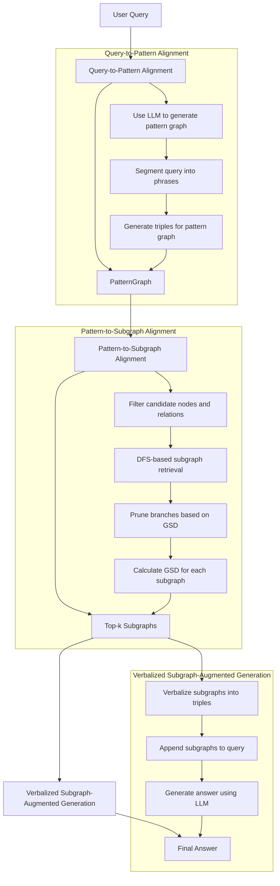

# SimGRAG: Leveraging Similar Subgraphs for Knowledge Graph-Driven Retrieval-Augmented Generation
https://arxiv.org/pdf/2412.15272
## Overview
**SimGRAG** is a novel method for **Knowledge Graph (KG)-driven Retrieval-Augmented Generation (RAG)**. It effectively aligns query texts with KG structures through a two-stage process: **query-to-pattern alignment** and **pattern-to-subgraph alignment**. The method ensures **plug-and-play usability**, **conciseness**, **scalability**, and **avoidance of entity leaks**, making it a powerful tool for tasks like question answering and fact verification.

## Key Features
1. **Plug-and-Play Usability**:
   - Seamlessly integrates with diverse KGs and LLMs without additional training.
2. **Conciseness**:
   - Retrieves focused subgraphs with the most relevant nodes and edges.
3. **Scalability**:
   - Efficiently handles large KGs with millions of nodes and edges.
4. **Avoidance of Entity Leaks**:
   - Does not require users to specify exact entities in the query.

## Method Overview
### 1. Query-to-Pattern Alignment
- **Input**: User query.
- **Process**: Uses an LLM to generate a pattern graph that aligns with the query.
- **Output**: `PatternGraph` (set of triples).

```cpp
PatternGraph generatePatternGraph(const std::string& query) {
    PatternGraph patternGraph = llm.generatePattern(query);
    return patternGraph;
}
```

### 2. Pattern-to-Subgraph Alignment
- **Input**: `PatternGraph`, Knowledge Graph (KG).
- **Process**: Retrieves top-k subgraphs from the KG that are semantically and structurally aligned with the pattern.
  - **Filtering**: Retrieves candidate nodes and relations using semantic embeddings.
  - **DFS Retrieval**: Expands subgraphs using DFS and prunes branches based on GSD.
  - **GSD Calculation**: Computes the Graph Semantic Distance for each subgraph.
- **Output**: Top-k subgraphs with the smallest GSD.

```cpp
std::vector<Subgraph> retrieveTopKSubgraphs(const PatternGraph& pattern, int k) {
    std::priority_queue<Subgraph, std::vector<Subgraph>, SubgraphComparator> topKSubgraphs;
    // Filter candidate nodes and relations
    for (const auto& triple : pattern.triples) {
        candidateNodes[triple.head] = embeddingModel.topKSimilarEntities(triple.head, k);
        candidateRelations[triple.relation] = embeddingModel.topKSimilarRelations(triple.relation, k);
    }
    // DFS-based subgraph retrieval
    for (const auto& startNode : candidateNodes[pattern.triples[0].head]) {
        std::unordered_map<Entity, Entity> mapping = {{pattern.triples[0].head, startNode}};
        expandSubgraph(pattern, mapping, candidateNodes, candidateRelations, topKSubgraphs, k);
    }
    // Extract top-k subgraphs
    std::vector<Subgraph> result;
    while (!topKSubgraphs.empty()) {
        result.push_back(topKSubgraphs.top());
        topKSubgraphs.pop();
    }
    return result;
}
```

### 3. Verbalized Subgraph-Augmented Generation
- **Input**: User query, top-k subgraphs.
- **Process**: Uses an LLM to generate an answer by verbalizing the subgraphs and appending them to the query.
- **Output**: Final answer.

```cpp
std::string answerQuery(const std::string& query, int k = 3) {
    // Step 1: Query-to-Pattern Alignment
    PatternGraph pattern = generatePatternGraph(query);
    // Step 2: Pattern-to-Subgraph Alignment
    std::vector<Subgraph> topKSubgraphs = retrieveTopKSubgraphs(pattern, k);
    // Step 3: Verbalized Subgraph-Augmented Generation
    std::string answer = llm.generateAnswer(query, topKSubgraphs);
    return answer;
}
```

### 4. Optimized Retrieval Algorithm
- **Input**: `PatternGraph`, KG, parameter k.
- **Process**: Efficiently retrieves the top-k subgraphs using vector search, greedy expansion, and pruning.
- **Output**: Top-k subgraphs with the smallest GSD.

```cpp
void expandSubgraph(const PatternGraph& pattern,
                    std::unordered_map<Entity, Entity>& mapping,
                    const std::unordered_map<Entity, std::vector<Entity>>& candidateNodes,
                    const std::unordered_map<Relation, std::vector<Relation>>& candidateRelations,
                    std::priority_queue<Subgraph, std::vector<Subgraph>, SubgraphComparator>& topKSubgraphs,
                    int k) {
    if (mapping.size() == pattern.triples.size()) {
        // Construct subgraph and calculate GSD
        Subgraph subgraph = constructSubgraph(mapping);
        subgraph.graphSemanticDistance = calculateGSD(pattern, subgraph);
        if (topKSubgraphs.size() < k || subgraph.graphSemanticDistance < topKSubgraphs.top().graphSemanticDistance) {
            topKSubgraphs.push(subgraph);
            if (topKSubgraphs.size() > k) {
                topKSubgraphs.pop();
            }
        }
        return;
    }
    // Expand next triple in pattern
    for (const auto& triple : pattern.triples) {
        if (mapping.find(triple.head) != mapping.end() && mapping.find(triple.tail) == mapping.end()) {
            for (const auto& candidateTail : candidateNodes.at(triple.tail)) {
                mapping[triple.tail] = candidateTail;
                expandSubgraph(pattern, mapping, candidateNodes, candidateRelations, topKSubgraphs, k);
                mapping.erase(triple.tail);
            }
        }
    }
}
```

## Experimental Results
### Tasks and Datasets
- **Knowledge Graph Question Answering (KGQA)**: Evaluated on the **MetaQA** dataset.
- **Fact Verification**: Evaluated on the **FactKG** dataset.

### Performance
- **MetaQA**:
  - 1-hop: 98.0 Hits@1
  - 2-hop: 98.4 Hits@1
  - 3-hop: 97.8 Hits@1
- **FactKG**: 86.8 accuracy

### Key Findings
1. **Error Analysis**:
   - Most errors occur during **query-to-pattern alignment**.
   - Errors in **subgraph-augmented generation** increase with query complexity.
2. **Ablation Studies**:
   - Increasing **few-shot examples** improves performance for complex queries.
   - Retrieving **top-k subgraphs** (e.g., k=3) balances performance and noise reduction.
3. **Retrieval Efficiency**:
   - The optimized retrieval algorithm achieves **0.74 seconds per query** on a 10-million-scale KG.

## Limitations
- **Dependence on LLM Capabilities**:
  - Performance is tied to the quality of the underlying LLM, particularly its ability to follow instructions and handle complex queries.

## Conclusion
**SimGRAG** addresses the critical challenge of aligning query texts with KG structures, offering a **plug-and-play**, **scalable**, and **concise** solution for KG-driven RAG. Its novel two-stage alignment process and optimized retrieval algorithm make it a powerful tool for applications like question answering and fact verification.

For more details, the code is available at: [https://github.com/YZ-Cai/SimGRAG](https://github.com/YZ-Cai/SimGRAG).

---

This `README.md` provides a comprehensive overview of the **SimGRAG** method, including its key features, workflow, experimental results, and limitations. It is structured to be clear and easy to understand for users and developers.


```markdown
# SimGRAG: Leveraging Similar Subgraphs for Knowledge Graph-Driven Retrieval-Augmented Generation

## Overview
**SimGRAG** is a novel method for **Knowledge Graph (KG)-driven Retrieval-Augmented Generation (RAG)**. It effectively aligns query texts with KG structures through a two-stage process: **query-to-pattern alignment** and **pattern-to-subgraph alignment**. Below is a visual explanation of how SimGRAG functions, using **Mermaid.js** for diagramming.
```
## Workflow Diagram


## Explanation of the Diagram

### 1. Query-to-Pattern Alignment
- **Input**: User query.
- **Process**: Uses an LLM to generate a pattern graph.
  - **Segment query into phrases**.
  - **Generate triples for the pattern graph**.
- **Output**: `PatternGraph` (set of triples).

### 2. Pattern-to-Subgraph Alignment
- **Input**: `PatternGraph`, Knowledge Graph (KG).
- **Process**: Retrieves top-k subgraphs from the KG.
  - **Filter candidate nodes and relations** using semantic embeddings.
  - **DFS-based subgraph retrieval** to expand subgraphs.
  - **Prune branches** based on Graph Semantic Distance (GSD).
  - **Calculate GSD** for each subgraph.
- **Output**: Top-k subgraphs with the smallest GSD.

### 3. Verbalized Subgraph-Augmented Generation
- **Input**: User query, top-k subgraphs.
- **Process**: Uses an LLM to generate an answer.
  - **Verbalize subgraphs into triples**.
  - **Append subgraphs to the query**.
  - **Generate answer using LLM**.
- **Output**: Final answer.

## Key Features
1. **Plug-and-Play Usability**:
   - Seamlessly integrates with diverse KGs and LLMs without additional training.
2. **Conciseness**:
   - Retrieves focused subgraphs with the most relevant nodes and edges.
3. **Scalability**:
   - Efficiently handles large KGs with millions of nodes and edges.
4. **Avoidance of Entity Leaks**:
   - Does not require users to specify exact entities in the query.

## Experimental Results
### Tasks and Datasets
- **Knowledge Graph Question Answering (KGQA)**: Evaluated on the **MetaQA** dataset.
- **Fact Verification**: Evaluated on the **FactKG** dataset.

### Performance
- **MetaQA**:
  - 1-hop: 98.0 Hits@1
  - 2-hop: 98.4 Hits@1
  - 3-hop: 97.8 Hits@1
- **FactKG**: 86.8 accuracy

## Limitations
- **Dependence on LLM Capabilities**:
  - Performance is tied to the quality of the underlying LLM, particularly its ability to follow instructions and handle complex queries.

## Conclusion
**SimGRAG** addresses the critical challenge of aligning query texts with KG structures, offering a **plug-and-play**, **scalable**, and **concise** solution for KG-driven RAG. Its novel two-stage alignment process and optimized retrieval algorithm make it a powerful tool for applications like question answering and fact verification.

For more details, the code is available at: [https://github.com/YZ-Cai/SimGRAG](https://github.com/YZ-Cai/SimGRAG).
```

### How to Use the Mermaid Diagram
1. Copy the Mermaid diagram code (inside the ```mermaid block).
2. Paste it into any Markdown editor or viewer that supports Mermaid.js (e.g., VS Code with Mermaid plugin, GitHub README.md, or Mermaid Live Editor).
3. The diagram will render as a flowchart, visually explaining the SimGRAG workflow.

This `README.md` provides a clear and visual explanation of the **SimGRAG** method using Mermaid.js, making it easy to understand the workflow and relationships between different components.
