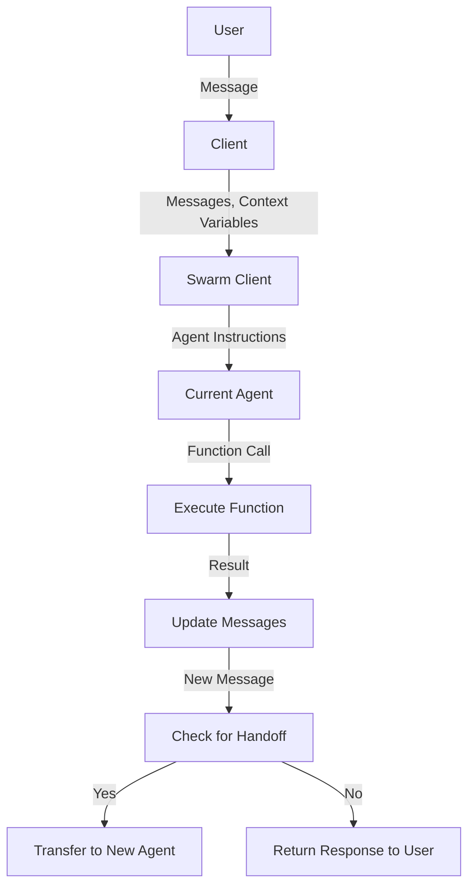

```mermaid
graph LR;
    A[User] -->|Message| B[Client];
    B -->|Messages, Context Variables| C[Swarm Client];
    C -->|Agent Instructions| D[Agent 1];
    D -->|Function Calls| E[Functions];
    E -->|Handoffs| F[Agent 2];
    F -->|Execution| G[Chat Completions API];
    G -->|Response| H[Swarm Client];
    H -->|Messages, Context Variables| I[User];
```

Here's a simplified Mermaid diagram representing the Swarm stack:



In this diagram:

1. The user sends a message to the client.
2. The client passes messages and context variables to the Swarm client.
3. The Swarm client retrieves instructions from the current agent and sends them along with the messages to the language model.
4. The language model generates a response, which may include function calls.
5. The Swarm client executes the functions and updates the messages with the results.
6. If the response includes a handoff (transfer to another agent), the Swarm client transfers control to the new agent.
7. Otherwise, it returns the response to the user.

This diagram illustrates the core flow of the Swarm system, highlighting the key components involved in handling user interactions and managing agent handoffs.

Here's a refactored version of the Swarm stack using concise C-like pseudocode:

```c
// User message structure
type Message = struct {
  role: string;
  content: string;
};

// Agent structure
type Agent = struct {
  name: string;
  model: string;
  instructions: function(string) *string;
  tools: []function();
};

// Swarm client
type SwarmClient = struct {
  agent: Agent;
  messages: []Message;
};

function createSwarmClient(agent: Agent): SwarmClient {
  return {agent: agent, messages: []};
}

// Execute a single turn of the conversation loop
function runTurn(swc: *SwarmClient) {
  // Get model response
  response := getModelResponse(swc.agent.instructions(), swc.messages);

  // Handle function calls in response
  for toolCall in response.tool_calls() {
    result := executeToolCall(toolCall, swc.agent.tools());
    append(&swc.messages, {role: "tool", content: result});
  }

  // Check for handoff and update agent if necessary
  if typeOf(response) == Agent {
    swc.agent = response;
  }
}

// Main conversation loop
function mainLoop(swc: *SwarmClient) {
  while true {
    userInput := getUserInput();
    append(&swc.messages, {role: "user", content: userInput});

    runTurn(swc);
  }
}
```

This refactored version maintains the core functionality of the Swarm stack while using more concise C-like pseudocode. The main differences include:

* Using structs to represent messages and agents.
* Simplifying function signatures and removing unnecessary details.
* Inlining some logic within functions for brevity.

The resulting code captures the essence of the Swarm system, making it easier to understand and modify as needed.

Based on the provided `swarm` directory structure, here's an explanation of the main functions in terms of the relevant files present after cloning the repository:

1. **Initialization and setup**
   - `swarm/core.py`: Contains the core functionality of the Swarm client.
     - `Swarm(client: OpenAI = None)`: Initializes a new Swarm client with an optional OpenAI client. This is the entry point for creating a new Swarm instance.

2. **Agent definition and creation**
   - `swarm/types.py`: Defines the Agent structure using Pydantic BaseModel.
     - `Agent(name: str = "Agent", model: str = "gpt-4o-mini", instructions: str | function, tools: list[function] = [])`: Represents an agent with a name, model, instructions, and a list of tools (functions).
   - `swarm/core.py`: Contains functions for creating and managing agents.
     - `create_agent(name: str, model: str, instructions: str | function, *tools: function)`: A helper function to create an Agent object with the given parameters.

3. **Running a conversation turn**
   - `swarm/core.py`: Contains the main loop for running a single turn of the conversation.
     - `run_turn(agent: Agent, messages: list[Message], context_variables: dict = {})`: Executes a single turn of the conversation by getting a model response, handling function calls, and checking for handoffs.

4. **Handling function calls**
   - `swarm/core.py`: Contains functions for executing tool calls and handling results.
     - `execute_tool_call(tool_call: FunctionCall, tools_map: dict[str, function]) -> Any`: Executes the given tool call using the provided tools map and returns the result.

5. **Streaming responses**
   - `swarm/core.py`: Contains functions for streaming responses from the model.
     - `stream_response(agent: Agent, messages: list[Message], stream: bool = False)`: Streams the response from the given agent and messages, with an optional flag to enable streaming.

6. **Running a conversation loop**
   - `swarm/repl.py`: Contains the main loop for running the entire conversation.
     - `run_demo_loop(agent: Agent, stream: bool = False)`: Runs a demo loop using the provided agent and an optional streaming flag.

7. **Utils and helper functions**
   - `swarm/util.py`: Contains utility functions for handling context variables and other miscellaneous tasks.
     - `get_context_variable(context_variables: dict, key: str) -> Any`: Retrieves the value of a given context variable from the provided dictionary.
   - `swarm/repl.py`: Contains helper functions for running demos and examples.
     - `process_and_print_streaming_response(response)`: A helper function to process and print streaming responses.

These files and their respective functions work together to implement the core functionality of the Swarm system, allowing users to create agents, run conversations, handle function calls, stream responses, and manage context variables.
