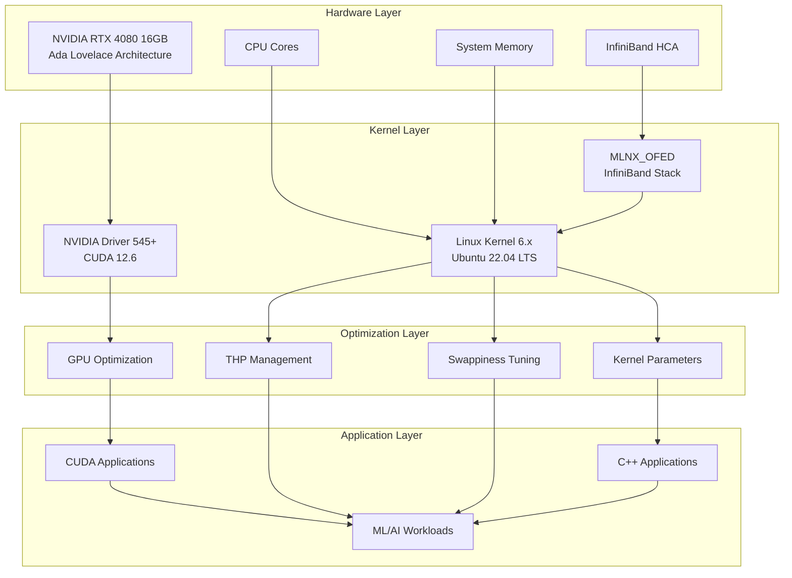

# Ubuntu 22.04 HPC/ML Optimization Toolkit

[](https://ubuntu.com/)
[](https://developer.nvidia.com/cuda-toolkit)
[](https://www.nvidia.com/en-us/geforce/graphics-cards/40-series/rtx-4080-family/)
[](https://isocpp.org/)
[](LICENSE)
[](https://github.com/danindiana/GRYPHGEN)

A comprehensive toolkit for optimizing Ubuntu 22.04 systems for High-Performance Computing (HPC) and Machine Learning workloads, with specific optimizations for NVIDIA RTX 4080 GPUs.

## 🚀 Features

- **Automated System Optimization Scripts**
  - Transparent Huge Pages (THP) configuration
  - Translation Lookaside Buffer (TLB) optimization
  - Memory swappiness tuning
  - Kernel parameter optimization

- **NVIDIA RTX 4080 Optimized Code Examples**
  - CUDA 12.x examples targeting Ada Lovelace architecture
  - Tensor Core utilization examples
  - Memory bandwidth optimization
  - Multi-stream GPU operations

- **High-Performance Networking**
  - InfiniBand setup and configuration
  - RDMA (Remote Direct Memory Access) examples
  - Low-latency networking optimization

- **Comprehensive Documentation**
  - Kernel optimization guides
  - Memory management best practices
  - GPU performance tuning
  - Architecture diagrams

- **Build System & CI/CD**
  - Modern CMake build system
  - Automated testing framework
  - GitHub Actions CI/CD pipeline

## 📊 Architecture Overview



## 🎯 Target Hardware

- **Primary GPU**: NVIDIA RTX 4080 (16GB GDDR6X)
- **Compute Capability**: 8.9 (Ada Lovelace)
- **CUDA Cores**: 9728
- **Tensor Cores**: 304 (4th Gen)
- **RT Cores**: 76 (3rd Gen)
- **Memory Bandwidth**: 716.8 GB/s

## 📁 Project Structure

```
ubuntu2204/
├── README.md                          # This file
├── docs/                              # Documentation
│   ├── architecture.md                # System architecture details
│   ├── guides/                        # Implementation guides
│   │   ├── bare-metal-stack.md       # Low-level system analysis
│   │   ├── kernel-optimization.md    # Kernel tuning guide
│   │   ├── memory-management.md      # Memory/swap configuration
│   │   └── thp-tlb-management.md     # THP/TLB optimization
│   └── networking/                    # Networking documentation
│       └── infiniband.md             # InfiniBand setup guide
├── scripts/                           # Automation scripts
│   ├── setup/                         # System setup scripts
│   │   ├── configure-thp.sh          # THP configuration
│   │   ├── configure-swappiness.sh   # Swap tuning
│   │   ├── install-infiniband.sh     # InfiniBand installation
│   │   └── optimize-kernel.sh        # Kernel optimization
│   ├── monitoring/                    # Monitoring utilities
│   │   ├── check-gpu-health.sh       # GPU health monitoring
│   │   ├── monitor-memory.sh         # Memory monitoring
│   │   └── benchmark-system.sh       # System benchmarking
│   └── utils/                         # Utility scripts
│       └── system-info.sh            # System information
├── examples/                          # Code examples
│   ├── cuda/                          # CUDA examples
│   │   ├── matrix-multiply/          # Matrix operations
│   │   ├── memory-optimization/      # Memory optimization
│   │   └── tensor-operations/        # Tensor Core examples
│   ├── cpp/                           # C++ examples
│   │   └── llama-inference/          # LLaMA inference
│   └── benchmarks/                    # Benchmarking code
│       ├── memory-bandwidth/         # Memory tests
│       └── gpu-performance/          # GPU tests
├── tests/                             # Testing scripts
│   ├── test-gpu-setup.sh             # GPU validation
│   ├── test-memory-config.sh         # Memory config tests
│   └── validate-dependencies.sh      # Dependency checks
├── tools/                             # Utility programs
├── .github/workflows/                 # CI/CD configuration
│   └── ci.yml                        # GitHub Actions
└── Makefile                          # Build orchestration
```

## 🛠️ Quick Start

### Prerequisites

```bash
# System requirements
- Ubuntu 22.04 LTS
- NVIDIA RTX 4080 (or compatible Ada Lovelace GPU)
- CUDA 12.x compatible driver (545+)
- GCC 11+ or Clang 14+
- CMake 3.24+
```

### Installation

1. **Clone the repository**
```bash
git clone https://github.com/danindiana/GRYPHGEN.git
cd GRYPHGEN/ubuntu2204
```

2. **Run system setup**
```bash
# Install dependencies and optimize system
sudo ./scripts/setup/optimize-kernel.sh
sudo ./scripts/setup/configure-thp.sh
sudo ./scripts/setup/configure-swappiness.sh
```

3. **Verify GPU setup**
```bash
./tests/test-gpu-setup.sh
```

4. **Build examples**
```bash
make all
```

## 💻 Usage Examples

### System Optimization

```bash
# Check current system configuration
./scripts/utils/system-info.sh

# Monitor GPU health
./scripts/monitoring/check-gpu-health.sh

# Run memory benchmarks
./scripts/monitoring/benchmark-system.sh
```

### CUDA Examples

```bash
# Build and run matrix multiplication
cd examples/cuda/matrix-multiply
make
./matrix_multiply

# Run memory optimization example
cd ../memory-optimization
make
./memory_opt
```

### Benchmark Suite

```bash
# Run comprehensive GPU performance tests
cd examples/benchmarks/gpu-performance
make
./gpu_benchmark --device 0 --iterations 1000
```

## 📈 Performance Optimization

### Memory Management

The toolkit provides automated scripts for:
- **THP (Transparent Huge Pages)**: Optimize for large memory allocations
- **Swappiness**: Reduce swap usage for memory-intensive workloads
- **TLB**: Improve virtual-to-physical address translation

### GPU Optimization

Targeting RTX 4080 Ada Lovelace architecture:
- **Tensor Core utilization**: FP16/BF16 mixed-precision operations
- **Memory coalescing**: Optimal memory access patterns
- **Stream parallelization**: Multi-stream GPU operations
- **Shared memory optimization**: Efficient use of 100KB L1/shared memory

### Kernel Parameters

```bash
# Recommended kernel parameters for ML workloads
vm.swappiness=10
vm.dirty_ratio=10
vm.dirty_background_ratio=5
kernel.sched_migration_cost_ns=5000000
```

## 🔬 Benchmarks

Expected performance on RTX 4080:

| Operation | Performance | Notes |
|-----------|-------------|-------|
| FP32 Compute | 48.74 TFLOPS | Standard precision |
| FP16 Tensor | 389.9 TFLOPS | With Tensor Cores |
| Memory Bandwidth | 716.8 GB/s | GDDR6X |
| Matrix Multiply (4096x4096) | ~0.8ms | Optimized kernel |

## 🧪 Testing

```bash
# Run all tests
make test

# Individual test suites
./tests/test-gpu-setup.sh          # GPU validation
./tests/test-memory-config.sh      # Memory configuration
./tests/validate-dependencies.sh   # Dependency validation
```

## 📚 Documentation

Comprehensive guides available in `docs/`:

- [System Architecture](docs/architecture.md) - Detailed architecture overview
- [Kernel Optimization](docs/guides/kernel-optimization.md) - Kernel tuning guide
- [Memory Management](docs/guides/memory-management.md) - Memory optimization
- [InfiniBand Setup](docs/networking/infiniband.md) - High-speed networking
- [Bare Metal Stack](docs/guides/bare-metal-stack.md) - Low-level system analysis

## 🤝 Contributing

Contributions are welcome! Please see our contributing guidelines.

1. Fork the repository
2. Create a feature branch (`git checkout -b feature/amazing-feature`)
3. Commit your changes (`git commit -m 'Add amazing feature'`)
4. Push to the branch (`git push origin feature/amazing-feature`)
5. Open a Pull Request

## 📄 License

This project is licensed under the MIT License - see the [LICENSE](LICENSE) file for details.

## 🙏 Acknowledgments

- NVIDIA CUDA Team for excellent documentation
- Ubuntu community for kernel optimization insights
- llama.cpp project for inference optimization techniques
- OpenFabrics Alliance for InfiniBand tools

## 📞 Support

- **Issues**: [GitHub Issues](https://github.com/danindiana/GRYPHGEN/issues)
- **Discussions**: [GitHub Discussions](https://github.com/danindiana/GRYPHGEN/discussions)
- **Documentation**: [Full Documentation](docs/)

## 🗺️ Roadmap

- [ ] Add support for multi-GPU configurations
- [ ] Implement distributed training examples
- [ ] Add ROCm/AMD GPU support
- [ ] Create Docker containers for easy deployment
- [ ] Add Kubernetes deployment manifests
- [ ] Integrate with popular ML frameworks (PyTorch, TensorFlow)

---

**Built with ❤️ for High-Performance Computing and Machine Learning**
