# System Architecture

## Overview

This document describes the architecture of the Ubuntu 22.04 HPC/ML optimization toolkit, designed specifically for NVIDIA RTX 4080 GPUs running machine learning and high-performance computing workloads.

## System Stack

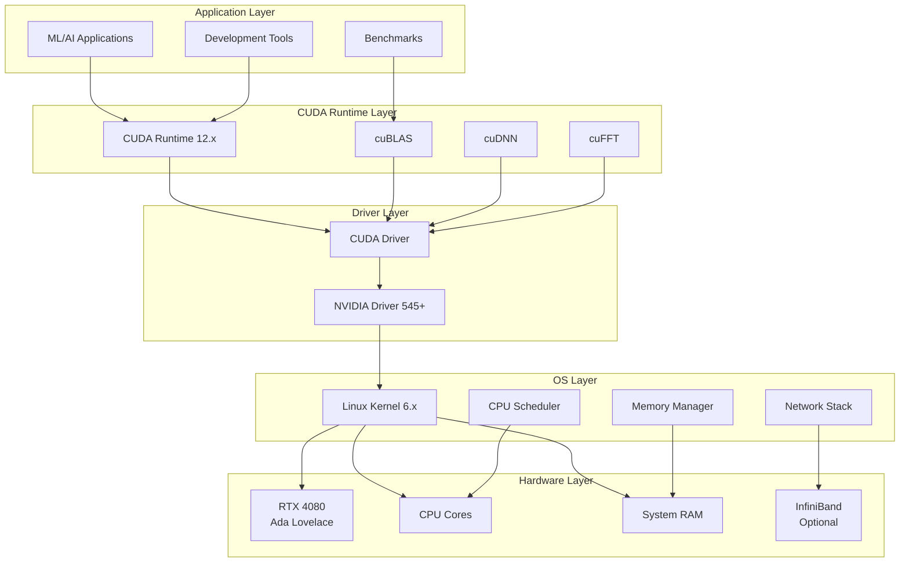

## Component Details

### Hardware Layer

#### NVIDIA RTX 4080 Specifications

| Component | Specification |
|-----------|---------------|
| Architecture | Ada Lovelace (sm_89) |
| CUDA Cores | 9,728 |
| Tensor Cores | 304 (4th Generation) |
| RT Cores | 76 (3rd Generation) |
| Base Clock | 2.21 GHz |
| Boost Clock | 2.51 GHz |
| Memory | 16 GB GDDR6X |
| Memory Bus | 256-bit |
| Memory Bandwidth | 716.8 GB/s |
| TDP | 320W |
| L2 Cache | 64 MB |
| L1/Shared Memory | 128 KB per SM |

#### Compute Capabilities

- **FP32 Performance**: 48.74 TFLOPS
- **FP16 (Tensor Core)**: 389.9 TFLOPS
- **INT8 (Tensor Core)**: 779.8 TOPS
- **Ray Tracing**: 110 RT-TFLOPS

### Software Stack

#### Operating System

- **Distribution**: Ubuntu 22.04 LTS (Jammy Jellyfish)
- **Kernel**: 6.x series (optimized with custom parameters)
- **Libc**: glibc 2.35

#### CUDA Toolkit

- **Version**: 12.6 (latest stable)
- **Compute Capability**: sm_89
- **Driver**: 545.x or newer

#### Key Libraries

1. **cuBLAS**: GPU-accelerated linear algebra
2. **cuDNN**: Deep learning primitives
3. **cuFFT**: Fast Fourier transforms
4. **cuRAND**: Random number generation
5. **cuSPARSE**: Sparse matrix operations

## Memory Architecture

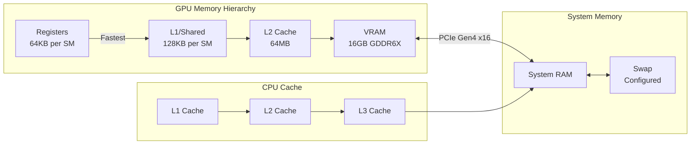

### Memory Optimization Strategies

1. **Coalesced Memory Access**: Consecutive threads access consecutive memory
2. **Shared Memory Utilization**: 128KB per SM, ~30x faster than global memory
3. **Texture Memory**: Cached, optimized for 2D spatial locality
4. **Constant Memory**: 64KB, broadcast to all threads in a warp
5. **Memory Prefetching**: Overlap data transfer with computation

## Kernel Optimizations

### CPU Scheduler Tuning

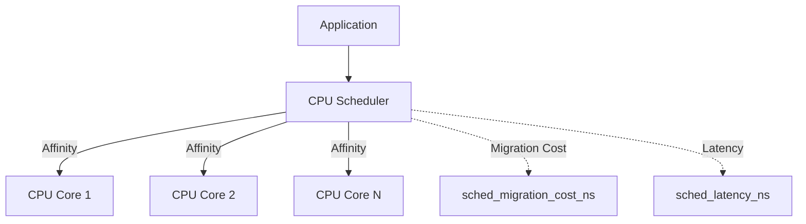

Key parameters:
- `sched_migration_cost_ns=5000000`: Reduce thread migration
- `sched_autogroup_enabled=0`: Disable autogroup for HPC
- `governor=performance`: Maximum CPU frequency

### Memory Management

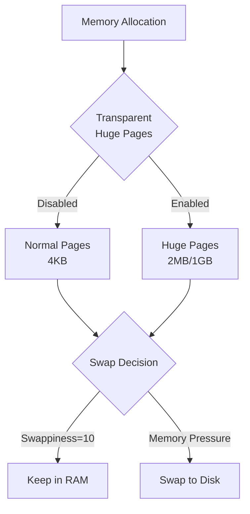

Optimizations:
- **THP**: Disabled for ML workloads (reduces TLB misses but can cause fragmentation)
- **Swappiness**: Set to 10 (aggressive RAM usage, minimal swap)
- **Huge Pages**: Manual allocation for specific applications

## Network Stack (InfiniBand)

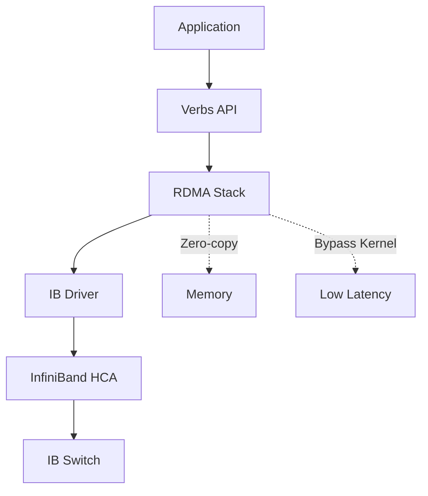

Features:
- **Bandwidth**: Up to 200 Gbps
- **Latency**: Sub-microsecond
- **RDMA**: Direct memory access without CPU involvement
- **Hardware offload**: Protocol processing in HCA

## Data Flow: ML Training Example

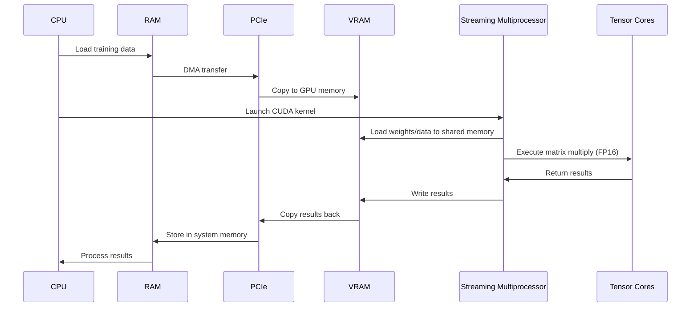

## Performance Characteristics

### Bottleneck Analysis

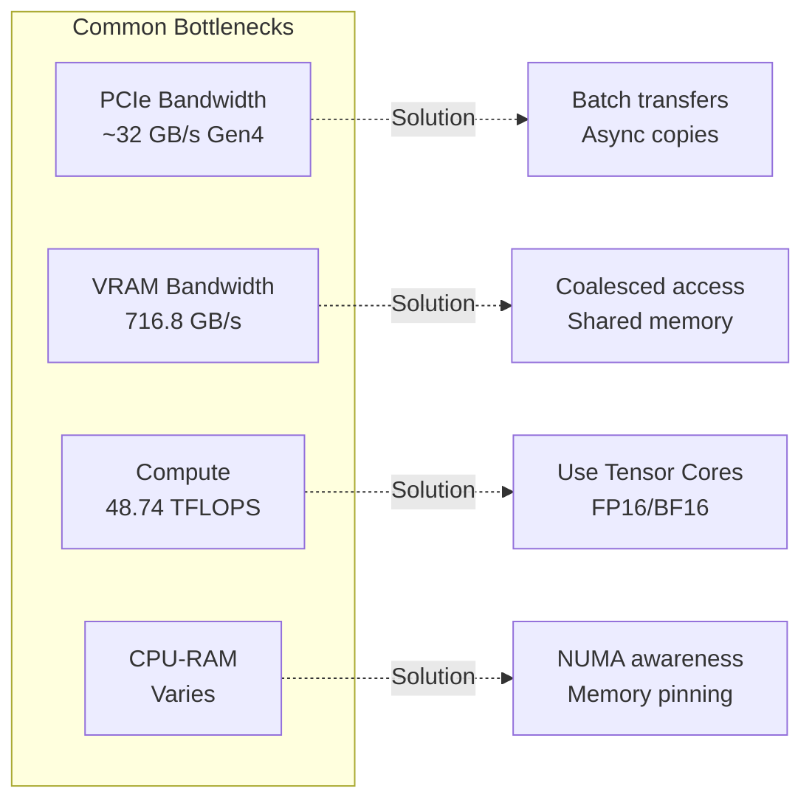

### Optimization Priorities

1. **Maximize Tensor Core Utilization**
   - Use FP16/BF16 mixed precision
   - Optimal matrix dimensions (multiples of 16)
   - cuBLAS with TENSOR_OP_MATH

2. **Minimize PCIe Transfers**
   - Batch operations
   - Asynchronous copies
   - Pinned memory
   - Peer-to-peer (multi-GPU)

3. **Optimize Memory Access**
   - Coalesced global memory access
   - Shared memory for frequently accessed data
   - Avoid bank conflicts
   - Use texture cache for spatial locality

4. **Kernel Optimization**
   - High occupancy (>50%)
   - Minimal divergence
   - Loop unrolling
   - Fast math intrinsics

## Monitoring and Profiling

### Tools

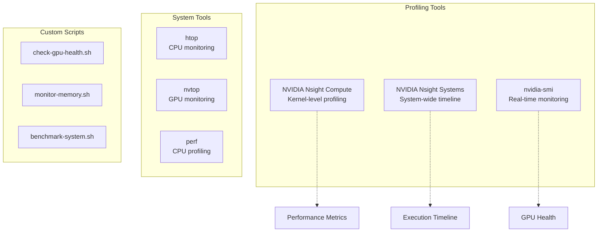

### Key Metrics

| Metric | Tool | Target (RTX 4080) |
|--------|------|-------------------|
| GPU Utilization | nvidia-smi | >80% |
| Memory Bandwidth | ncu | >600 GB/s |
| Compute Throughput | ncu | >40 TFLOPS (FP32) |
| Tensor Core Usage | ncu | >300 TFLOPS (FP16) |
| Occupancy | ncu | >50% |
| Temperature | nvidia-smi | <85°C |
| Power Draw | nvidia-smi | ~320W under load |

## Deployment Scenarios

### Single-GPU Workstation

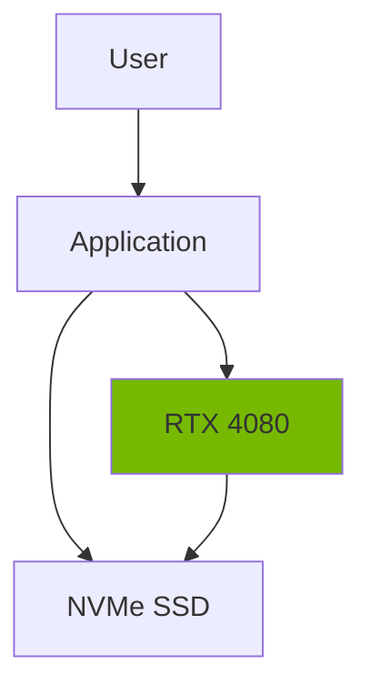

Optimal for:
- Model development and testing
- Small to medium datasets
- Interactive workloads
- Single-precision training

### Multi-GPU Server

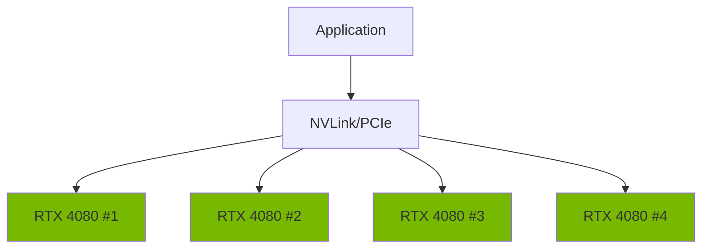

Optimal for:
- Large-scale training
- Data parallelism
- Model parallelism
- High-throughput inference

### HPC Cluster

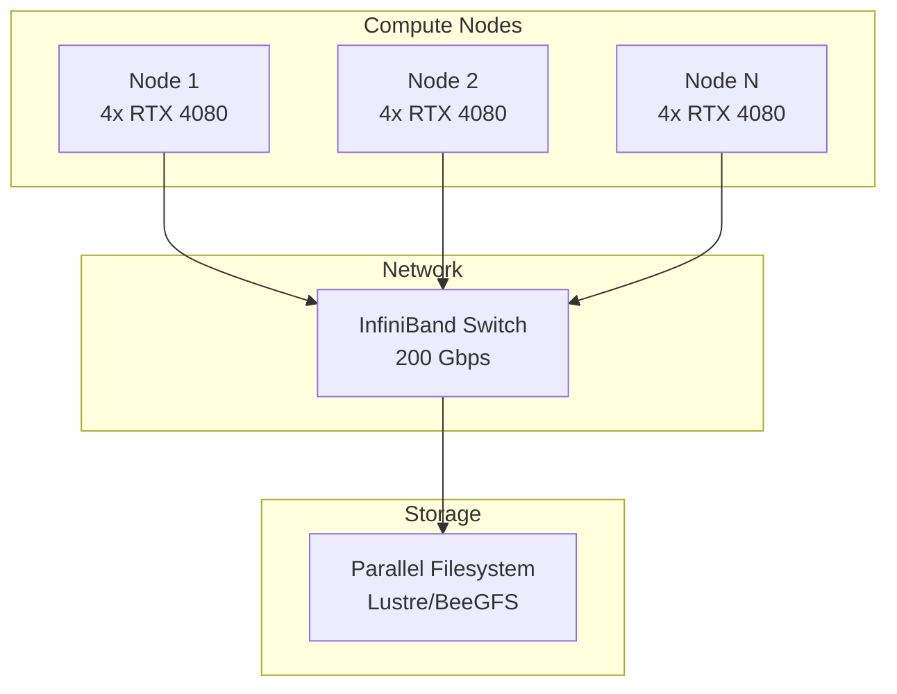

Optimal for:
- Distributed training
- Large-scale simulations
- Multi-node inference
- Research clusters

## Future Enhancements

1. **Multi-GPU Support**
   - NCCL integration
   - Gradient accumulation
   - Pipeline parallelism

2. **Container Support**
   - Docker images with CUDA
   - Kubernetes integration
   - Singularity containers

3. **Framework Integration**
   - PyTorch optimization
   - TensorFlow tuning
   - JAX support

4. **Advanced Profiling**
   - Automated bottleneck detection
   - Performance regression testing
   - Continuous benchmarking

## References

- [NVIDIA RTX 4080 Specifications](https://www.nvidia.com/en-us/geforce/graphics-cards/40-series/rtx-4080-family/)
- [CUDA Programming Guide](https://docs.nvidia.com/cuda/cuda-c-programming-guide/)
- [Ada Lovelace Architecture Whitepaper](https://www.nvidia.com/en-us/geforce/ada-lovelace-architecture/)
- [Ubuntu 22.04 LTS Documentation](https://ubuntu.com/server/docs)
